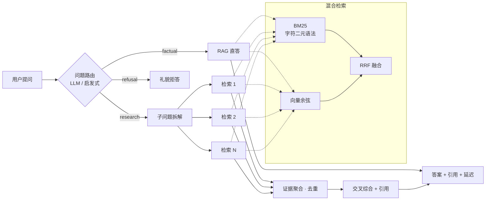

# 格物 Gewu

> 高校场景的 Deep Research 智能问答系统：**问题路由 × 混合检索 × 多步研究 × 可评测**。
> 简单事实问题走 RAG 直答；复合政策问题自动进入深度研究链路（拆解 → 多路检索 → 交叉综合）；范围外问题礼貌拒答。

[](./.github/workflows/ci.yml)
[](./LICENSE)

**声明**：本项目为个人开源展示项目，采用 **clean-room** 方式独立实现；演示语料为完全虚构的「钱塘大学」合成数据，与任何真实高校、任何闭源商业项目无关。

## 为什么做这个项目

校园政策问答是典型的"答案有对错"场景——保研条件、转专业门槛答错是有代价的。这迫使系统必须解决聊天 demo 不会遇到的问题：

- **多跳问题**：「我挂过一门课还能转专业吗？转完原课程绩点还算吗、影响保研吗？」需要跨多份文件综合，单轮 RAG 无能为力；
- **幻觉控制**：答案必须带引用，检索不到依据要明确说不知道，而不是编造政策；
- **成本与滥用防护**：公开服务需要限流和每日 token 预算。

## 核心特性

| 特性 | 说明 |
| --- | --- |
| 问题路由 | LLM 分类 factual / research / refusal；无 key 时降级为启发式规则 |
| 混合检索 | BM25（中文字符二元语法，零分词依赖）+ 向量余弦，RRF 融合排序 |
| Deep Research | 子问题拆解 → 多路检索 → 证据跨子问题去重 → 交叉综合，全程 trace 可视 |
| 引用与拒答 | 每条回答标注 `[n]` 引用来源；证据不足时明确声明"未找到依据" |
| 离线评测 | 18 题种子数据集（事实 / 多跳 / 拒答三类），一键产出 Markdown 指标报告 |
| 成本防线 | 按 IP 令牌桶限流 + 每日 token 预算（持久化、跨重启） |
| 零依赖启动 | 无 API key 也能跑：检索演示模式（纯 BM25） |
| 模型无关 | 任意 OpenAI 兼容端点（智谱 / DeepSeek / OpenAI / vLLM），改环境变量即切换 |

## 架构



详见 [docs/architecture.md](./docs/architecture.md)（含设计决策问答）与 [docs/roadmap.md](./docs/roadmap.md)。

## 快速开始

前置：Python 3.10+、Node 18+。

```bash
# 1.（可选）配置模型：不配置则以检索演示模式运行
cp .env.example .env   # 填入 LLM_API_KEY 等

# 2. 安装并建索引
make install-api && make ingest

# 3. 启动后端（:8000）与前端（:3100）
make install-web
make dev-api   # 终端 1
make dev-web   # 终端 2
```

打开 http://localhost:3100 即可对话。

**检索调试**（不经模型直接看命中）：

```bash
curl -s localhost:8000/api/search -H 'Content-Type: application/json' \
  -d '{"query": "转专业绩点要求", "k": 3}' | python3 -m json.tool
```

## 评测

```bash
make ingest   # 先确保索引存在
make eval     # 跑 eval/dataset.jsonl，报告写入 eval/reports/
```

指标：通过率 / 关键词命中 / 引用召回 / 分类型延迟。种子集 18 题（factual 7 / multi_hop 8 / refusal 3），数据在 [eval/dataset.jsonl](./eval/dataset.jsonl)，欢迎扩充。

## 语料替换

`data/corpus/*.md` 为虚构「钱塘大学」的政策文档（带 `title/source/updated` frontmatter）。把文件换成任意公开语料（如某校官网通知）后 `make ingest` 即完成知识库切换，其余部分零改动。

## API 一览

| 方法 | 路径 | 说明 |
| --- | --- | --- |
| POST | `/api/chat` | SSE 流式问答（`question` + `mode: auto/direct/research`） |
| POST | `/api/search` | 调试：直接查看混合检索命中 |
| GET | `/api/docs` | 已入库文档列表 |
| GET | `/api/health` | 服务状态 / LLM 与向量开关 / 预算用量 |

## 部署

```bash
docker compose up --build -d
```

生产环境注意：Nginx 反代时关闭 SSE 缓冲（后端已下发 `X-Accel-Buffering: no`）；限流中间件取 `X-Forwarded-For` 首段作为客户端 IP，请确保代理层透传。

## License

MIT
