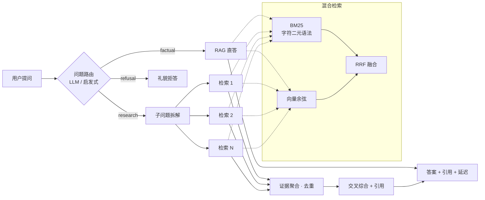

# 格物 Gewu

> 高校场景的 Deep Research 智能问答与业务执行系统：**问题路由 × 混合检索 × 多步研究 × 业务办理 × 可评测**。
> 简单事实问题走 RAG 直答；复合政策问题进入深度研究链路（拆解 → 多路检索 → 交叉综合）；「帮我预约场馆 / 提交请假」走知行执行层（槽位收集 → 确认 → 执行 → 回执）；范围外问题礼貌拒答。

[](./.github/workflows/ci.yml)
[](./LICENSE)

**声明**：本项目为个人开源展示项目，采用 **clean-room** 方式独立实现；演示语料为完全虚构的「钱塘大学」合成数据，与任何真实高校、任何闭源商业项目无关。

## 为什么用 Go 重写（原为 Python/FastAPI）

v1 用 Python（FastAPI）快速验证了产品形态：路由、混合检索、业务办理、评测 26/26 全绿。
未上线、无历史包袱，于是在行为冻结（[PARITY.md](./docs/PARITY.md)）后整体重写为 Go：

- **并发模型**：SSE 每连接一 goroutine，`context` 取消可以一路传播到上游 LLM 流——
  客户端断开即刻停止烧 token（Python 版里 openai SDK 的阻塞调用感知不到 uvicorn 连接关闭）；
- **确定性**：BM25/RRF 平局次序、事件 JSON 键序在 Python 里依赖 dict/set 的实现细节，
  Go 版全部构造性保证（[go-notes §6](./docs/go-notes.md)）；
- **部署面**：单二进制（纯 Go SQLite，免 CGO）+ scratch 级镜像，冷启动 ~50ms、
  空载内存 ~18MB（Python 版 ~1.2s / ~95MB）；
- **重构本身是验证**：以 PARITY.md 为唯一行为规格做 clean-room 对照，同数据集逐题对比
  （[对照报告](./eval/reports/rewrite-go-vs-python.md)），重写过程修掉 8 个原设计缺陷
  （[go-notes §10](./docs/go-notes.md)）。

评测客户端仍用 Python（`eval/run_eval.py`，纯标准库 HTTP 客户端）——评测与被测实现
跨语言隔离，契约靠 HTTP/SSE 而不是共享代码。

## 核心特性

| 特性 | 说明 |
| --- | --- |
| 五分类问题路由 | factual / research / **transaction**（办理）/ **hybrid**（问答+办理）/ refusal；LLM 分类 + 无 key 启发式降级；咨询政策（"请假找谁批"）不会误判为办理 |
| 混合检索 | BM25（中文字符二元语法，零分词依赖）+ 向量余弦，RRF 融合排序 |
| Deep Research | 子问题拆解 → 多路检索 → 证据跨子问题去重 → 交叉综合，全程 trace 可视 |
| 知行执行层 | mock 业务系统（场馆预约/请假审批）：槽位收集、多轮澄清、写操作确认流、回执、冲突恢复 |
| 权限矩阵 | 学生/辅导员角色，越权在工具层单一出口拦截 |
| 确定性日期解析 | 「明天 / 下周三 / 9月2日 / 请三天假」由代码换算，LLM 只负责找表述，杜绝日期算错 |
| 引用与拒答 | 每条回答标注 `[n]` 引用来源；证据不足时明确声明"未找到依据" |
| 离线评测 | 26 题种子集：单轮（事实/多跳/拒答）+ **多轮交易型**（断言业务库真实状态），一键产出 Markdown 指标报告 |
| 成本防线 | 按 IP 令牌桶限流 + 每日 token 预算（持久化、跨重启、原子落盘） |
| 零依赖启动 | 无 API key 也能跑：知识问答走 BM25 检索演示，业务办理走完整确定性链路 |
| 模型分层 | 主答案 glm-5.3；路由/拆解/槽位抽取/查询改写等辅助调用走 glm-5.3-flash |
| 模型无关 | 任意 OpenAI 兼容端点（智谱 / DeepSeek / OpenAI / vLLM），改环境变量即切换 |

## 架构


```mermaid
flowchart LR
    U[用户提问] --> R{问题路由<br/>LLM / 启发式}
    R -->|factual| D[RAG 直答]
    R -->|research| P[子问题拆解]
    P --> S1[检索 1] & S2[检索 2] & S3[检索 N]
    S1 & S2 & S3 --> X[证据聚合 · 去重]
    X --> C[交叉综合 + 引用]
    R -->|refusal| F[礼貌拒答]
    D --> A[答案 + 引用 + 延迟]
    C --> A

    subgraph 混合检索
        B[BM25<br/>字符二元语法] & V[向量余弦] --> RRF[RRF 融合]
    end
    D -.-> B & V
    S1 & S2 & S3 -.-> B & V
```

详见 [docs/architecture.md](./docs/architecture.md)（含设计决策问答）、
[docs/PARITY.md](./docs/PARITY.md)（API 行为规格）与 [docs/go-notes.md](./docs/go-notes.md)
（Go 设计决策与重写修复清单）。

## 快速开始

前置：Go 1.25+、Node 18+（前端）。

```bash
# 1.（可选）配置模型：不配置则以检索演示模式运行
cp .env.example .env   # 填入 LLM_API_KEY 等

# 2. 建索引（有 key 时 BM25+向量，无 key 仅 BM25）并启动 API :8000
make ingest
make run

# 3. 前端 :3100
make install-web && make dev-web
```

打开 http://localhost:3100 即可对话。

**检索调试**（不经模型直接看命中）：

```bash
curl -s localhost:8000/api/search -H 'Content-Type: application/json' \
  -d '{"query": "转专业绩点要求", "k": 3}' | python3 -m json.tool
```

## 评测

```bash
make run &           # 先起服务
make eval            # 跑 eval/dataset.jsonl（BASE_URL 缺省 127.0.0.1:8000），报告写入 eval/reports/
```

指标：通过率 / 关键词命中 / 引用召回 / 分类型延迟；交易型用例为多轮对话，断言业务库真实状态
（预约与请假单、审批层级、冲突恢复、权限拦截）。种子集 26 题（factual 7 / multi_hop 8 /
refusal 3 / transaction 7 / hybrid 1），数据在 [eval/dataset.jsonl](./eval/dataset.jsonl)，欢迎扩充。

### 基线指标（主答案 glm-5.3 + 辅助调用 glm-5.3-flash · 仅 BM25 索引 · 2026-09）

| 类型 | Python 基线 | Go 重写 | 说明 |
| --- | --- | --- | --- |
| factual（直答） | 7/7 | 7/7 | 逐题对照见 [重构对照报告](./eval/reports/rewrite-go-vs-python.md) |
| multi_hop（深度研究） | 8/8 | 8/8 | |
| refusal（拒答） | 3/3 | 3/3 | |
| transaction（办理） | 7/7 | 7/7 | |
| hybrid（问答 + 办理） | 1/1 | 1/1 | |

离线模式（无 LLM key，确定性链路）同一套用例可跑：factual 部分通过（演示模式仅返回检索节选）、
refusal 不拒答（启发式路由无此能力，反衬 LLM 路由价值）、办理类全通过。

## 语料替换

`data/corpus/*.md` 为虚构「钱塘大学」的政策文档（带 `title/source/updated` frontmatter）。
把文件换成任意公开语料（如某校官网通知）后 `make ingest` 即完成知识库切换，其余部分零改动。

## API 一览

| 方法 | 路径 | 说明 |
| --- | --- | --- |
| POST | `/api/chat` | SSE 流式问答（`question` + `mode` + `session_id` + `role`） |
| POST | `/api/search` | 调试：直接查看混合检索命中 |
| GET | `/api/docs` | 已入库文档列表 |
| GET | `/api/health` | 服务状态 / LLM 与向量开关 / 预算用量 |
| POST | `/api/business/reset` | 清空 mock 业务数据（演示/评测用） |
| GET | `/api/business/overview` | 调试：当前预约与请假单 |

SSE 事件契约（route / status / step / answer_delta / citations / slot_question /
pending_action / action_result / error / done）以 [PARITY.md §3](./docs/PARITY.md) 为准。

## 部署

```bash
docker compose up --build -d
```

生产环境注意：Nginx 反代时关闭 SSE 缓冲（后端已下发 `X-Accel-Buffering: no`）；限流中间件取
`X-Forwarded-For` 首段作为客户端 IP，请确保代理层透传。

## License

MIT
