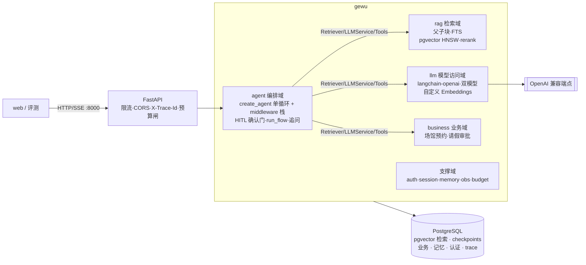

# 格物 Gewu

> **个人毕业设计项目：基于 RAG 与 LangGraph 的校园制度智能问答 Agent（研究与实现）。**
> 以「高校智能问答与业务执行」为载体场景，把 agent 开发中的关键选型——路由、
> 编排、检索、存储、实现语言、架构形态——做成**同一行为规格下可切换、可评测
> 的实现**，用逐题等价证明与指标报告做对比，而不是跟着直觉或博客选型。

[](./.github/workflows/ci.yml)
[](./LICENSE)

**声明**：本项目为个人毕业设计项目（开源），采用 **clean-room** 方式独立实现；演示语料为完全虚构的「钱塘大学」合成数据，与任何真实高校、任何闭源商业项目无关。

## 在对比什么

对比大多已完成并留档结论（对比期间以行为开关灰度，结论落定后退役一侧、收口代码）：

| 对比维度 | 方案 A ↔ 方案 B | 结论与现状 | 证据 |
| --- | --- | --- | --- |
| 架构形态 | 模块化单体 → 六微服务 → 退役回单体 | 微服务学习目标达成后有序退役：能力缺口先吸收进单体，再删分布式管道 | [ADR-0009](./docs/ADR/0009-微服务退役与单体模块化.md) · [docs/history/](./docs/history/) · tag `pre-ms-removal` |
| 实现语言 | Python/FastAPI ↔ Go | 行为冻结（PARITY.md）后 clean-room 互写两次；并发、确定性、部署面的收益与代价均有报告；终态 Python + LangGraph（tag `go-final` 锚定 Go 终态） | [对照报告](./eval/reports/rewrite-go-vs-python.md) · [ADR-0010](./docs/ADR/0010-langgraph-migration.md) |
| 问题路由 | 级联三级（规则 → 小模型五分类 → 主模型复核）↔ agent-first | **agent-first 胜出**：P31 级联全量退役、外壳塌缩为单循环，路由降级为观测标签（关键词闸保底） | [walkthrough/02](./docs/walkthrough/02-routing.md) · [PARITY §0.9](./docs/PARITY.md) |
| 任务编排 | 固定 workflow（直答/深研/办理）↔ ReAct 自主组合工具 | **合流**：P17 起 react 与 auto 同路，P31 收敛为 `create_agent` 单循环 + middleware 栈（HITL 确认门/压缩/流式）；写操作一律 fail-closed | [architecture/02](./docs/architecture/02-orchestration-graph.md) |
| 分块策略 | flat 扁平 ↔ hierarchical 父子块 | 入库侧 `CHUNK_STRATEGY`（auto 画像选型 / heading / recursive），换策略须 `REBUILD=1` 重建 | [architecture/04](./docs/architecture/04-rag-retrieval.md) |
| 会话状态 | 内存 ↔ SQLite ↔ PG | 终态 PostgreSQL 全库：PostgresSaver checkpointer 会话跨重启续办，业务/记忆/认证/会话/trace 同库（P21-2 SQLite 退役） | [architecture/07](./docs/architecture/07-state-persistence.md) |

仍在灰度的行为开关见 [`.env.example`](./.env.example)（`RERANK_MODE` / `STREAM_ANSWER` /
`MEMORY_CONSOLIDATE` / `EMBED_MODE` 等），全部在全绿门禁下接入，随时可回退。

## 对比的方法：先冻结规格，再换实现

方案的对比要在同等条件下才有意义，本项目的做法：

1. **先写考卷**：[PARITY.md](./docs/PARITY.md) 冻结 SSE 事件契约与行为语义，
   评测集定义「什么是正确」；
2. **新旧并存**：新方案以行为开关接入，缺省走旧路径，全绿门禁下灰度，随时可回退；
3. **同数据集评测留档**：`make eval` 产出 Markdown 指标报告（`eval/reports/`），
   交易型用例断言业务库真实状态，而非文本相似；
4. **结论落文档**：单点决策进 [ADR/](./docs/ADR/)，取舍与边界进
   [walkthrough/](./docs/walkthrough/)，退役形态留档 [docs/history/](./docs/history/) 与 git tag。

## 载体场景

所有对比都跑在同一个场景上：**高校场景的 Deep Research 智能问答与业务执行系统**。
agent 主循环自主决定检索、追问与办理：简单事实问题走 RAG 直答；复合政策问题进入
深度研究链路（拆解 → 多路检索 → 交叉综合）；「帮我预约场馆 / 提交请假」走
run_flow 统一办理入口（闸解析 → 槽位收集 → 确认 → 执行 → 回执）；范围外问题礼貌拒答。
语料是虚构的，但工程问题是真实的：路由歧义、多跳证据、写操作安全、多轮状态管理——
每一项都直接压在要对比的方案选型上。

## 架构：模块化单体（Python + LangGraph 单循环）

`apps/server`（uvicorn :8000，FastAPI + LangGraph `create_agent` 单循环）+
`apps/web`（Next.js :3100）+ PostgreSQL 全库（检索存储 / checkpointer / 业务 /
记忆 / 认证 / 会话 / trace）。

编排层的历史是本项目「实现对比」叙事的主线：v1 Python/FastAPI 快速验证 →
[PARITY.md](./docs/PARITY.md) 冻结行为后 clean-room 重写 Go（对照报告留档）→
P8 微服务形态退役回单体 → P14 以同一份 PARITY 全量迁回 Python + LangGraph →
**P31 外壳塌缩为单循环**（级联路由删除，`create_agent` + middleware 栈承担
HITL 确认门 / 上下文压缩 / 答案流式，原生 interrupt 承担写操作人工确认）。


```mermaid
flowchart LR
    C[web / 评测] -->|HTTP/SSE :8000| API[FastAPI<br/>限流·CORS·X-Trace-Id·预算闸]

    subgraph gewu
        AGENT[agent 编排域<br/>create_agent 单循环 + middleware 栈<br/>HITL 确认门·run_flow·追问]
        RAG[rag 检索域<br/>父子块·FTS<br/>pgvector HNSW·rerank]
        LLM[llm 模型访问域<br/>langchain-openai·双模型<br/>自定义 Embeddings]
        BIZ[business 业务域<br/>场馆预约·请假审批]
        SUP[支撑域<br/>auth·session·memory·obs·budget]
    end

    API --> AGENT
    AGENT -->|Retriever/LLMService/Tools| RAG & LLM & BIZ
    gewu --> DB[(PostgreSQL<br/>pgvector 检索 · checkpoints<br/>业务 · 记忆 · 认证 · trace)]
    LLM --> EXT[[OpenAI 兼容端点]]
```

**依赖规则**（`make lint-arch` 零依赖守护）：`agent → rag/llm/business`（经注入接口）；
检索/模型/业务域反向禁止 import 编排域；业务系统只能经 `agent.tools`（权限矩阵单一出口）
触达；支撑域不 import 任何业务域；`main.py` 只做装配（app.py 为可测试的装配工厂）。

模块地图与设计决策详见 [docs/architecture.md](./docs/architecture.md)。

## 实现语言的两次对比（Python → Go → Python+LangGraph）

这是本项目「先冻结规格，再换实现」方法最完整的两次实践。v1 用 Python（FastAPI）
快速验证产品形态后，行为冻结（[PARITY.md](./docs/PARITY.md)）整体重写为 Go，收获了：

- **并发模型**：SSE 每连接一 goroutine，`context` 取消可以一路传播到上游 LLM 流——
  客户端断开即刻停止烧 token（Python 版里 openai SDK 的阻塞调用感知不到 uvicorn 连接关闭）；
- **确定性**：BM25/RRF 平局次序、事件 JSON 键序在 Python 里依赖 dict/set 的实现细节，
  Go 版全部构造性保证（[go-notes §6](./docs/history/go-notes.md)）；
- **部署面**：单二进制（纯 Go SQLite，免 CGO），冷启动 ~50ms、空载内存 ~18MB（Python 版 ~1.2s / ~95MB）；
- **重构本身是验证**：以 PARITY.md 为唯一行为规格做 clean-room 对照，同数据集逐题对比
  （[对照报告](./eval/reports/rewrite-go-vs-python.md)），重写过程修掉 8 个原设计缺陷
  （[go-notes §10](./docs/history/go-notes.md)）。

P14 再度以同一份 PARITY 迁回 Python + LangGraph（动机：图编排显式化、原生
interrupt 确认流、checkpointer 会话持久化——手写骨架验证过原理后换框架工程化）。
两次迁移的对照报告都留档 `eval/reports/`；Go 时代终态锚定在 git tag `go-final`。

评测客户端仍是纯标准库 Python（`eval/run_eval.py`）——评测与被测实现
跨语言隔离，契约靠 HTTP/SSE 而不是共享代码。

## 核心特性

| 特性 | 说明 |
| --- | --- |
| agent-first 单循环 | `create_agent` + middleware 栈：意图由主模型在循环内自决（P31 起无前置路由），关键词闸做代码级守卫，route 降级为观测标签 |
| 混合检索 | PG 原生 FTS（中文二元语法分词下沉 SQL 侧，零分词依赖）+ pgvector halfvec HNSW 向量，RRF 融合；**父子块**层级切分（子块命中回父块上下文）；LLM 精排 rerank 可开关；读写收口为存储函数 |
| Deep Research | 子问题拆解 → 多路检索 → 证据跨子问题去重 → 交叉综合，全程 trace 可视 |
| 知行执行层 | mock 业务系统（场馆预约/请假审批）：run_flow 统一办理入口（P33）、多轮澄清、**原生 interrupt() 写操作确认流**、回执、冲突恢复；PostgresSaver 持久化，服务重启可续办 |
| 长期记忆 | episodic（会话原文）+ fact（结构化事实）双轨：抽取开眼（防同义重复/删除复活，P32）、注入分轨（画像常驻 + 相关性筛选）、陈旧标注与冲突裁决声明 |
| 用户体系 | 邀请码注册 + 登录（argon2id + httpOnly cookie 会话）；学生/辅导员权限矩阵，越权在工具层单一出口拦截；admin 巡查面板 |
| 确定性日期解析 | 「明天 / 下周三 / 9月2日 / 请三天假」由代码换算，LLM 只负责找表述，杜绝日期算错 |
| 引用与拒答 | 每条回答标注 `[n]` 引用来源；证据不足时明确声明"未找到依据"；智能追问（P25 follow_ups） |
| 联网检索 | 阿里 IQS 搜索工具（`IQS_API_KEY` 空则整链关闭），按次计费配每日上限闸 |
| 离线评测 | 多数据集：单轮 + **多轮交易型**（断言业务库真实状态），一键产出 Markdown 指标报告 |
| 成本与观测 | 限流（XFF 末段键）+ 每日 token 预算（全局 + per-user）；X-Trace-Id 贯穿；trace/span 两表落 PG（P27），`make trace-query` CLI 排障 |
| 模型分层 | 主答案 glm-5.3；拆解/精排/上下文压缩/追问/记忆固化等辅助调用走 glm-5.3-flash |
| 模型无关 | 任意 OpenAI 兼容端点（智谱 / DeepSeek / OpenAI / vLLM），改环境变量即切换 |

## 快速开始

前置：Python 3.11+（uv 管理依赖）、Node 18+（前端）。

```bash
# 1. 配置模型（P6 起强制有 key 启动）
cp .env.example .env   # 填入 LLM_API_KEY / EMBED_API_KEY 等

# 2. 起检索存储 PG（优先 docker compose；宿主 Homebrew PG 自动回退——多项目
#    共享 postmaster 场景见下）
make pg-up

# 3. 同步依赖并启动 API :8000
make install
make run

# 4. 前端 :3100（chat / console / memory / admin / login 五页面）
make install-web && make dev-web
```

**共享宿主 postmaster 的建库建号模板**（多项目共用一个 PG 实例、每项目独立
database + 角色，以管理员执行一次）：

```sql
CREATE ROLE gewu LOGIN PASSWORD 'gewu';          -- 应用账号，非 superuser
CREATE DATABASE gewu OWNER gewu;
CREATE DATABASE gewu_test OWNER gewu;            -- 测试库（make test 会清库）
REVOKE ALL ON DATABASE gewu, gewu_test FROM PUBLIC;  -- 数据/连接权限隔离
\c gewu      CREATE EXTENSION vector;
\c gewu_test CREATE EXTENSION vector;
```

实例端口与缺省（5433）不同时（如 brew services 默认 5432），在 `.env` 覆盖
`PG_DSN` 即可。

打开 http://localhost:3100 进入**登录页**（邀请码注册，P21 起全站需登录）；
登录后对话主页即 agent 单循环；**控制台**（/console）看业务台账、检索调试、
语料与服务健康；**记忆面板**（/memory）管理长期事实；**管理台**（/admin，
admin 角色）巡查用户/邀请码/会话。

**检索调试**（不经模型直接看命中；需登录 cookie）：

```bash
curl -s localhost:8000/api/search -H 'Content-Type: application/json' \
  -d '{"query": "转专业绩点要求", "k": 3}' | python3 -m json.tool
```

## 评测

```bash
make run &                     # 先起服务（建议 MEMORY_CONSOLIDATE=off 隔离记忆固化）
make eval                      # 主数据集 → eval/reports/report-*.md
```

指标：通过率 / 关键词命中 / 引用召回 / 分类型延迟；交易型用例为多轮对话，断言业务库真实状态
（预约与请假单、审批层级、冲突恢复、权限拦截）。主数据集 28 题（factual 9 / multi_hop 8 /
refusal 3 / transaction 7 / hybrid 1），数据在 [eval/dataset.jsonl](./eval/dataset.jsonl)，欢迎扩充。
注意：P21 起全站需登录，评测客户端的认证适配为挂账项（[roadmap](./docs/roadmap.md)）；
`/api/business/reset` 需 admin 会话。

## 语料替换

`data/corpus/*.md` 为虚构「钱塘大学」的政策文档（带 `title/source/updated` frontmatter，
统一 md 契约，可由 Word/PDF/Excel 转换而来）。把文件换成任意公开语料后
`make ingest` 重新入库即完成知识库切换，其余部分零改动（换分块策略/参数须
`REBUILD=1` 重建）。

## API 一览

全量 27 端点契约（认证 / 会话 / 记忆 / 管理 / 反馈域）见
[architecture/08-api-contract.md](./docs/architecture/08-api-contract.md)。核心端点：

| 方法 | 路径 | 说明 |
| --- | --- | --- |
| POST | `/api/chat` | SSE 流式问答（`question` + `mode` + `session_id`；响应头 `X-Trace-Id`） |
| POST | `/api/search` | 调试：直接查看混合检索命中（需登录） |
| GET | `/api/docs` | 已入库文档列表（需登录） |
| GET | `/api/health` | 服务状态 / LLM 与向量开关 / 预算用量 |
| POST | `/api/auth/register` `/login` `/logout` | 邀请码注册 / 登录（账号级限速）/ 登出 |
| POST | `/api/sessions` | 会话登记（服务端资源，P22） |

SSE 事件契约（route / status / step / answer_delta / citations / slot_question /
pending_action / action_result / follow_ups / error / done，十一类）以
[PARITY.md §3](./docs/PARITY.md) 为准。

## 部署

```bash
make run                                # 宿主直跑 :8000（systemd 托管）
# 或前端容器化：docker compose up -d --build web（端口绑 127.0.0.1:3100，经反代暴露）
```

生产环境注意：

- Nginx 反代时关闭 SSE 缓冲（后端已下发 `X-Accel-Buffering: no`）；
- 限流键取 `X-Forwarded-For` **末段**（追加式反代拓扑下=真实来源，P36），
  请确保 `proxy_set_header X-Forwarded-For $proxy_add_x_forwarded_for`；
- HTTPS 上线后生产 `.env` 加 `COOKIE_SECURE=1`（会话 cookie 带 Secure 标志）；
- FastAPI 框架文档面（`/docs` / `/redoc` / `/openapi.json`）缺省关闭，
  本地调试加 `API_DOCS=1`；
- 游客开放通道（P39）：生产 `.env` 加 `GUEST_MODE=1` 后访客免登录直接用
  （学生同集能力 + 50k/天配额 + 7 天短会话），过期游客 `make guest-prune`
  定期回收；缺省关闭=仅注册用户可用；
- 注册模式（P39 二段）：生产 `.env` 加 `OPEN_REGISTRATION=1` 开放注册
  （纯邮箱+密码免邀请码，register 端点 IP 5 次/分限速）；缺省关闭=邀请码
  内测制，两模式随时可切。

## 文档地图

| 想看什么 | 去哪 |
| --- | --- |
| 架构文档系列：总览 / 编排图 / 各领域 / 横切 / 评测（01~11） | [docs/architecture/](./docs/architecture/) |
| 设计讲解系列：链路 / 路由 / 执行 / 记忆 / 工程防线 / 演进史（含取舍与已知短板；Go 时代视角，历史留档） | [docs/walkthrough/](./docs/walkthrough/) |
| 单点决策记录（10 篇，含 LangGraph 迁移） | [docs/ADR/](./docs/ADR/) |
| 任务执行留档：P 系列任务书（P6~P39，全真跑门禁） | [docs/runbooks/](./docs/runbooks/)（P31 = 单循环终态 · P32 = 记忆层 · P34 = 前端设计工作流 · P39 = 游客开放通道） |
| 竞品深研：8 个开源 Agent 项目源码级对照 | [docs/research/](./docs/research/) |
| 行为规格与 SSE 事件契约 | [docs/PARITY.md](./docs/PARITY.md) |
| 前端设计契约 | [DESIGN.md](./DESIGN.md) |
| 历史形态留档（微服务 + Go 时代） | [docs/history/](./docs/history/) |
| 路线图与进行中的实验 | [docs/roadmap.md](./docs/roadmap.md) |
| **docs 全量导航** | [docs/README.md](./docs/README.md) |

## License

MIT
