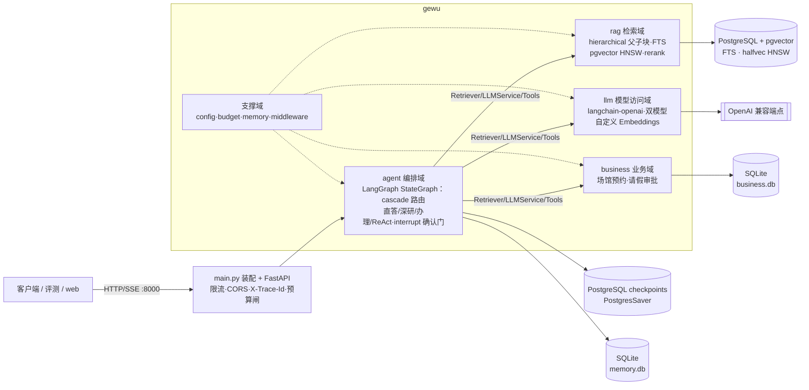

# 格物 Gewu

> **一个 agent 开发方案的实践对比学习项目。** 以「高校智能问答与业务执行」为载体场景，
> 把 agent 开发中的关键选型——路由、编排、检索、存储、实现语言、架构形态——做成
> **同一行为规格下可切换、可评测的实现**，用逐题等价证明与指标报告做对比，
> 而不是跟着直觉或博客选型。

[](./.github/workflows/ci.yml)
[](./LICENSE)

**声明**：本项目为个人开源学习与展示项目，采用 **clean-room** 方式独立实现；演示语料为完全虚构的「钱塘大学」合成数据，与任何真实高校、任何闭源商业项目无关。

## 在对比什么

| 对比维度 | 方案 A ↔ 方案 B | 怎么切 | 现状与结论 | 证据 |
| --- | --- | --- | --- | --- |
| 架构形态 | 模块化单体 → 六微服务 → 退役回模块化单体 | 形态迁移 + 26/26 逐题 PARITY | 微服务学习目标达成后有序退役：能力缺口先吸收进单体，再删分布式管道 | [ADR-0009](./docs/ADR/0009-微服务退役与单体模块化.md) · [docs/history/](./docs/history/) · tag `pre-ms-removal` |
| 实现语言 | Python/FastAPI ↔ Go | 行为冻结（PARITY.md）后 clean-room 重写 | 并发取消、确定性、部署面全面受益；重写过程本身修掉 8 个原设计缺陷 | [对照报告](./eval/reports/rewrite-go-vs-python.md) · [go-notes](./docs/go-notes.md) |
| 问题路由 | 级联三级（规则快路径 → 小模型五分类 → 主模型复核）↔ agent-first（三执行策略 + ReAct 自主编排） | `ROUTER_MODE` | 级联缺省；agent-first 配独立 8 题评测集 | [walkthrough/02](./docs/walkthrough/02-routing.md) |
| 任务编排 | 固定 workflow（直答 / 深度研究 / 槽位流程）↔ ReAct 引擎自主组合工具 | `REACT_MODE` | 确定性链路用 workflow，开放组合用 ReAct；写操作一律确认流 fail-closed | [walkthrough/03](./docs/walkthrough/03-acting.md) |
| 分块策略 | flat 单层切分 ↔ hierarchical 父子块（子块命中回父块上下文） | `CHUNK_MODE` | hierarchical 缺省，flat 保留可回退 | [architecture.md](./docs/architecture.md) |
| 会话状态 | 内存 ↔ SQLite 持久化 | `SESSION_STORE` | 持久化缺省，办理中途重启可续办 | [walkthrough/09](./docs/walkthrough/09-durable-execution.md) |

另有 `RERANK_MODE` / `QUERY_REWRITE` 等能力开关（新旧实现并存、缺省值见
[`.env.example`](./.env.example)），所有开关都在全绿门禁下灰度，随时可回退。

## 对比的方法：先冻结规格，再换实现

方案的对比要在同等条件下才有意义，本项目的做法：

1. **先写考卷**：[PARITY.md](./docs/PARITY.md) 冻结 SSE 事件契约与行为语义，
   评测集（28 题主数据集 + 8 题 agent-first）定义「什么是正确」；
2. **新旧并存**：新方案以行为开关接入，缺省走旧路径，全绿门禁下灰度，随时可回退；
3. **同数据集评测留档**：`make eval` 产出 Markdown 指标报告（`eval/reports/`），
   交易型用例断言业务库真实状态，而非文本相似；
4. **结论落文档**：单点决策进 [ADR/](./docs/ADR/)，取舍与边界进
   [walkthrough/](./docs/walkthrough/)，退役形态留档 [docs/history/](./docs/history/) 与 git tag。

## 载体场景

所有对比都跑在同一个场景上：**高校场景的 Deep Research 智能问答与业务执行系统**。
简单事实问题走 RAG 直答；复合政策问题进入深度研究链路（拆解 → 多路检索 → 交叉综合）；
「帮我预约场馆 / 提交请假」走知行执行层（槽位收集 → 确认 → 执行 → 回执）；
范围外问题礼貌拒答。语料是虚构的，但工程问题是真实的：路由歧义、多跳证据、
写操作安全、多轮状态管理——每一项都直接压在要对比的方案选型上。

## 架构：模块化单体（P14 起 Python + LangGraph）

`apps/server`（uvicorn :8000，FastAPI + LangGraph StateGraph 编排）+
PostgreSQL（检索存储 P12 起 + LangGraph checkpointer P14 起）+ SQLite（业务/记忆）。
编排层的历史是本项目「实现对比」叙事的主线：v1 Python/FastAPI 快速验证 →
[PARITY.md](./docs/PARITY.md) 冻结行为后 clean-room 重写 Go（对照报告留档）→
P8 微服务形态退役回单体 → **P14 以同一份 PARITY 全量迁回 Python + LangGraph**
（tag `go-final` 锚定 Go 终态，可随时回看）。原生机制落位：StateGraph 显式建图、
`interrupt()` 承担写操作人工确认、PostgresSaver 会话跨重启续办、custom stream
writer 对接既有 SSE 契约（前端零改动）。决策与证据：
[ADR-0010](./docs/ADR/0010-langgraph-migration.md)、[P14 任务书](./docs/P14-langgraph-migration.md)。


```mermaid
flowchart LR
    C[客户端 / 评测 / web] -->|HTTP/SSE :8000| API[main.py 装配 + FastAPI<br/>限流·CORS·X-Trace-Id·预算闸]

    subgraph gewu
        AGENT[agent 编排域<br/>LangGraph StateGraph：cascade 路由<br/>直答/深研/办理/ReAct·interrupt 确认门]
        RAG[rag 检索域<br/>hierarchical 父子块·FTS<br/>pgvector HNSW·rerank]
        LLM[llm 模型访问域<br/>langchain-openai·双模型<br/>自定义 Embeddings]
        BIZ[business 业务域<br/>场馆预约·请假审批]
        SUP[支撑域<br/>config·budget·memory·middleware]
    end

    API --> AGENT
    AGENT -->|Retriever/LLMService/Tools| RAG & LLM & BIZ
    RAG --> DB[(PostgreSQL + pgvector<br/>FTS · halfvec HNSW)]
    AGENT --> DB2[(PostgreSQL checkpoints<br/>PostgresSaver)]
    AGENT --> DB3[(SQLite<br/>memory.db)]
    BIZ --> DB4[(SQLite<br/>business.db)]
    LLM --> EXT[[OpenAI 兼容端点]]
    SUP -.-> AGENT & RAG & LLM & BIZ
```

**依赖规则**（`make lint-arch` 零依赖守护）：`agent → rag/llm/business`（经注入接口）；
检索/模型/业务域反向禁止 import 编排域；业务系统只能经 `agent.tools`（权限矩阵单一出口）
触达；支撑域不 import 任何业务域；`main.py` 只做装配（app.py 为可测试的装配工厂）。

模块地图与设计决策详见 [docs/architecture.md](./docs/architecture.md)。

## 实现语言的两次对比（Python → Go → Python+LangGraph）

这是本项目「先冻结规格，再换实现」方法最完整的两次实践。v1 用 Python（FastAPI）
快速验证产品形态后，行为冻结（[PARITY.md](./docs/PARITY.md)）整体重写为 Go，收获了：

- **并发模型**：SSE 每连接一 goroutine，`context` 取消可以一路传播到上游 LLM 流——
  客户端断开即刻停止烧 token（Python 版里 openai SDK 的阻塞调用感知不到 uvicorn 连接关闭）；
- **确定性**：BM25/RRF 平局次序、事件 JSON 键序在 Python 里依赖 dict/set 的实现细节，
  Go 版全部构造性保证（[go-notes §6](./docs/go-notes.md)）；
- **部署面**：单二进制（纯 Go SQLite，免 CGO），冷启动 ~50ms、空载内存 ~18MB（Python 版 ~1.2s / ~95MB）；
- **重构本身是验证**：以 PARITY.md 为唯一行为规格做 clean-room 对照，同数据集逐题对比
  （[对照报告](./eval/reports/rewrite-go-vs-python.md)），重写过程修掉 8 个原设计缺陷
  （[go-notes §10](./docs/go-notes.md)）。

P14 再度以同一份 PARITY 迁回 Python + LangGraph（动机：图编排显式化、原生
interrupt 确认流、checkpointer 会话持久化——手写骨架验证过原理后换框架工程化）。
两次迁移的对照报告都留档 `eval/reports/`；Go 时代终态锚定在 git tag `go-final`。

评测客户端仍是纯标准库 Python（`eval/run_eval.py`）——评测与被测实现
跨语言隔离，契约靠 HTTP/SSE 而不是共享代码。

## 核心特性

| 特性 | 说明 |
| --- | --- |
| 三层级联路由 | L0 规则快路径（明确办理指令零 LLM）→ L1 小模型五分类 → L2 主模型复核低置信；`mode=react` 走 ReAct 自主组合工具（P14 起 agent-first 随 triage 退役，结论留档） |
| 混合检索 | PG 原生 FTS（中文二元语法分词下沉 SQL 侧，零分词依赖）+ pgvector halfvec HNSW 向量，RRF 融合；**父子块**层级切分（子块命中回父块上下文）；LLM 精排 rerank 可开关；读写收口为存储函数（P12 起，[迁移对账](./docs/P12-storage-backend.md)） |
| 查询改写与上下文补全 | 多轮指代消解（"那第二条呢"）在路由前补全，贯通路由与检索两个环节 |
| Deep Research | 子问题拆解 → 多路检索 → 证据跨子问题去重 → 交叉综合，全程 trace 可视 |
| 知行执行层 | mock 业务系统（场馆预约/请假审批）：槽位收集、多轮澄清、**LangGraph interrupt() 写操作确认流**、回执、冲突恢复；**PostgresSaver checkpointer 持久化，服务重启可续办** |
| 长期记忆 | episodic（会话原文）+ fact（结构化事实抽取）双库，注入 prompt 参与补全与作答 |
| 权限矩阵 | 学生/辅导员角色，越权在工具层单一出口拦截 |
| 确定性日期解析 | 「明天 / 下周三 / 9月2日 / 请三天假」由代码换算，LLM 只负责找表述，杜绝日期算错 |
| 引用与拒答 | 每条回答标注 `[n]` 引用来源；证据不足时明确声明"未找到依据" |
| 离线评测 | 28 题主数据集 + 8 题 agent-first 数据集：单轮 + **多轮交易型**（断言业务库真实状态），一键产出 Markdown 指标报告 |
| 成本与观测 | 按 IP 固定窗口限流 + 每日 token 预算（持久化、跨重启）；X-Trace-Id 贯穿响应头 |
| 模型分层 | 主答案 glm-5.3；路由/拆解/槽位抽取/查询改写/精排等辅助调用走 glm-5.3-flash |
| 模型无关 | 任意 OpenAI 兼容端点（智谱 / DeepSeek / OpenAI / vLLM），改环境变量即切换 |

## 快速开始

前置：Python 3.11+（uv 管理依赖）、Node 18+（前端）。

```bash
# 1. 配置模型（P6 起强制有 key 启动）
cp .env.example .env   # 填入 LLM_API_KEY / EMBED_API_KEY 等

# 2. 起检索存储 PG（优先 docker compose；宿主 Homebrew PG 自动回退——多项目
#    共享 postmaster 场景见下）
make pg-up

# 3. 同步依赖并启动 API :8000
make install
make run

# 4. 前端 :3100（对话 / 对比实验台 / 控制台 三视图）
make install-web && make dev-web
```

**共享宿主 postmaster 的建库建号模板**（多项目共用一个 PG 实例、每项目独立
database + 角色，以管理员执行一次）：

```sql
CREATE ROLE gewu LOGIN PASSWORD 'gewu';          -- 应用账号，非 superuser
CREATE DATABASE gewu OWNER gewu;
CREATE DATABASE gewu_test OWNER gewu;            -- 测试库（make test 会清库）
REVOKE ALL ON DATABASE gewu, gewu_test FROM PUBLIC;  -- 数据/连接权限隔离
\c gewu      CREATE EXTENSION vector;
\c gewu_test CREATE EXTENSION vector;
```

实例端口与缺省（5433）不同时（如 brew services 默认 5432），在 `.env` 覆盖
`PG_DSN` 即可。

打开 http://localhost:3100 即可对话。**对比实验台**（/compare）同题并发
`mode=auto`（级联 workflow）与 `mode=react`（ReAct agent）双流并排——本项目
「方案对比」卖点的现场演示入口；**控制台**（/console）看业务台账、检索调试、
语料与服务健康。设计见 [docs/P11-web-demo.md](./docs/P11-web-demo.md)。

**检索调试**（不经模型直接看命中）：

```bash
curl -s localhost:8000/api/search -H 'Content-Type: application/json' \
  -d '{"query": "转专业绩点要求", "k": 3}' | python3 -m json.tool
```

## 评测

```bash
make run &                     # 先起服务（RATE_LIMIT_PER_MINUTE=600 建议值）
make eval                      # 28 题主数据集 → eval/reports/report-*.md
# agent-first 8 题（ReAct 自主编排链路）：
make run &
python3 eval/run_eval.py --dataset eval/dataset-agent.jsonl --mode react --tag agent
python3 eval/run_eval.py --dataset eval/dataset-agent.jsonl --tag agent-first
```

指标：通过率 / 关键词命中 / 引用召回 / 分类型延迟；交易型用例为多轮对话，断言业务库真实状态
（预约与请假单、审批层级、冲突恢复、权限拦截）。主数据集 28 题（factual 9 / multi_hop 8 /
refusal 3 / transaction 7 / hybrid 1），数据在 [eval/dataset.jsonl](./eval/dataset.jsonl)，欢迎扩充。

## 语料替换

`data/corpus/*.md` 为虚构「钱塘大学」的政策文档（带 `title/source/updated` frontmatter）。
把文件换成任意公开语料（如某校官网通知）后重新入库即完成知识库切换，其余部分零改动（入库 CLI 随语料工程线排期，当前经 rag.Store.upsert_doc 写入）。

## API 一览

| 方法 | 路径 | 说明 |
| --- | --- | --- |
| POST | `/api/chat` | SSE 流式问答（`question` + `mode` + `session_id` + `role`；响应头 `X-Trace-Id`） |
| POST | `/api/search` | 调试：直接查看混合检索命中 |
| GET | `/api/docs` | 已入库文档列表 |
| GET | `/api/health` | 服务状态 / LLM 与向量开关 / 预算用量 |
| POST | `/api/business/reset` | 清空 mock 业务数据（演示/评测用） |
| GET | `/api/business/overview` | 调试：当前预约与请假单 |

SSE 事件契约（route / status / step / answer_delta / citations / slot_question /
pending_action / action_result / error / done）以 [PARITY.md §3](./docs/PARITY.md) 为准。

## 部署

```bash
make build && ./bin/gewu-api          # 宿主直跑（推荐）
# 或前端容器化：docker compose up -d --build web（API 单体宿主运行 :8000）
```

生产环境注意：Nginx 反代时关闭 SSE 缓冲（后端已下发 `X-Accel-Buffering: no`）；限流中间件取
`X-Forwarded-For` 首段作为客户端 IP，请确保代理层透传。

## 文档地图

| 想看什么 | 去哪 |
| --- | --- |
| 模块地图与依赖规则 | [docs/architecture.md](./docs/architecture.md) |
| 设计讲解系列：链路 / 路由 / 执行 / 记忆 / 工程防线 / 演进史（9 篇，含取舍与已知短板） | [docs/walkthrough/](./docs/walkthrough/) |
| 单点决策记录（9 篇） | [docs/ADR/](./docs/ADR/) |
| 行为规格与 SSE 事件契约 | [docs/PARITY.md](./docs/PARITY.md) |
| 历史形态（微服务时代） | [docs/history/](./docs/history/) |
| 前端展示台：对话 / 对比实验 / 控制台（SPEC + 验收记录） | [docs/P11-web-demo.md](./docs/P11-web-demo.md) |
| 路线图与进行中的实验 | [docs/roadmap.md](./docs/roadmap.md) |

## License

MIT
