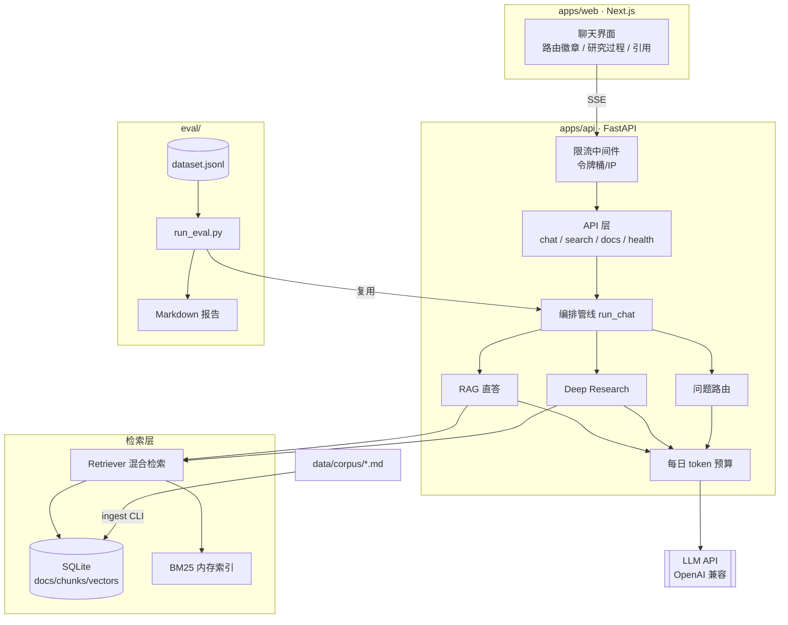
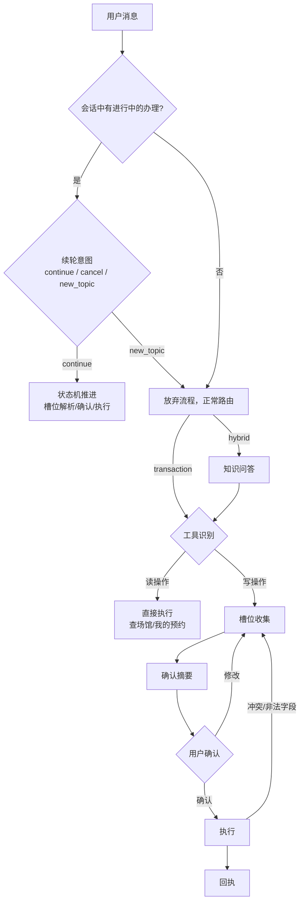

# 架构设计

## 总览

## 一次「深度研究」问答的完整流程

1. **路由**：LLM 按提示词将问题分类为 `factual / research / refusal`（结构化 JSON 输出）；失败或无 key 时降级为启发式（长度 + 并列连词信号）。
2. **拆解**：LLM 把复合问题拆成 2~4 个自包含子问题，消除指代（"我挂过科"→"学籍预警与不及格课程处理规定"）。
3. **多路检索**：每个子问题独立走混合检索（各取 top5），命中标题以 `step` 事件推给前端。
4. **证据聚合**：跨子问题按 chunk_id 去重，最多保留 12 条（控制上下文长度），统一编号。
5. **交叉综合**：LLM 只依据编号证据作答，每个事实点标注 `[n]`；证据不足处明确声明；冲突处指出并给出来源。
6. **事件流**：全过程为 `route → status → step* → answer_delta* → citations → done` 的 SSE 事件序列，前端逐类渲染，评测端复用同一管线。

## 设计决策问答

### 为什么自研编排而不用 LangChain / LangGraph？

本项目的问题形态是"路由 + 两级管线"，不涉及复杂图状态与人工介入。自研 ~400 行编排代码换来：零重依赖、事件流完全可控（SSE 每个环节可插桩）、评测可直连管线内部。若未来加入多轮上下文与人工确认节点，LangGraph 的 checkpoint 能力才会体现出价值——这是明确的演进边界，而非不会用。

### 为什么 BM25 用字符二元语法而不是分词？

校园政策文本专有名词密度高（"推免""体测""学分认定"），通用分词器会把它们切碎；字符二元语法对这类词天然友好，且免去 jieba 等依赖与词表维护。BM25 与向量检索 RRF 融合后，字面精确匹配与语义泛化互补——GPA、日期、政策编号这类**必须精确**的信息由 BM25 兜底。

### 为什么不用向量数据库？

语料规模千级 chunk，SQLite + 内存暴力余弦延迟在毫秒级。外部向量库会显著增加部署复杂度，违背"clone 即跑"的目标。`Store.vector_search` 是唯一接触向量存储的代码，替换为 Qdrant/Milvus 只影响该函数与入库写入。

### 引用与拒答怎么保证不是形式主义？

- 检索为空 → 固定话术"知识库中未找到相关资料"，不进入生成；
- 生成提示词强制"资料不足处必须声明"，评测集的引用召回指标（expected_docs ∩ 实际引用）持续监督；
- 拒答是路由的三分类之一，评测集含 3 道范围外问题验证不会过度拒答校园问题。

### 成本防线如何设计？

两层：入口处按 IP 令牌桶限流（`RateLimitMiddleware`，默认 20 次/分钟）；LLM 调用前检查每日 token 预算（`data/usage.json` 持久化，跨重启有效，默认 200 万/天）。流式响应无法拿到精确 usage，按字符数/2 保守估算入账。

### 模型如何切换？

所有模型调用收敛在 `app/llm.py`，走 OpenAI 兼容协议。改 `LLM_BASE_URL / LLM_MODEL / LLM_SMALL_MODEL / EMBED_MODEL` 环境变量即可在智谱、DeepSeek、OpenAI、本地 vLLM 之间切换；评测报告会记录当次使用的模型，保证指标可比。

**模型分层**：辅助调用（问题路由、子问题拆解、槽位抽取、续轮意图、查询改写）都是小输入小输出的分类/抽取任务，走 `LLM_SMALL_MODEL`（glm-5.3-flash，单次 ~1s）；只有最终答案生成走主模型。分层后直答链路延迟从 28s 降到 5s，且辅助调用占比高，token 成本同步大幅下降。

---

## 知行执行层（v2）

「格物」负责让学生知道（信息问答），「知行」负责让学生办成（业务执行）。v2 在五分类路由下新增 transaction / hybrid 两条链路：

### 设计决策问答（执行层）

**为什么写操作必须确认，读操作不用？** 答错话只是尴尬，执行错动作是事故。确认流（摘要 → 确认 → 执行 → 回执）是幻觉防线在执行场景的对等物；读操作无副作用，确认只会增加摩擦。

**为什么日期换算不用 LLM？** 「下周三到底是哪天」这类换算 LLM 极易算错。分工是：LLM 负责"从句子里找出日期表述"，`dates.py` 用确定性规则换算（含中文数字天数「请三天假」、周几、下周一等），并有独立单测。LLM 输出的任何日期都会再过一遍这个解析器归一化。

**权限为什么放在工具层而不是业务系统？** 业务系统（mock）保持对角色无感知，权限判定收敛在 `tools.py` 单一出口——agent 的任何路径（路由、LLM 选择工具、恢复流程）都绕不过这道闸。越权尝试返回明确的拒绝文案，评测集里专门有学生调辅导员工具的用例。

**执行失败怎么处理？** 失败不是终点而是流程的一部分：时段冲突时业务系统返回当日可选项，agent 重新追问该字段；日期非法同理。字段级错误带 `field` 标记，状态机只回退对应槽位，已收集的其他信息保留。

**多轮会话状态放在哪？** 内存 `SessionStore`（TTL 30 分钟），以 `session_id` 隔离。续轮消息先经过意图判定（继续 / 取消 / 切话题），切话题自动放弃流程——用户不会被困在表单里。持久化在 roadmap 中。

**交易场景怎么评测？** 评测集的多轮用例直接驱动完整对话，断言对象是**业务库的真实状态**（预约单、请假单、审批层级、冲突是否恢复、权限是否拦截），而非文本相似——比"答案里包含 XX 字样"可信得多。无 LLM key 时整条链路走确定性解析，全部用例可离线跑通。
