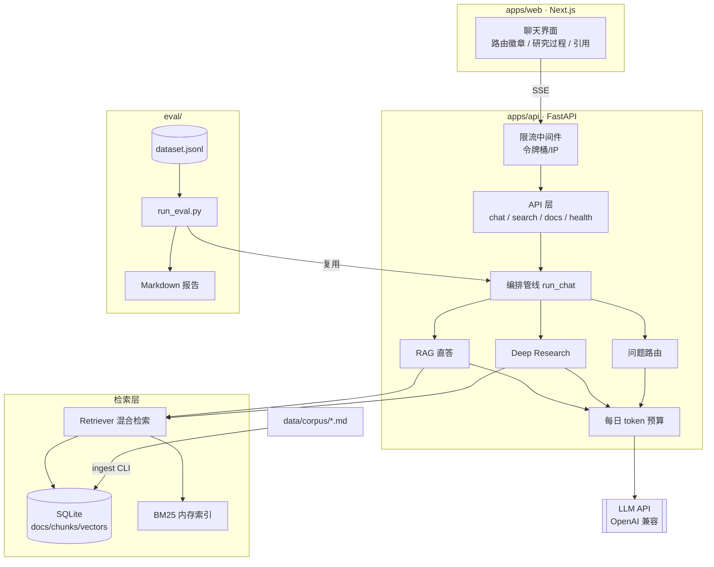

# 架构设计

## 总览

## 一次「深度研究」问答的完整流程

1. **路由**：LLM 按提示词将问题分类为 `factual / research / refusal`（结构化 JSON 输出）；失败或无 key 时降级为启发式（长度 + 并列连词信号）。
2. **拆解**：LLM 把复合问题拆成 2~4 个自包含子问题，消除指代（"我挂过科"→"学籍预警与不及格课程处理规定"）。
3. **多路检索**：每个子问题独立走混合检索（各取 top5），命中标题以 `step` 事件推给前端。
4. **证据聚合**：跨子问题按 chunk_id 去重，最多保留 12 条（控制上下文长度），统一编号。
5. **交叉综合**：LLM 只依据编号证据作答，每个事实点标注 `[n]`；证据不足处明确声明；冲突处指出并给出来源。
6. **事件流**：全过程为 `route → status → step* → answer_delta* → citations → done` 的 SSE 事件序列，前端逐类渲染，评测端复用同一管线。

## 设计决策问答

### 为什么自研编排而不用 LangChain / LangGraph？

本项目的问题形态是"路由 + 两级管线"，不涉及复杂图状态与人工介入。自研 ~400 行编排代码换来：零重依赖、事件流完全可控（SSE 每个环节可插桩）、评测可直连管线内部。若未来加入多轮上下文与人工确认节点，LangGraph 的 checkpoint 能力才会体现出价值——这是明确的演进边界，而非不会用。

### 为什么 BM25 用字符二元语法而不是分词？

校园政策文本专有名词密度高（"推免""体测""学分认定"），通用分词器会把它们切碎；字符二元语法对这类词天然友好，且免去 jieba 等依赖与词表维护。BM25 与向量检索 RRF 融合后，字面精确匹配与语义泛化互补——GPA、日期、政策编号这类**必须精确**的信息由 BM25 兜底。

### 为什么不用向量数据库？

语料规模千级 chunk，SQLite + 内存暴力余弦延迟在毫秒级。外部向量库会显著增加部署复杂度，违背"clone 即跑"的目标。`Store.vector_search` 是唯一接触向量存储的代码，替换为 Qdrant/Milvus 只影响该函数与入库写入。

### 引用与拒答怎么保证不是形式主义？

- 检索为空 → 固定话术"知识库中未找到相关资料"，不进入生成；
- 生成提示词强制"资料不足处必须声明"，评测集的引用召回指标（expected_docs ∩ 实际引用）持续监督；
- 拒答是路由的三分类之一，评测集含 3 道范围外问题验证不会过度拒答校园问题。

### 成本防线如何设计？

两层：入口处按 IP 令牌桶限流（`RateLimitMiddleware`，默认 20 次/分钟）；LLM 调用前检查每日 token 预算（`data/usage.json` 持久化，跨重启有效，默认 200 万/天）。流式响应无法拿到精确 usage，按字符数/2 保守估算入账。

### 模型如何切换？

所有模型调用收敛在 `app/llm.py`，走 OpenAI 兼容协议。改 `LLM_BASE_URL / LLM_MODEL / EMBED_MODEL` 三个环境变量即可在智谱、DeepSeek、OpenAI、本地 vLLM 之间切换；评测报告会记录当次使用的模型，保证指标可比。
