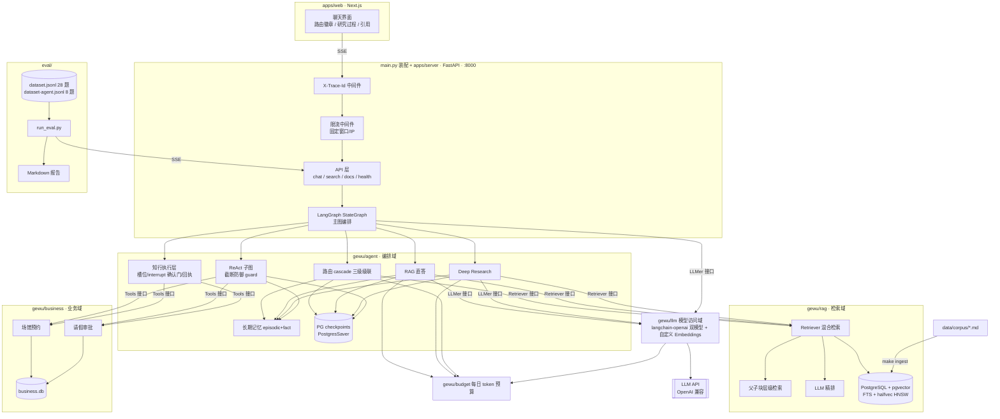
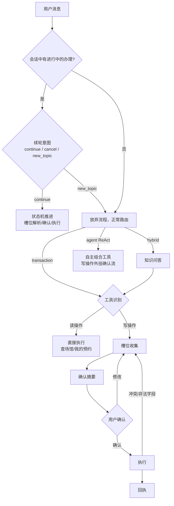

# 架构设计（模块化单体 · P14：Python + LangGraph）

## 总览

```mermaid
flowchart TB
    subgraph Web[apps/web · Next.js]
        UI[聊天界面<br/>路由徽章 / 研究过程 / 引用]
    end
    subgraph API[main.py 装配 + apps/server · FastAPI · :8000]
        TR[X-Trace-Id 中间件]
        RL[限流中间件<br/>固定窗口/IP]
        EP[API 层<br/>chat / search / docs / health]
        PIPE[LangGraph StateGraph<br/>主图编排]
    end
    subgraph AGENT[gewu/agent · 编排域]
        ROUTE[路由 cascade 三级级联]
        DIRECT[RAG 直答]
        RES[Deep Research]
        REACT[ReAct 子图<br/>截断防御 guard]
        TX[知行执行层<br/>槽位/interrupt 确认门/回执]
        MEM[长期记忆 episodic+fact]
        SESS[(PG checkpoints<br/>PostgresSaver)]
    end
    subgraph RAGD[gewu/rag · 检索域]
        RET[Retriever 混合检索]
        HIE[父子块层级检索]
        RR[LLM 精排]
        ST[(PostgreSQL + pgvector<br/>FTS + halfvec HNSW)]
    end
    subgraph BIZ[gewu/business · 业务域]
        BOOK[场馆预约]
        LEAVE[请假审批]
        BT[(business.db)]
    end
    LLMD[gewu/llm 模型访问域<br/>langchain-openai 双模型 + 自定义 Embeddings]
    BUD[gewu/budget 每日 token 预算]
    LLM[[LLM API<br/>OpenAI 兼容]]
    CORPUS[data/corpus/*.md]

    UI -->|SSE| TR --> RL --> EP --> PIPE
    PIPE --> ROUTE & DIRECT & RES & REACT & TX
    ROUTE & DIRECT & RES -->|Retriever 接口| RET
    RET --> HIE & RR & ST
    REACT & TX -->|Tools 接口| BOOK & LEAVE
    PIPE & DIRECT & RES -->|LLMer 接口| LLMD --> LLM
    ROUTE & DIRECT & RES & REACT --> MEM & SESS
    DIRECT & RES & ROUTE & LLMD --> BUD
    BOOK & LEAVE --> BT
    CORPUS -->|make ingest| ST

    subgraph EVAL[eval/]
        DS[(dataset.jsonl 28 题<br/>dataset-agent.jsonl 8 题)] --> RUN[run_eval.py] -->|SSE| EP
        RUN --> REP[Markdown 报告]
    end
```

## 模块地图与依赖规则（lint 守护）

| 域 | 包 | 职责 |
| --- | --- | --- |
| 接口 | `gewu/api` | HTTP 层：路由注册、请求校验、SSE 事件写出、interrupt/resume 桥（thread 停在确认门时以用户消息 resume）——只做 HTTP 语义，不含业务逻辑 |
| 编排 | `gewu/agent` | graph（LangGraph 主图：entry_gate 会话优先 → resolve 指代补全 → route → 六链路分发；done 由 SSE 端点单点发射）、react（ReAct 子图 + 截断防御：finish_reason=length 且带 tool_calls 时一律不执行——合成错误 observation 回填交模型重发，Pi 式修复）、tx（知行执行层：槽位/确认/恢复）、research（深研）、tools（权限矩阵） |
| 路由 | `gewu/agent/routing` | cascade 三级级联（L0 规则/L1 flash 概率分布双阈值+margin/L2 主模型灰度兜底）+ 启发式降级；triage/classic 随 P14 Q6 退役（结论留档 walkthrough/02） |
| 检索 | `gewu/rag` | hierarchical（父子块检索）、关键词检索（PG 原生 FTS，中文二元语法分词下沉 SQL 侧）、pgvector halfvec HNSW 向量检索、RRF 融合、rerank；读写收口为存储函数（rag_tokenize / rag_fts_search / rag_upsert_doc，schema.py 为 DDL 唯一权威） |
| 模型访问 | `gewu/llm` | ChatOpenAI 工厂（主/小双模型 + thinking 开关）+ 自定义 GewuEmbeddings（text 批量 / ark_multimodal 逐条并发）；finish_reason 与 usage 三元组解析（P10 契约 Python 侧） |
| 业务 | `gewu/business` | mock 校内业务：场馆预约（容量/冲突/限额）+ 请假审批（分级） |
| 支撑 | `gewu/config` `budget` `memory` `middleware` `dates` | 配置、token 预算（usage_metadata 精确入账）、长期记忆（fact+episodic SQLite）、限流与 trace-id、确定性中文日期 |
| 装配 | `apps/server/main.py`（工厂 `gewu/api/app.py`） | 组装根：env、依赖注入、PostgresSaver checkpointer——**不含 HTTP 与业务逻辑** |

依赖规则（`make lint-arch` 断言，违规即非零退出，CI 门禁）：

1. `api → agent/rag/business（只读展示）/支撑域`，禁止直接 import llm（接口层不得绕过编排调模型）；
2. `agent → routing/rag/llm/business`，rag/llm/business 只经接口（Retriever / LLMer / Tools）；
3. `routing` 只依赖 llm——路由域是叶子，不得反向依赖编排/检索/业务/接口层；
4. `rag / llm / business ↛ agent`（反向禁止——编排域是唯一的上游）；
5. `business ↛ rag / agent`（业务系统只经 `agent.Tools` 权限矩阵单一出口被触达）；
6. 支撑域可被任何域用，但不 import 业务域；
7. `apps/server/main.py` 只 import `gewu.api`/`gewu.config`（装配一线）。

lint 实现为 `scripts/lint-arch.sh`（go list + grep，零依赖）；带健康检查：go list
本身失败（编译错误 / import cycle）时报错而非静默通过；已用注入违规 import 的方式
反向验证过拦截有效性。

## 双链路：cascade（默认）与 agent-first（灰度）

同一条 `RunChat` 管线，两个路由器按 `ROUTER_MODE` 切换：

- **cascade（默认）**：L0 规则快路径（明确办理指令零 LLM）→ L1 小模型五分类
  （factual/research/transaction/hybrid/refusal）→ 低置信 L2 主模型复核；refusal
  判定带安全网（办理强动词 / 校园领域词与拒答矛盾时强制升级复核）。
- **agent-first（灰度）**：分类空间塌缩为三条**执行策略**——refusal（固定拒答）/
  direct（一次检索直答）/ agent（ReAct 引擎自主组合工具，写操作外挂确认流）；
  低置信 fail-open 到 agent 而不是猜错窄路。

两条链路复用同一套检索、执行层、事件契约与评测集；`mode=react` 显式指定也走 ReAct。

## 行为开关（灰度与回退）

| 开关 | 取值（缺省在前） | 说明 |
| --- | --- | --- |
| `ROUTER_MODE` | cascade / classic / agent-first | 级联路由 / 旧单次分类 / 三策略+ReAct |
| `CHUNK_MODE` | hierarchical / flat | 父子块 / 旧单层切分 |
| `RERANK_MODE` | on / off | LLM 精排 |
| `REACT_MODE` | off / on | 路径不定的办理问题自动转 ReAct |
| `QUERY_REWRITE` | on / off | 多轮指代消解补全 |
| `SESSION_STORE` | sqlite / memory | 办理会话持久化（data/sessions.db，重启续办）/ 进程内 map |

检索存储 P12 起为 **PostgreSQL + pgvector**（生产形态对齐：一个库同时当关系库和向量库，
后续 business/memory/sessions 按同一底座逐库评估迁入）。此前为 SQLite 自管双索引
（进程内 BM25 + 暴力余弦）——P8-2 曾以"量级未触发"决策不换后端，P12 推翻该决策
（动机与对账见 [docs/P12-storage-backend.md](./P12-storage-backend.md) 与
eval/reports/migration-p12-pg.md）。专业向量库（Milvus）的触发线不变：chunk 十万级
或需要服务端混排时另立项。

## 一次「深度研究」问答的完整流程

1. **上下文补全**（多轮）：问题命中指代信号词时，先结合会话历史与用户事实补全
   （"那第二条是什么"→"转专业绩点要求是什么"），补全后贯通路由与检索两个环节。
2. **路由**：cascade 级联或 agent-first 三策略（见上）。
3. **拆解**：LLM 把复合问题拆成 2~4 个自包含子问题，消除指代。
4. **多路检索**：每个子问题独立走混合检索（FTS 关键词 + 向量余弦 + RRF + LLM 精排），命中以 `step` 事件推送。
5. **证据聚合**：跨子问题去重，最多保留 12 条，统一编号。
6. **交叉综合**：LLM 只依据编号证据作答，事实点标注 `[n]`；证据不足明确声明。
7. **事件流**：`route → status → step* → answer_delta* → citations → done` 的 SSE 序列，前端逐类渲染，评测端复用同一管线。

## 设计决策问答

### 为什么先自研编排、P14 又迁到 LangGraph？

**自研阶段（P6~P13，Go）**：问题形态是"路由 + 两级管线 + 工具循环"，手写编排换来
零重依赖、事件流完全可控（SSE 每个环节可插桩）、评测可直连管线内部——用它验证了
级联路由、ReAct 循环、截断防御、确认流这些**原理层**的设计，每一个都留了单测与
对照报告。**迁移时机（P14）**：原理验证完成后，框架的工程价值开始大于学习价值——
LangGraph 恰好提供了当时"手写了 300 行"的那些件的原生等价物：StateGraph 显式建图
（路由/管线/循环成为一等公民可视化）、`interrupt()` 人工介入（确认流从自研状态机
变成图原生暂停/恢复）、PostgresSaver checkpointer（会话持久化与续办免费获得）、
custom stream writer（SSE 契约照旧逐环节可插桩）。迁移以 PARITY 为唯一行为规格
（前端零改动、评测同数据集全绿），Go 终态锚定 tag `go-final`——这是本项目
"先冻结规格，再换实现"方法论的第三次实践。决策全文见
[ADR-0010](./ADR/0010-langgraph-migration.md)。

### 为什么关键词检索用字符二元语法而不是分词？

校园政策文本专有名词密度高（"推免""体测""学分认定"），通用分词器会把它们切碎；字符二元语法对这类词天然友好，且免去 jieba 等依赖与词表维护。关键词路与向量检索 RRF 融合后，字面精确匹配与语义泛化互补——GPA、日期、政策编号这类**必须精确**的信息由关键词路兜底。P12 起分词下沉为 PG 侧的 rag_tokenize SQL 函数（入库 tsv 与查询分词同源），Go 侧 Tokenize 保留为参考实现与单测契约。

### 为什么检索存储用 PostgreSQL + pgvector？

P12 起检索栈整体迁 PG（生产形态对齐，动机见 P12 runbook）：一个库同时承担关系存储
（docs/chunks/元数据）与向量（pgvector halfvec HNSW）+ 关键词（tsvector/GIN FTS）
三种检索形态，SQL 元数据过滤（时效性等）成为顺手能力。2048 维向量超出 HNSW 的
2000 维上限，走 halfvec 半精度（官方 >2000 维推荐路径）。业务/记忆/会话三库仍是
SQLite（P13 起逐库评估迁入）；Milvus 触发线不变：chunk 十万级或服务端混排需求。
迁移对账：doc 级 top-5 命中一致率 83%、cascade 28/28，报告留档 eval/reports/。

### 引用与拒答怎么保证不是形式主义？

- 检索为空 → 固定话术"知识库中未找到相关资料"，不进入生成；
- 生成提示词强制"资料不足处必须声明"，评测集的引用召回指标（expected_docs ∩ 实际引用）持续监督；
- 拒答是路由类别之一且带安全网（领域词与拒答矛盾强制复核），评测集含 3 道范围外问题验证不过度拒答。

### 成本防线如何设计？

两层：入口处按 IP 固定窗口限流（默认 600 次/分钟，评测建议值）；chat 入口检查每日
token 预算（`data/usage.json` 持久化，跨重启有效，默认 200 万/天），耗尽 429。P14 起
usage 由 langchain 的 usage_metadata 精确入账（LLMService 统一收口）。

### 模型如何切换与分层？

所有模型调用收敛在 `gewu/llm`（langchain-openai，OpenAI 兼容协议）；改 `LLM_BASE_URL / LLM_MODEL /
LLM_SMALL_MODEL / EMBED_MODEL` 即可切换供应商。**分层**：路由/拆解/槽位抽取/续轮意图/
查询改写/精排等小输入小输出任务走 `LLM_SMALL_MODEL`（单次 ~1s）；只有最终答案与 ReAct
主循环走主模型。分层后直答链路延迟从 28s 降到 5s。

---

## 知行执行层

「格物」负责让学生知道（信息问答），「知行」负责让学生办成（业务执行）。

```mermaid
flowchart TB
    U[用户消息] --> S{会话中有进行中的办理?}
    S -->|是| INT{续轮意图<br/>continue / cancel / new_topic}
    INT -->|continue| ADV[状态机推进<br/>槽位解析/确认/执行]
    INT -->|new_topic| R[放弃流程，正常路由]
    S -->|否| R
    R -->|transaction| T{工具识别}
    R -->|hybrid| K[知识问答] --> T
    R -->|agent ReAct| A[自主组合工具<br/>写操作外挂确认流]
    T -->|读操作| RD[直接执行<br/>查场馆/我的预约]
    T -->|写操作| C1[槽位收集] --> C2[确认摘要] --> C3{用户确认}
    C3 -->|确认| EX[执行] --> OK[回执]
    EX -->|冲突/非法字段| C1
    C3 -->|修改| C1
```

### 设计决策问答（执行层）

**为什么写操作必须确认，读操作不用？** 答错话只是尴尬，执行错动作是事故。确认流（摘要 → 确认 → 执行 → 回执）是幻觉防线在执行场景的对等物；读操作无副作用，确认只会增加摩擦。

**为什么日期换算不用 LLM？** 「下周三到底是哪天」这类换算 LLM 极易算错。分工是：LLM 负责"从句子里找出日期表述"，`gewu/dates` 用确定性规则换算（含中文数字天数「请三天假」、周几、下周一等），并有独立单测。LLM 输出的任何日期都会再过一遍这个解析器归一化。

**权限为什么放在工具层而不是业务系统？** 业务系统（mock）保持对角色无感知，权限判定收敛在 `agent.Tools` 单一出口——agent 的任何路径（路由、LLM 选择工具、恢复流程、ReAct 自主调用）都绕不过这道闸。越权尝试返回明确的拒绝文案，评测集里专门有学生调辅导员工具的用例。

**执行失败怎么处理？** 失败不是终点而是流程的一部分：时段冲突时业务系统返回当日可选项，agent 重新追问该字段；日期非法同理。字段级错误带 `field` 标记，状态机只回退对应槽位，已收集的其他信息保留。

**多轮会话状态放在哪？** `SessionStore` 接口双后端：进程内 map（默认行为不变）与 SQLite
（`SESSION_STORE=sqlite` 缺省启用，P8-1 吸收自微服务形态的能力缺口）。SQLite 版以进程内
map 为运行时真相源、SQLite 做持久化镜像：Open 全量加载、每轮出口 Sync 写透、Clear 同步删库；
TTL 30 分钟语义不变——办理到一半重启服务，同 session_id 续一句话即可接着办。
验证记录：[eval/reports/P8-session-persist.md](../eval/reports/P8-session-persist.md)。

**交易场景怎么评测？** 评测集的多轮用例直接驱动完整对话，断言对象是**业务库的真实状态**（预约单、请假单、审批层级、冲突是否恢复、权限是否拦截），而非文本相似——比"答案里包含 XX 字样"可信得多。无 LLM key 时整条链路走确定性解析，全部用例可离线跑通。
