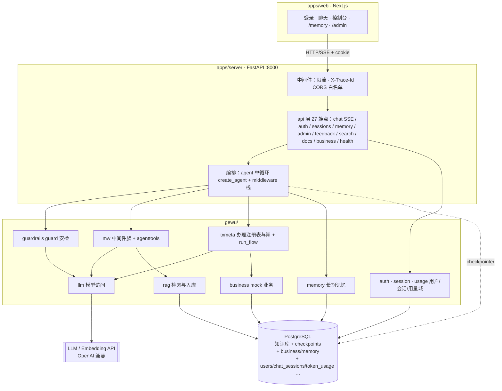

# 01 · 系统总览

「格物」是面向高校场景的校园制度智能问答与业务执行 Agent：事实问题走 RAG 直答、复合政策问题走 Deep Research、办理诉求走确认门执行（摘要 → 确认 → 执行 → 回执）、寒暄自然回应、范围外礼貌拒答——全部收敛在同一条 SSE 事件流下，前端与评测共用同一契约。P31 起生产链路为 **agent-first 单循环唯一形态**（create_agent + middleware 栈，级联固定图全量退役、外壳塌缩，行为语义演进见 [PARITY §0.9](../PARITY.md)）。本文给出系统组成、技术栈、模块地图与依赖规则；各领域的深入拆解见后续各篇。

## 系统组成

gewu 是一个**模块化单体**：FastAPI 服务进程承载全部会话编排与业务逻辑，Next.js 前端静态托管，持久化统一在 PostgreSQL（知识库 + 会话检查点 + 业务台账 + 长期记忆 + 用户/会话/用量/反馈，P21 起 SQLite 全部退役）；LLM 与 Embedding 经 OpenAI 兼容协议访问外部 API。

| 组件 | 位置 | 端口/形态 | 职责 |
| --- | --- | --- | --- |
| server | `apps/server/`（Python 3.12+ / uv） | `:8000` | 主服务：27 端点（7 路由文件）、SSE 流式问答、agent 编排、RAG 检索与入库、业务执行、用户/会话/管理域。装配入口 `main.py` → 工厂 `gewu/api/app.py` |
| web | `apps/web/`（Next.js + shadcn/ui） | dev `:3100` | 五个页面：登录/注册（邀请码）、聊天（chrome-less 布局，含追问 pills/来源 Dialog/赞踩）、控制台、记忆面板（/memory）、管理后台（/admin）；手写 SSE 解析（`lib/api.ts`），对 interrupt 无感知 |
| PG（知识库+检查点） | docker-compose（pgvector 镜像） | `:5433` | 知识库三表（docs/chunks/vectors，FTS + halfvec HNSW）与 LangGraph checkpoints 表族 |
| PG（业务/记忆） | `business.*` / `memory_*` 表 | psycopg pool | mock 业务台账（预约/请假单）与长期记忆（fact/episodic），P21-2 自 SQLite 迁入 |
| PG（用户/运营域） | `users`/`auth_sessions`/`invite_codes`/`chat_sessions`/`token_usage`/`message_feedback` | psycopg pool | P21~P25：用户体系、会话登记、按用户用量账、消息反馈 |
| LLM API | 外部（OpenAI 兼容） | HTTPS | glm-5.3（主模型）+ glm-5.3-flash（小模型）双档；embedding-3（2048 维） |

运行形态刻意保持单一：`make run`（或 `docker compose up`）起全部依赖，`make pg-up` 只拉 PG。没有多进程编排、没有消息队列——这是微服务退役后的刻意选择（见文末）。

## 技术栈清单

| 层 | 选型 | 说明 |
| --- | --- | --- |
| 会话编排 | **LangChain 1.x `create_agent` + middleware**（LangGraph 运行时） | P31 起唯一形态：单循环 + HITL 确认门/压缩/流式 middleware；`mode=react` 为 auto 别名（评测兼容）；主循环见 [05](05-react-agent.md)，形态演进见 [02](02-orchestration-graph.md) |
| Web 框架 | FastAPI + uvicorn | :8000，SSE 流式；装配工厂 `gewu/api/app.py`（可脱离 main 测试） |
| 模型接入 | langchain-openai（ChatOpenAI） | OpenAI 兼容协议，换端点即换供应商；智谱 thinking 私有参数按开关注入 |
| 认证 | argon2-cffi + 服务端 cookie 会话 | argon2id 密码、`gewu_session` httpOnly cookie，见 [11](11-auth.md) |
| 向量/关键词 | PostgreSQL + pgvector（halfvec HNSW + tsvector GIN） | 读写收口存储函数，见 [04](04-rag-retrieval.md) |
| 会话持久化 | LangGraph PostgresSaver | 同一 PG 实例，checkpoints/checkpoint_blobs/checkpoint_writes 表族 |
| 业务/记忆/用户/运营 | psycopg（ConnectionPool，rag.Store 同款） | 见 [07](07-state-persistence.md)/[11](11-auth.md) |
| 工具链 | uv + ruff + pytest + GitHub Actions | CI 双 job（server + web）；本地门禁 make lint / lint-arch / design-lint，见 [09](09-cross-cutting.md) |

## 模块间通信

| 链路 | 协议/机制 | 说明 |
| --- | --- | --- |
| 浏览器 → server | HTTP + **SSE**（`POST /api/chat`） | `data: {json}\n\n` 分帧，UTF-8 原文不转义；十一类事件契约见 [08](08-api-contract.md)；前端经 next rewrites 同源代理 |
| 浏览器 ↔ server（身份） | `gewu_session` cookie（httpOnly, SameSite=Lax, 30d） | 服务端会话表（auth_sessions 存 sha256 摘要），见 [11](11-auth.md) |
| server → PostgreSQL | psycopg3 连接池（psycopg_pool） | 知识库走存储函数（`rag_fts_search`/`rag_upsert_doc`）；checkpointer 要求 autocommit 连接 |
| agent → rag/llm/business | 进程内函数调用 | `Retriever` 依赖最小 Protocol，测试用 Fake 同构替换；运行时对象经工具闭包持有（不进 state，checkpointer msgpack 拒绝），见 [05](05-react-agent.md) |
| server → LLM API | HTTPS（OpenAI 兼容 `/chat/completions`、`/embeddings`） | 双模型缓存分发；用量经 contextvar 归属双写（全局闸 + 个人账），见 [09](09-cross-cutting.md) |

## 总体架构图

## 模块地图与依赖规则

| 域 | 位置（相对 `apps/server/`） | 职责（一句话） |
| --- | --- | --- |
| 接口 | `gewu/api/` | 7 路由文件 27 端点 + SSE 写出 + interrupt/resume 桥 + follow_ups 追发；只做 HTTP 语义 |
| 编排 | `gewu/agent/` | agent 单循环装配（agent.py）、middleware 栈（mw.py：HITL 确认门/压缩/流式/记忆注入）、guard 安检（guardrails.py）、主循环工具集（agenttools.py，含 run_flow）、resume 翻译（resume.py）、追问生成（followups.py）、办理注册表与闸（txmeta.py）、深研（research.py）、工具权限（tools.py）、事件（events.py）、提示词（prompts.py）、SSE 事件流出（emitter.py） |
| 检索 | `gewu/rag/` | 混合检索管线（retrieve.py）、PG 存取（store.py）、DDL 权威（schema.py）、切片策略链（chunker.py）、入库主流程（ingest.py） |
| 模型访问 | `gewu/llm/` | ChatOpenAI 工厂（chat.py）+ 自定义 Embeddings（embed.py）+ 门面（service.py，含 agent_model 工厂与记账口） |
| 业务 | `gewu/business/` | mock 场馆预约 + 请假审批（对角色无感知，权限在工具层） |
| 用户/会话/用量 | `gewu/auth/` · `gewu/session/` · `gewu/usage.py` | 认证三表与守卫（[11](11-auth.md)）、会话登记与反馈表（[07](07-state-persistence.md)）、per-user token 账（[09](09-cross-cutting.md)） |
| 支撑 | `gewu/` 顶层 | config / budget / memory / middleware / dates / jsonx |

**依赖规则**（`make lint-arch`，`scripts/lint-arch.sh` 的 grep 断言零依赖守护）：

1. `api` 路由实现层（routes/chat/sessions/memory/admin/feedback 六文件）禁止直接 import `llm`（app.py 作为装配工厂豁免）；
2. `rag`、`llm`、`business` ↛ `agent`（反向禁止）；三者之间禁止横向 import（经编排层解耦）；
3. `business` 只经 `agent.tools` 的 `call_tool` 单一出口被触达——权限矩阵在这里收敛（未知工具/越权/缺参在进入业务系统前拦截）；
4. 支撑域（memory/budget/middleware/**auth/session/usage**）不 import 业务域（agent/rag/business）；
5. `main.py` 只做装配（仅 import `gewu.api` / `gewu.config`）；
6. **web 侧规则**：`apiFetch` 调用点不得自带 `${API_BASE}`（双拼出非法主机名且请求不出网——2026-10-01 线上会话创建失败事故的根因，lint 挡回归）。

规则原文见 `scripts/lint-arch.sh`；违规即非零退出，进 CI。

## 仓库顶层目录导览

| 目录 | 职责 |
| --- | --- |
| `apps/server/` | 服务端全部代码：`main.py` 装配入口、`ingest_main.py` 入库 CLI、`gewu/` 七域、`scripts/`（smoke_chat 冒烟 / auth_tool 邀请码 CLI）、`tests/`（289 例：单测 + PG 集成 + 契约） |
| `apps/web/` | Next.js 前端六区（SSE 手写解析，对确认门 interrupt 无感知）；设计契约见仓库根 DESIGN.md |
| `docs/` | 本系列（architecture/）+ walkthrough/（作者讲解）+ runbooks/（P 系列任务书）+ ADR/ + research/ + history/ |
| `eval/` | 评测资产：五份数据集、run_eval.py、检索层评测 run_retrieval_eval.py、对照脚本、reports/ 全量留档，见 [10](10-evaluation.md) |
| `scripts/` | lint-arch.sh（依赖守护）等工程脚本 |
| `docker/` + `docker-compose.yml` | PG（pgvector:pg17）与本地依赖编排 |
| `data/` | 运行时产物：usage.json（全局 token 预算）与 archive/（SQLite 退役归档，git 忽略） |

## 为什么是模块化单体

微服务形态（P0~P5）与单体（P8 起）在这个项目里做过完整的实践对比：26/26 逐题 PARITY 迁移到六服务再退役回来，结论是**当前量级下单体 + 清晰依赖规则**是正确形态——进程内函数调用替代 RPC，边界靠 lint 守护而不是网络。历史证据：
[ADR-0009](../ADR/0009-微服务退役与单体模块化.md)、[docs/history/](../history/)、
tag `pre-ms-removal`。

---

下一篇《02 · 编排主图》：单循环形态的完整生命周期（P31 终态）与从级联到单循环的形态演进史。
