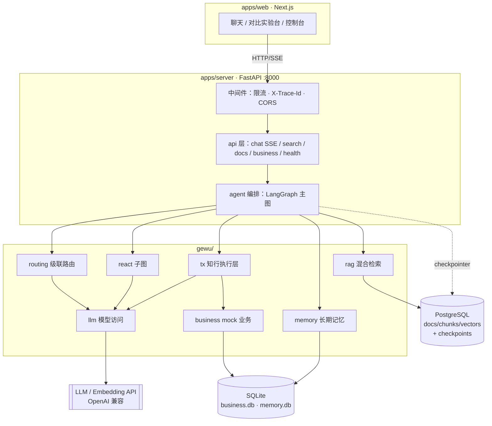

# 01 · 系统总览

「格物」是面向高校场景的校园制度智能问答与业务执行 Agent：事实问题走 RAG 直答、复合政策问题走 Deep Research、办理诉求走知行执行层（槽位 → 确认 → 执行 → 回执）、范围外问题礼貌拒答——全部收敛在同一条 SSE 事件流下，前端与评测共用同一契约。本文给出系统组成、技术栈、模块地图与依赖规则；各领域的深入拆解见后续各篇。

## 系统组成

gewu 是一个**模块化单体**：FastAPI 服务进程承载全部会话编排与业务逻辑，Next.js 前端静态托管，持久化分置在 PostgreSQL（知识库 + 会话检查点）与 SQLite（业务/记忆）两类存储中；LLM 与 Embedding 经 OpenAI 兼容协议访问外部 API。

| 组件 | 位置 | 端口/形态 | 职责 |
| --- | --- | --- | --- |
| server | `apps/server/`（Python 3.12+ / uv） | `:8000` | 主服务：REST API、SSE 流式问答、LangGraph 会话编排、RAG 检索、业务执行。装配入口 `main.py` → 工厂 `gewu/api/app.py` |
| web | `apps/web/`（Next.js） | dev `:3000` | 聊天界面 / 三路线对比实验台 / 控制台；手写 SSE 解析（`lib/api.ts`），对 interrupt 无感知 |
| PostgreSQL | docker-compose（pgvector 镜像） | `:5433` | 知识库三表（docs/chunks/vectors，FTS + halfvec HNSW）与 LangGraph checkpoints 表族，共用一个实例 |
| SQLite | `data/business.db` / `data/memory.db` | 进程内文件 | mock 业务台账（预约/请假单）与长期记忆（fact/episodic），量级未触发迁移 |
| LLM API | 外部（OpenAI 兼容） | HTTPS | glm-5.3（主模型）+ glm-5.3-flash（小模型）双档；embedding-3（2048 维） |

运行形态刻意保持单一：`make run`（或 `docker compose up`）起全部依赖，`make pg-up` 只拉 PG。没有多进程编排、没有消息队列——这是微服务退役后的刻意选择（见文末）。

## 技术栈清单

| 层 | 选型 | 说明 |
| --- | --- | --- |
| 会话编排 | **LangGraph**（StateGraph + interrupt + checkpointer） | P14 起核心；主图见 [02](02-orchestration-graph.md) |
| Web 框架 | FastAPI + uvicorn | :8000，SSE 流式；装配工厂 `gewu/api/app.py`（可脱离 main 测试） |
| 模型接入 | langchain-openai（ChatOpenAI） | OpenAI 兼容协议，换端点即换供应商；智谱 thinking 私有参数按开关注入 |
| 向量/关键词 | PostgreSQL + pgvector（halfvec HNSW + tsvector GIN） | 读写收口存储函数，见 [04](04-rag-retrieval.md) |
| 会话持久化 | LangGraph PostgresSaver | 同一 PG 实例，checkpoints/checkpoint_blobs/checkpoint_writes 表族 |
| 业务/记忆 | sqlite3 标准库（单连接 + 锁） | mock 业务与长期记忆，见 [07](07-state-persistence.md) |
| 工具链 | uv + ruff + pytest + GitHub Actions | CI 双 job（server + web），门禁见 [09](09-cross-cutting.md) |

## 模块间通信

| 链路 | 协议/机制 | 说明 |
| --- | --- | --- |
| 浏览器 → server | HTTP + **SSE**（`POST /api/chat`） | `data: {json}\n\n` 分帧，UTF-8 原文不转义；十类事件契约见 [08](08-api-contract.md) |
| server → PostgreSQL | psycopg3 连接池（psycopg_pool） | 知识库走存储函数（`rag_fts_search`/`rag_upsert_doc`）；checkpointer 要求 autocommit 连接 |
| server → SQLite | 进程内 sqlite3 | business.db 与 memory.db 各自单连接 + threading.Lock |
| agent → rag/llm/business | 进程内函数调用，经 Protocol 接口 | `Retriever` 依赖 `RetrievalStore`/`RagLLM` 最小协议，测试用 Fake 同构替换 |
| 主图 ↔ ReAct 子图 | `config.configurable` 注入 `ReactContext` | 运行时对象（检索器/业务系统/工具表）不能进 state——checkpointer 的 msgpack 序列化会拒绝 |
| server → LLM API | HTTPS（OpenAI 兼容 `/chat/completions`、`/embeddings`） | 双模型缓存分发；用量经 `TokenBudget` 统一入账 |

## 总体架构图

## 模块地图与依赖规则

| 域 | 位置（相对 `apps/server/`） | 职责（一句话） |
| --- | --- | --- |
| 接口 | `gewu/api/` | 6 端点 + SSE 写出 + interrupt/resume 桥；只做 HTTP 语义 |
| 编排 | `gewu/agent/` | 主图（graph.py）、ReAct 子图（react.py）、路由（routing.py）、执行层（tx.py）、深研（research.py）、工具权限（tools.py）、状态（state.py）、事件（events.py）、提示词（prompts.py） |
| 检索 | `gewu/rag/` | 混合检索管线（retrieve.py）、PG 存取（store.py）、DDL 权威（schema.py） |
| 模型访问 | `gewu/llm/` | ChatOpenAI 工厂（chat.py）+ 自定义 Embeddings（embed.py）+ 门面（service.py） |
| 业务 | `gewu/business/` | mock 场馆预约 + 请假审批（对角色无感知，权限在工具层） |
| 支撑 | `gewu/` 顶层 | config / budget / memory / middleware / dates / jsonx |

**依赖规则**（`make lint-arch`，`scripts/lint-arch.sh` 的 grep 断言零依赖守护）：

1. `api`（接口层）→ `agent`/`rag`/`business`/支撑域；路由实现层（routes.py/chat.py）禁止直接 import `llm`（app.py 作为装配工厂豁免）；
2. `rag`、`llm`、`business` ↛ `agent`（反向禁止）；三者之间禁止横向 import（经编排层解耦）；
3. `business` 只经 `agent.tools` 的 `call_tool` 单一出口被触达——权限矩阵在这里收敛（未知工具/越权/缺参在进入业务系统前拦截）；
4. 支撑域（memory/budget/middleware）不 import 业务域；
5. `main.py` 只做装配（仅 import `gewu.api` / `gewu.config`；`app.py` 是可测试的装配工厂，等价于 Go 时代的 `cmd/server/main.go`，享有豁免）。

规则原文见 `scripts/lint-arch.sh` 头部注释；违规即非零退出，进 CI。

## 仓库顶层目录导览

| 目录 | 职责 |
| --- | --- |
| `apps/server/` | 服务端全部代码：`main.py` 装配入口、`gewu/` 六域、`tests/`（单测 + PG 集成 + 契约）、`scripts/smoke_chat.py` 冒烟 |
| `apps/web/` | Next.js 前端（SSE 手写解析，对确认门 interrupt 无感知） |
| `docs/` | 本系列（architecture/）+ walkthrough/（作者讲解）+ runbooks/（P 系列任务书）+ ADR/ + research/ + history/ |
| `eval/` | 评测资产：数据集、run_eval.py、检索对照脚本、reports/ 全量留档，见 [10](10-evaluation.md) |
| `scripts/` | lint-arch.sh（依赖守护）等工程脚本 |
| `docker/` + `docker-compose.yml` | PG（pgvector:pg17）与本地依赖编排 |
| `data/` | 运行时产物：business.db / memory.db / usage.json（git 忽略） |

## 为什么是模块化单体

微服务形态（P0~P5）与单体（P8 起）在这个项目里做过完整的实践对比：26/26 逐题 PARITY 迁移到六服务再退役回来，结论是**当前量级下单体 + 清晰依赖规则**是正确形态——进程内函数调用替代 RPC，边界靠 lint 守护而不是网络。历史证据：
[ADR-0009](../ADR/0009-微服务退役与单体模块化.md)、[docs/history/](../history/)、
tag `pre-ms-removal`。

---

下一篇《02 · 编排主图》深入 `gewu/agent/graph.py`：图结构、共享状态、条件边与一次问答的完整生命周期。
