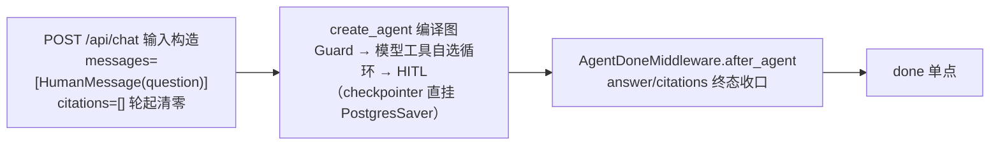
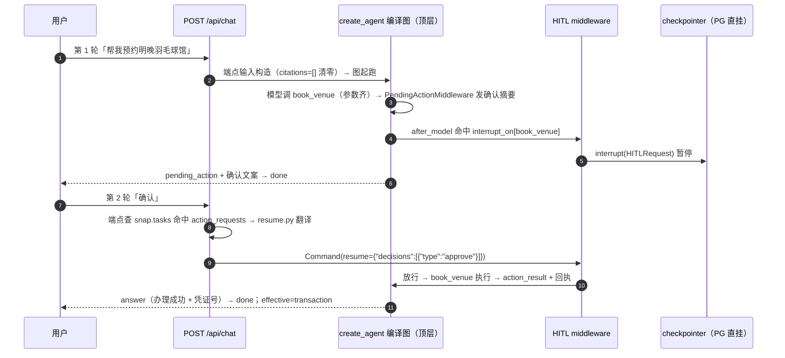

# 02 · 编排主图（LangGraph · P31 单循环终态）

会话编排即 **agent-first 单循环**（LangChain 1.x `create_agent` + middleware 家族）：P31-3 外壳塌缩后，**SSE 端点直调 `create_agent` 编译产物**（`app.state.graph` 即子图本体，checkpointer 直挂），不再有外壳 StateGraph——入口清零/终态收口分别由端点输入构造与 `AgentDoneMiddleware.after_agent` 承接（原 agent_in/agent_done 节点的搬迁去处，见下）。P17 时代的「外壳手写薄图 + classic 对照分支」三件套中，classic 级联路由、direct/research 分支、tx 流程节点已随 P31-2 全量退役（tag `classic-pre-retirement` 留档；评测轨改 agent-only，28 题历史报告见 eval/reports/orchestration-*.md）——前置意图分类在生产路径上不承重（route 只是事后合成的观测标签，不决定链路/工具集/模型档），判断预算全部下沉到动作级代码闸与模型工具自选。

## 图结构

`create_agent(model, tools, middleware=…, state_schema=GewuAgentState, checkpointer=…)` 编译产物即全部——模型-工具循环与中断语义由官方 harness 原生承载（`factory.py` 编译入口 `checkpointer` 原生参数）：



中间件栈（`gewu/agent/agent.py build_agent` 装配；wrap_* 外层=列表在前者，after_* 链执行序=列表倒序）：

```python
graph = create_agent(
    model,                                        # llm.agent_model()（GLM-5.3，温度/上限固化）
    tools=[search_knowledge, parse_date, deep_research, *8个业务工具],   # agenttools.py @tool 化
    middleware=[
        ToolTraceMiddleware(),                    # wrap_tool_call 栈最外层：全工具观测（P27）
        GuardMiddleware(),                        # before_agent：关键词安检闸（P31-1），block 短路
        ModelCallLimitMiddleware(run_limit=8),    # 轮次上限（旧 REACT_MAX_TURNS 等价）
        TruncationDefenseMiddleware(),            # P10 截断防御（Pi 式回填重调）
        UsageRecordMiddleware(llm),               # token 记账 + [llm] per-call 埋点（P24-1）
        AgentPromptMiddleware(memory=memory),     # before_agent 状态行+mem_block 装配；wrap_model_call system prompt
        HumanInTheLoopMiddleware(interrupt_on=写工具四件),   # 写确认门（HITL）
        PendingActionMiddleware(business),        # 确认摘要先于中断发射
        WriteSlotGateMiddleware(business),        # 缺必填参数 → slot_question 引导收集
        ResearchLimitMiddleware(),                # deep_research 单轮限 1 次（flash 代码闸）
        SearchQueryGuardMiddleware(),             # 检索词零重合拼回原话（P24-3 硬防线）
        AgentDoneMiddleware(),                    # after_agent 终态收口（P31-3；倒序先于 RouteEvent 保事件序）
        RouteEventMiddleware(),                   # after_agent：effective route 合成补发
        SummarizationMiddleware(...),             # 上下文压缩（30k 触发、保 20 条，P13 收口）
    ],
    state_schema=GewuAgentState,                  # messages + role/user/session_id/citations/answer/truncated
    checkpointer=checkpointer,                    # P31-3 直挂（PostgresSaver，thread_id=session_id）
)
```

## 关键设计

**控制流 = 模型 + 工具 + 中间件闸**（P31 终局表述）。没有前置意图分类：链路选择、工具选择、模型档全部由主循环模型在动作级决定；代码闸只守下限——HITL 写确认 / 槽位门 / 轮次上限 / 检索词守卫 / 联网日限 / deep_research 限次。软语义（语气、范围外尽力答、拒绝话术）全部交主模型 prompt（AGENT_SYSTEM）。

**意图的两段式表达（纯观测）**：

1. **guard（入口安检，P31-1 关键词闸）**：`in_conversation` 直通放行（会话感知，防办理短回复被安检吃掉）→ `GREETING_RE` 纯问候零成本放行 + provisional route=chitchat（徽章早亮）→ `DANGER_RE` 危险词硬红线 block（GUARD_BLOCK_ANSWER + route=refusal + jump_to=end，话术 21ms 短路零 LLM）→ 其余一律放行。LLM 判定（allow/meta/block + fail-open）随 P31-1 删除——flash 非确定是两次线上实证的掷骰子问题，软寒暄交主循环自然答质量更优。
2. **effective route（出口合成）**：`RouteEventMiddleware.after_agent` 按本轮工具轨迹合成（写工具→transaction/先检索后写→hybrid、deep_research→research、检索→factual、零工具→chitchat），与 provisional 不同则补发。前端徽章随第二次事件覆盖更新——**意图从「路由器猜」变成「工具轨迹说话」，且不决定任何控制流**。

**多轮指代消解（resolve_query 退役后的承接）**：agent 路径模型看 `messages` 历史自行消解指代（P31-2 起）；原 QUERY_REWRITE 补全是增强不是依赖（四门控本就静默回退），与主循环能力冗余，故不保留。

**事件发射（custom stream writer）**。节点/工具/中间件内经 `gewu/agent/emitter.py` 把 PARITY 十类事件送入 custom 流；SSE 端点以 `graph.stream(..., stream_mode="custom")` 消费——P31-3 外壳塌缩后无嵌套图，`subgraphs` 参数摘除（P17 时代子图嵌套形态必须带 `subgraphs=True` 否则事件被父图吞掉的历史坑随形态消失，custom 事件也不再包 (namespace, event) 元组）。

**done 单点**。done 事件（含 reason: completed/max_tokens/error）只在 SSE 端点发射一次；终态 `answer`/`truncated` 从 `graph.get_state(config).values` 读取（agent 链路的 answer 由 agent_done 节点写、interrupt 悬停轮则为当前值）。一次 chat 恰一个 done，与 Go RunChat 单点语义对齐。

## 典型请求链路一：寒暄与危险词（P31 关键词闸）

「你好」→ guard 正则快路径零 LLM 放行（provisional=chitchat）→ 主循环零工具直答（自然寒暄+能力导流）→ effective=chitchat；「怎么代写论文」→ DANGER_RE 命中 → GUARD_BLOCK_ANSWER，**21ms 全链完成、零 LLM 调用**（对照 P27 基线：guard LLM 判定时代首问串行多一跳 small 调用）。

## 典型请求链路二：写操作办理（agent 链路 HITL 确认门）



resume 翻译（`gewu/agent/resume.py`，含 `classify_reply` 续轮意图判定）：用户文本映射为 approve（确认）/reject（取消）/respond（修改=按新参数重发再确认、切话题=放弃办理）——前端零改动照常 POST。**修改绝不走 edit decision**（edit 会替换参数直接执行、跳过二次确认）。跨重启续办：PostgresSaver 直挂编译图落盘 + 重启后 resume 桥照常工作（P17-6 首验、P31-3 直挂形态复验）。

## 终态收口与事件序（P31-3 搬迁对照）

| 外壳节点（P31-2 前） | P31-3 去处 |
| --- | --- |
| `agent_in`（清零 + 状态行） | 端点输入构造（citations=[] 经 reducer 清零、answer_streamed 清零）+ AgentPromptMiddleware.before_agent（「正在理解问题…」状态行） |
| `agent_done`（answer/citations 收口 + 截断标记 + 兜底） | `AgentDoneMiddleware.after_agent`（含 answer/truncated 写回 state 供端点 get_state 终态读取） |
| `resolve_query`（指代补全 + mem_block） | 指代消解交模型 messages 历史；mem_block 装配迁 AgentPromptMiddleware（每 run 从 MemoryStore 取） |
| `build_graph` 外壳 StateGraph | 退役——`app.state.graph` 直指 create_agent 编译产物 |

SSE 事件序不变：… → answer_delta* → route(effective) → citations → done（AgentDoneMiddleware 在栈中位于 RouteEventMiddleware 之前，after_* 链倒序执行保证 route 先于 citations）。`stream_mode="custom"` 不再带 `subgraphs`（无嵌套图，custom 事件不再包 (namespace, event) 元组）。

## 相关文件

| 文件 | 职责 |
| --- | --- |
| `gewu/agent/agent.py` | 主循环装配（create_agent + middleware 栈 + checkpointer 直挂）＝顶层图 |
| `gewu/agent/mw.py` | 自定义中间件族（安检/终态收口/槽位门/确认摘要/route 合成）与 GewuAgentState |
| `gewu/agent/guardrails.py` | GuardMiddleware 关键词安检闸（GREETING_RE/DANGER_RE/会话感知） |
| `gewu/agent/agenttools.py` | 主循环 @tool 工具集（检索/日期/deep_research/8 业务工具） |
| `gewu/agent/txmeta.py` | 办理槽位元数据与确认摘要（slot_meta/FLOW_DEFS/build_confirm） |
| `gewu/agent/research.py` | deep_research 的子问题拆解（plan 纯函数） |
| `gewu/agent/resume.py` | resume 桥翻译（classify_reply + 用户文本 → HITL decisions） |
| `gewu/api/chat.py` | 输入构造（citations 轮起清零）、stream 消费、done 单点、interrupt/resume 桥 |

---
