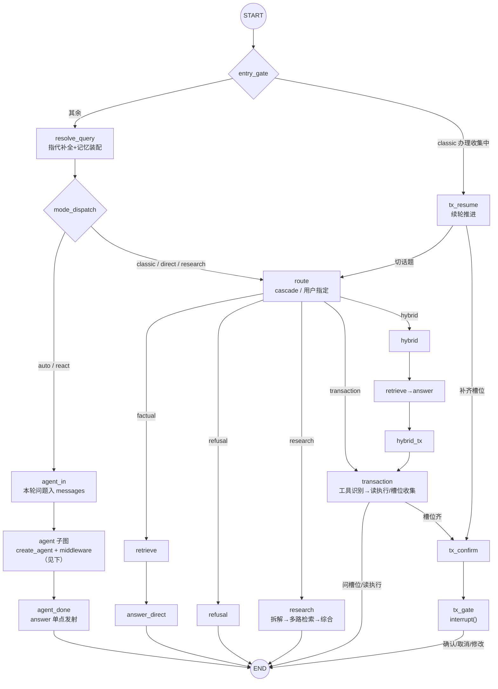
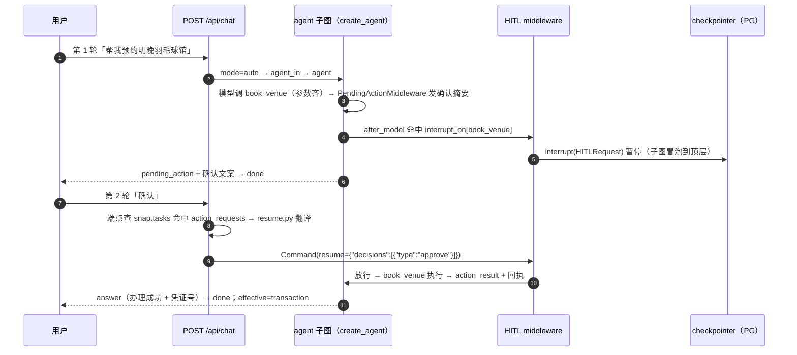

# 02 · 编排主图（LangGraph StateGraph · P17 双底座）

全部会话编排收敛在一张外壳图（`gewu/agent/graph.py` 的 `build_graph`）：入口分派 → 指代补全 → **mode 分派** → 各链路 → 终态。P17 起 `mode=auto/react` 的默认链路是 **agent-first 单循环**（LangChain 1.x `create_agent` + middleware 子图，意图分流靠模型工具自选）；P14~P16 的「cascade 前置路由 → 分支图」**原样保留为 `mode=classic` 实验基线**（论文双底座对照，见 [03](03-routing.md) 与 eval/reports/orchestration-*.md）。图结构即文档——每个节点是一个可单测的函数，每条条件边是一次显式的分支决策。

## 图结构



agent 子图（`gewu/agent/agent.py` 装配，`create_agent` 编译产物直接 `add_node` 嵌套进外壳图；checkpointer 只挂顶层，子图 interrupt 冒泡暂停）：

```python
agent = create_agent(
    model,                                        # llm.agent_model()（GLM-5.3，温度/上限固化）
    tools=[search_knowledge, parse_date, deep_research, *8个业务工具],   # agenttools.py @tool 化
    middleware=[
        GuardMiddleware(llm),                     # before_agent：lenient 安检，block/meta 短路
        ModelCallLimitMiddleware(run_limit=8),    # 轮次上限（旧 REACT_MAX_TURNS 等价）
        TruncationDefenseMiddleware(),            # P10 截断防御（Pi 式回填重调）
        UsageRecordMiddleware(llm),               # token 记账 + [llm] per-call 埋点（P24-1）
        AgentPromptMiddleware(),                  # system prompt + 记忆块
        HumanInTheLoopMiddleware(interrupt_on=写工具四件),   # 写确认门（HITL）
        PendingActionMiddleware(business),        # 确认摘要先于中断发射
        WriteSlotGateMiddleware(business),        # 缺必填参数 → slot_question 引导收集
        ResearchLimitMiddleware(),                # deep_research 单轮限 1 次（flash 代码闸）
        SearchQueryGuardMiddleware(),             # 检索词零重合拼回原话（P24-3 硬防线）
        RouteEventMiddleware(),                   # after_agent：effective route 合成补发
        SummarizationMiddleware(...),             # 上下文压缩（30k 触发、保 20 条，P13 收口）
    ],
    state_schema=GewuAgentState,                  # messages + role/user/mem_block/citations
)
```

## 节点清单

| 节点 | 工厂（graph.py） | 职责 | 主要产出 state |
| --- | --- | --- | --- |
| `resolve_query` | `make_resolve_node` | 多轮指代补全 + 长期记忆块装配（四重门控，单轮零 LLM 成本） | `resolved` / `mem_block` |
| `mode_dispatch` | 函数 | **P17 控制权收口**：auto/react→agent 子图；classic/direct/research→route | — |
| `agent_in` | `make_agent_in_node` | 本轮问题（指代消解后）追加进 `messages` 对话历史 | `messages` |
| `agent` | `build_agent`（agent.py） | agent-first 主循环子图：guard 安检 → 模型工具自选循环 → HITL 确认门 | `messages`/`citations`/interrupt |
| `agent_done` | `make_agent_done_node` | answer 单点发射 + 截断标记 + 轮次耗尽部分结论兜底 | `answer`/`citations`/`truncated` |
| `route` | `make_route_node` | classic/direct/research 的路由决策包（cascade 或 user-specified） | `route` |
| `retrieve` / `answer_direct` / `refusal` / `research` | 同 P14 | classic 链路（原样保留，行为零改动） | 同 P14 |
| `transaction` / `hybrid` / `hybrid_tx` | 同 P14 | classic 的 workflow 办理链路（确定性槽位收集，论文对照基线） | `tx_*` 或 `answer` |
| `tx_confirm` / `tx_gate` / `tx_resume` | 同 P14 | classic 的确认门与续轮（`interrupt()` 原生机制首发地） | `tx_*` |

## 共享状态（ChatState）

图的状态是跨节点传递的唯一媒介（`gewu/agent/state.py`，TypedDict）——**所有跨节点字段必须显式声明**（LangGraph 会静默丢弃 schema 外的 key，这是 P14 调试中两度撞上的坑）：

```python
class ChatState(TypedDict, total=False):
    # 请求上下文
    question: str   # 原始问题（记忆存档/用户可见层用）
    resolved: str   # 补全后问题（贯通路由与检索）
    mode: str       # auto | react(=auto) | classic | direct | research
    role: str
    user: str
    session_id: str
    # agent-first 主循环（P17）：对话历史（add_messages 合并，checkpointer 持久化）
    messages: Annotated[list[BaseMessage], add_messages]
    route: dict     # classic 链路路由决策包
    # 检索与回答
    hits: list[dict]
    citations: list[dict]
    truncated: bool # 主答案撞 max_tokens（done.reason=max_tokens 的依据）
    answer: str     # 本轮累积回答文本（记忆固化用）
    # 办理流程跨轮状态（classic workflow 链路专用；agent 链路办理在 messages 内）
    tx_tool: str
    tx_phase: str
    tx_slots: dict
    tx_last_asked: str
    hybrid_then_tx: bool
    mem_block: str
```

三类字段：**请求上下文**、**回答侧记**（hits/citations/answer/truncated）、**跨轮状态**（classic 的 tx_* 与 agent 的 messages）——由 checkpointer 持久化，跨请求、跨进程存活（见 [07](07-state-persistence.md)）。`thread_id = session_id`：一个会话一个 thread，interrupt 恢复与状态续办都以此为锚。

## 关键设计

**mode_dispatch（控制权收口）**。P17 把「用户要什么」与「图怎么走」解耦：

```python
def mode_dispatch(state: ChatState) -> str:
    return "agent_in" if state["mode"] in ("auto", "react") else "route"
```

auto/react 同一条 agent 主循环（react 是历史评测语义的别名）；classic/direct/research 仍从 route 节点构造决策包并发 route 事件（SSE 契约不变）。`fill_policy`/cascade 全套只服务 classic。

**agent 子图的两段式意图表达**。前置路由取消后，意图分流的判断权转移到两处：

1. **guard（入口安检）**：正则快路径（纯问候零 LLM）→ LLM lenient 判定（allow/meta/block，fail-open）。放行时发 provisional route 事件（layer=guard）；block 吐 `REFUSAL_ANSWER`、meta 就地寒暄，均 `jump_to="end"` 短路。
2. **effective route（出口合成）**：`RouteEventMiddleware.after_agent` 按本轮工具轨迹合成（写工具→transaction/先检索后写→hybrid、deep_research→research、检索→factual、零工具→chitchat），与 provisional 不同则补发。前端徽章随第二次事件覆盖更新——**意图从「路由器猜」变成「工具轨迹说话」**。

**会话感知的 guard**（迁移中撞出来的坑）：对话已在进行中（历史存在 AI 消息，如办理槽位收集轮的短回复「研讨间301」）时 guard 只放行不分类——对应 chat-langchain 的 "NOT a follow-up to previous context" 条款，防多轮回复被安检当寒暄吃掉。

**Command(goto) 跨链跳转**（classic 保留）：hybrid 链「先答政策再办业务」用两次跳转实现；工具未识别时 transaction `Command(goto="retrieve")` 转知识库兜底。跳转与条件边并存的原则：**链路内的固定顺序用边，语义分叉用条件边，跨链复用用 Command**。

**事件发射（custom stream writer + subgraphs 冒泡）**。节点/工具/中间件内经 `gewu/agent/emitter.py` 把 PARITY 十类事件送入 custom 流；SSE 端点以 `graph.stream(..., stream_mode="custom", subgraphs=True)` 消费——**P17 起必须带 `subgraphs=True`**，否则 agent 子图内 middleware/工具的事件被父图吞掉（症状：徽章/状态静默丢失）。

**done 单点**。done 事件（含 reason: completed/max_tokens/error）只在 SSE 端点发射一次；终态 `answer`/`truncated` 从 `graph.get_state(config).values` 读取（agent 链路的 answer 由 agent_done 节点写、interrupt 悬停轮则为当前值）。一次 chat 恰一个 done，与 Go RunChat 单点语义对齐。

## 典型请求链路一：寒暄与范围外（agent 链路，P17 新默认）

「你好」→ guard 正则快路径零 LLM 放行（provisional=chitchat）→ 主循环零工具直答（自然寒暄+能力导流）→ effective=chitchat；「帮我写道歉邮件」→ guard LLM 判 block → `REFUSAL_ANSWER`，全程仅 guard 一跳（~1.2s）。

## 典型请求链路二：写操作办理（agent 链路 HITL 确认门）



resume 翻译（`gewu/agent/resume.py`）：用户文本经 `classify_reply` 映射为 approve（确认）/reject（取消）/respond（修改=按新参数重发再确认、切话题=放弃办理）——前端零改动照常 POST。**修改绝不走 edit decision**（edit 会替换参数直接执行、跳过二次确认）。跨重启续办：PostgresSaver 落盘 + 重启后 resume 桥照常工作（P17-6 真跑验证）。

classic 链路的写办理（transaction workflow → tx_gate）与失败恢复细节见 [06](06-transaction.md)。

## 相关文件

| 文件 | 职责 |
| --- | --- |
| `gewu/agent/graph.py` | 外壳主图装配、classic 全部节点工厂与条件边 |
| `gewu/agent/agent.py` | agent-first 主循环装配（create_agent + middleware 栈） |
| `gewu/agent/mw.py` | 自定义中间件族（截断防御/槽位门/确认摘要/route 合成）与 GewuAgentState |
| `gewu/agent/guardrails.py` | GuardMiddleware 与 lenient 判定（快路径/fail-open/会话感知） |
| `gewu/agent/agenttools.py` | 主循环 @tool 工具集（检索/日期/deep_research/8 业务工具） |
| `gewu/agent/resume.py` | resume 桥翻译（用户文本 → HITL decisions） |
| `gewu/agent/state.py` | ChatState 定义与 `new_state` 入口 |
| `gewu/api/chat.py` | stream 消费（subgraphs=True）、done 单点、interrupt/resume 桥 |

---
