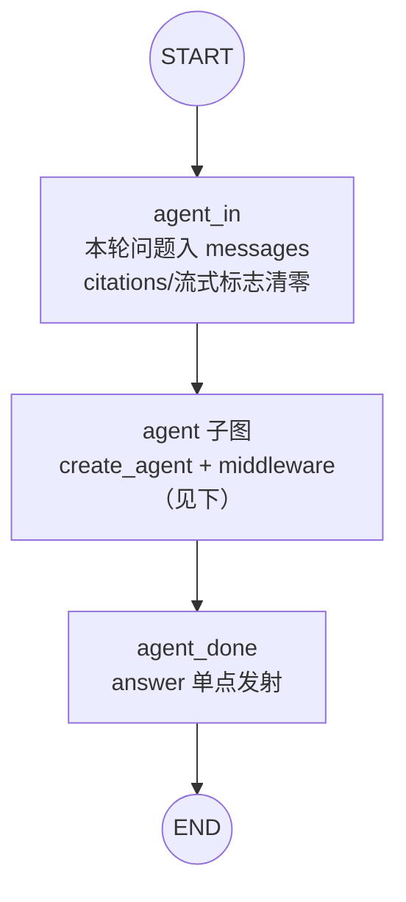
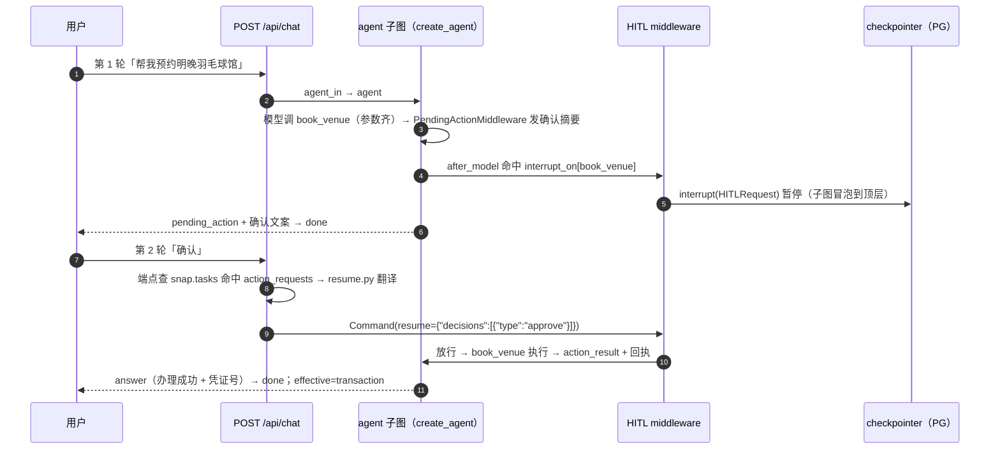

# 02 · 编排主图（LangGraph StateGraph · P31 单循环收敛）

全部会话编排收敛为 **agent-first 单循环**（LangChain 1.x `create_agent` + middleware 子图）：外壳图只保留 `agent_in → agent → agent_done` 一条链。P17 时代的「外壳手写薄图 + classic 对照分支」三件套中，classic 级联路由、direct/research 分支、tx 流程节点已随 P31-2 全量退役（tag `classic-pre-retirement` 留档；评测轨改 agent-only，28 题历史报告见 eval/reports/orchestration-*.md）——前置意图分类在生产路径上不承重（route 只是事后合成的观测标签，不决定链路/工具集/模型档），判断预算全部下沉到动作级代码闸与模型工具自选。图结构即文档——每个节点是一个可单测的函数。

## 图结构



> P31-3 将进一步塌缩：SSE 端点直调 `create_agent` 编译产物（`app.state.graph` 指向子图本体），外壳 StateGraph 退役。

agent 子图（`gewu/agent/agent.py` 装配，`create_agent` 编译产物直接 `add_node` 嵌套进外壳图；checkpointer 只挂顶层，子图 interrupt 冒泡暂停）：

```python
agent = create_agent(
    model,                                        # llm.agent_model()（GLM-5.3，温度/上限固化）
    tools=[search_knowledge, parse_date, deep_research, *8个业务工具],   # agenttools.py @tool 化
    middleware=[
        GuardMiddleware(),                        # before_agent：关键词安检闸（P31-1），block 短路
        ModelCallLimitMiddleware(run_limit=8),    # 轮次上限（旧 REACT_MAX_TURNS 等价）
        TruncationDefenseMiddleware(),            # P10 截断防御（Pi 式回填重调）
        UsageRecordMiddleware(llm),               # token 记账 + [llm] per-call 埋点（P24-1）
        AgentPromptMiddleware(),                  # system prompt + 联网准则 + 记忆块
        HumanInTheLoopMiddleware(interrupt_on=写工具四件),   # 写确认门（HITL）
        PendingActionMiddleware(business),        # 确认摘要先于中断发射
        WriteSlotGateMiddleware(business),        # 缺必填参数 → slot_question 引导收集
        ResearchLimitMiddleware(),                # deep_research 单轮限 1 次（flash 代码闸）
        SearchQueryGuardMiddleware(),             # 检索词零重合拼回原话（P24-3 硬防线）
        RouteEventMiddleware(),                   # after_agent：effective route 合成补发
        SummarizationMiddleware(...),             # 上下文压缩（30k 触发、保 20 条，P13 收口）
    ],
    state_schema=GewuAgentState,                  # messages + role/user/mem_block/citations
)
```

## 节点清单

| 节点 | 工厂（graph.py） | 职责 | 主要产出 state |
| --- | --- | --- | --- |
| `agent_in` | `make_agent_in_node` | 本轮问题追加进 `messages` 对话历史；citations/answer_streamed 轮起清零（P26/P30 跨轮污染防御） | `messages` |
| `agent` | `build_agent`（agent.py） | agent-first 主循环子图：guard 安检 → 模型工具自选循环 → HITL 确认门 | `messages`/`citations`/interrupt |
| `agent_done` | `make_agent_done_node` | answer 单点发射 + 截断标记 + 轮次耗尽部分结论兜底 | `answer`/`citations`/`truncated` |

P31-2 退役的节点（`resolve_query/route/retrieve/answer_direct/refusal/research/transaction/hybrid/tx_confirm/tx_gate/tx_resume` 与全部条件边）见 tag `classic-pre-retirement`；槽位元数据/确认摘要拆至 `gewu/agent/txmeta.py` 供 agent 侧中间件与 resume 桥共用，deep_research 的子问题拆解 `plan` 保留在 `gewu/agent/research.py`。

## 共享状态（ChatState）

图的状态是跨节点传递的唯一媒介（`gewu/agent/state.py`，TypedDict）——**所有跨节点字段必须显式声明**（LangGraph 会静默丢弃 schema 外的 key，这是 P14 调试中两度撞上的坑）：

```python
class ChatState(TypedDict, total=False):
    # 请求上下文
    question: str   # 本轮问题（记忆存档/用户可见层用）
    mode: str       # auto | react(=auto)（P31 起 mode 枚举收窄，服务端 422 兜底）
    role: str
    user: str
    session_id: str
    # agent-first 主循环（P17）：对话历史（add_messages 合并，checkpointer 持久化）
    messages: Annotated[list[BaseMessage], add_messages]
    # 引用与回答
    citations: list[dict]
    truncated: bool # 主答案撞 max_tokens（done.reason=max_tokens 的依据）
    answer: str     # 本轮累积回答文本（记忆固化用）
    answer_streamed: str  # P30 流式防重：最终轮已流式发出的文本（轮起清零）
```

classic 的跨轮字段（`resolved/route/hits/tx_*/hybrid_then_tx/mem_block`）随节点退役删除；办理语义由 `messages` 对话 + HITL 中断承载。**跨轮状态只有 `messages` 一族**——由 checkpointer 持久化，跨请求、跨进程存活（见 [07](07-state-persistence.md)）。`thread_id = session_id`：一个会话一个 thread，interrupt 恢复以此为锚。

## 关键设计

**控制流 = 模型 + 工具 + 中间件闸**（P31 终局表述）。没有前置意图分类：链路选择、工具选择、模型档全部由主循环模型在动作级决定；代码闸只守下限——HITL 写确认 / 槽位门 / 轮次上限 / 检索词守卫 / 联网日限 / deep_research 限次。软语义（语气、范围外尽力答、拒绝话术）全部交主模型 prompt（AGENT_SYSTEM）。

**意图的两段式表达（纯观测）**：

1. **guard（入口安检，P31-1 关键词闸）**：`in_conversation` 直通放行（会话感知，防办理短回复被安检吃掉）→ `GREETING_RE` 纯问候零成本放行 + provisional route=chitchat（徽章早亮）→ `DANGER_RE` 危险词硬红线 block（GUARD_BLOCK_ANSWER + route=refusal + jump_to=end，话术 21ms 短路零 LLM）→ 其余一律放行。LLM 判定（allow/meta/block + fail-open）随 P31-1 删除——flash 非确定是两次线上实证的掷骰子问题，软寒暄交主循环自然答质量更优。
2. **effective route（出口合成）**：`RouteEventMiddleware.after_agent` 按本轮工具轨迹合成（写工具→transaction/先检索后写→hybrid、deep_research→research、检索→factual、零工具→chitchat），与 provisional 不同则补发。前端徽章随第二次事件覆盖更新——**意图从「路由器猜」变成「工具轨迹说话」，且不决定任何控制流**。

**多轮指代消解（resolve_query 退役后的承接）**：agent 路径模型看 `messages` 历史自行消解指代（P31-2 起）；原 QUERY_REWRITE 补全是增强不是依赖（四门控本就静默回退），与主循环能力冗余，故不保留。

**事件发射（custom stream writer + subgraphs 冒泡）**。节点/工具/中间件内经 `gewu/agent/emitter.py` 把 PARITY 十类事件送入 custom 流；SSE 端点以 `graph.stream(..., stream_mode="custom", subgraphs=True)` 消费——**子图嵌套形态下必须带 `subgraphs=True`**，否则 agent 子图内 middleware/工具的事件被父图吞掉（症状：徽章/状态静默丢失）。

**done 单点**。done 事件（含 reason: completed/max_tokens/error）只在 SSE 端点发射一次；终态 `answer`/`truncated` 从 `graph.get_state(config).values` 读取（agent 链路的 answer 由 agent_done 节点写、interrupt 悬停轮则为当前值）。一次 chat 恰一个 done，与 Go RunChat 单点语义对齐。

## 典型请求链路一：寒暄与危险词（P31 关键词闸）

「你好」→ guard 正则快路径零 LLM 放行（provisional=chitchat）→ 主循环零工具直答（自然寒暄+能力导流）→ effective=chitchat；「怎么代写论文」→ DANGER_RE 命中 → GUARD_BLOCK_ANSWER，**21ms 全链完成、零 LLM 调用**（对照 P27 基线：guard LLM 判定时代首问串行多一跳 small 调用）。

## 典型请求链路二：写操作办理（agent 链路 HITL 确认门）



resume 翻译（`gewu/agent/resume.py`，含 `classify_reply` 续轮意图判定）：用户文本映射为 approve（确认）/reject（取消）/respond（修改=按新参数重发再确认、切话题=放弃办理）——前端零改动照常 POST。**修改绝不走 edit decision**（edit 会替换参数直接执行、跳过二次确认）。跨重启续办：PostgresSaver 落盘 + 重启后 resume 桥照常工作（P17-6 真跑验证）。

## 相关文件

| 文件 | 职责 |
| --- | --- |
| `gewu/agent/graph.py` | 单链外壳装配（agent_in/agent/agent_done；P31-3 塌缩后退役） |
| `gewu/agent/agent.py` | agent-first 主循环装配（create_agent + middleware 栈） |
| `gewu/agent/mw.py` | 自定义中间件族（截断防御/槽位门/确认摘要/route 合成）与 GewuAgentState |
| `gewu/agent/guardrails.py` | GuardMiddleware 关键词安检闸（GREETING_RE/DANGER_RE/会话感知） |
| `gewu/agent/agenttools.py` | 主循环 @tool 工具集（检索/日期/deep_research/8 业务工具） |
| `gewu/agent/txmeta.py` | 办理槽位元数据与确认摘要（slot_meta/FLOW_DEFS/build_confirm） |
| `gewu/agent/research.py` | deep_research 的子问题拆解（plan 纯函数） |
| `gewu/agent/resume.py` | resume 桥翻译（classify_reply + 用户文本 → HITL decisions） |
| `gewu/agent/state.py` | ChatState 定义与 `new_state` 入口 |
| `gewu/api/chat.py` | stream 消费（subgraphs=True）、done 单点、interrupt/resume 桥 |

---
