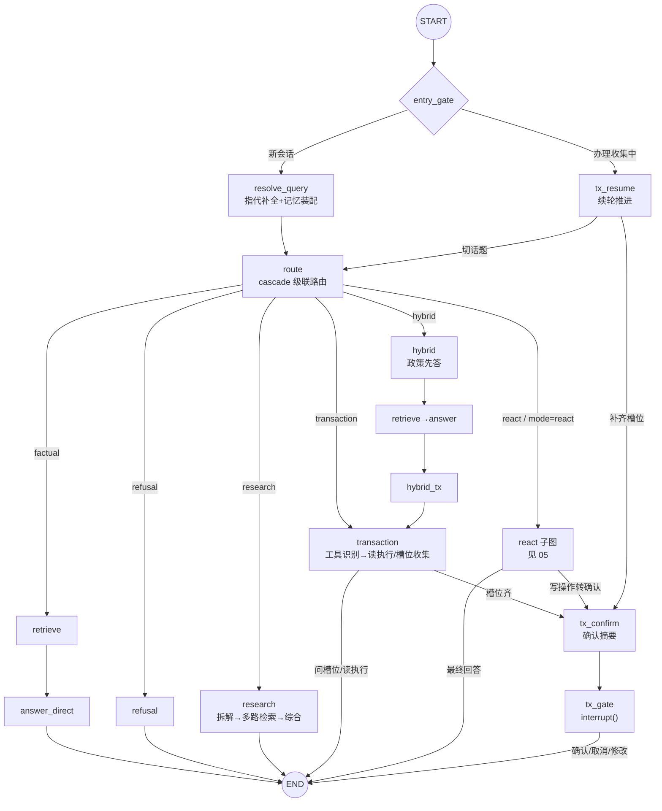
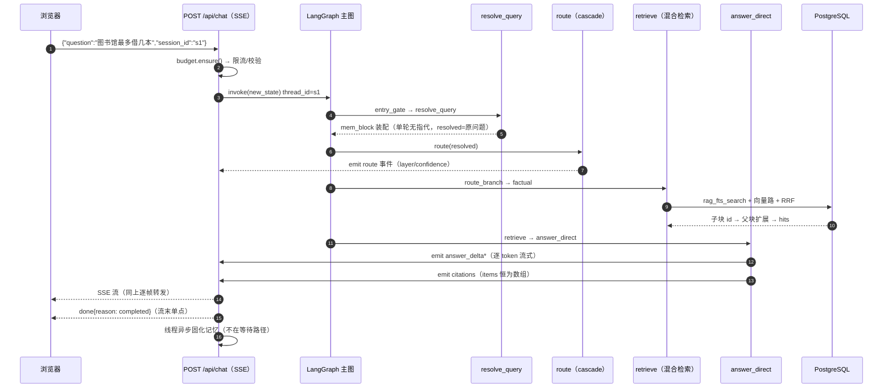
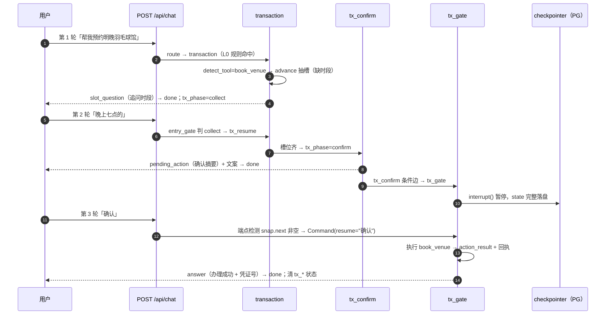

# 02 · 编排主图（LangGraph StateGraph）

全部会话编排收敛在一张图（`gewu/agent/graph.py` 的 `build_graph`）：入口分派 → 指代补全 → 路由 → 六条链路 → 终态。图结构即文档——每个节点是一个可单测的函数，每条条件边是一次显式的分支决策。本文拆解图结构、共享状态、节点与边的清单，并用时序图走一遍两类典型请求的完整生命周期。

## 图结构



图的装配代码（`build_graph` 尾部）与上图一一对应：13 个节点 + 1 条 START 条件边 + 6 条链路条件边 + 4 条后置条件边 + 3 条固定边：

```python
g.add_conditional_edges(START, entry_gate,
    {"resolve_query": "resolve_query", "tx_resume": "tx_resume"})
g.add_edge("resolve_query", "route")
g.add_conditional_edges("route", route_branch,
    {"factual": "retrieve", "refusal": "refusal", "research": "research",
     "hybrid": "hybrid", "transaction": "transaction", "react": "react"})
# retrieve → answer_direct → (hybrid_tx | END)
# react/transaction/tx_resume → (tx_confirm | END)   ← 三链共用确认门
# tx_confirm → tx_gate → interrupt 暂停
g.compile(checkpointer=checkpointer or MemorySaver())
```

## 节点清单

| 节点 | 工厂（graph.py） | 职责 | 主要产出 state |
| --- | --- | --- | --- |
| `resolve_query` | `make_resolve_node` | 多轮指代补全 + 长期记忆块装配（四重门控，单轮零 LLM 成本） | `resolved` / `mem_block` |
| `route` | `make_route_node` | 产出路由决策包；`mode=direct/research` 用户直连构造，其余走 cascade | `route` |
| `retrieve` | `make_retrieve_node` | 混合检索（漏斗见 [04](04-rag-retrieval.md)） | `hits` |
| `answer_direct` | `make_answer_node` | 编号上下文 + 流式直答 + 引用；`finish_reason=length` 置 `truncated` | `answer`/`citations`/`truncated` |
| `refusal` | `make_refusal_node` | 固定话术礼貌拒答 + 空 citations | `answer` |
| `research` | `make_research_node` | 深研：拆解 → 逐路检索 → 证据聚合 → 综合作答（`research.py`） | 同上 |
| `transaction` | `make_transaction_node` | 工具识别（启发式优先 LLM 兜底）→ 读直执行 / 写进槽位收集 / 未识别转知识库 | `tx_*` 或 `answer` |
| `hybrid` / `hybrid_tx` | — | 两段跳板：先政策直答再转办理（见下文 Command 跳转） | `hybrid_then_tx` |
| `react` | `make_react_node` | 跑 ReAct 子图（[05](05-react-agent.md)）；写操作转确认时回写 tx 状态 | `answer`/`citations` 或 `tx_*` |
| `advance`（函数） | `make_advance` | collect 阶段推进：LLM 抽槽 → 归一合并 → 缺追问/齐进确认；transaction 首轮与 tx_resume 续轮共用 | `tx_*` |
| `tx_confirm` | `make_tx_confirm_node` | 发 `pending_action` 事件 + 确认摘要文案（三链共用，避免重复 emit） | `answer` |
| `tx_gate` | `make_tx_gate_node` | **首个动作即 `interrupt()`**——图在此暂停，resume 值分类处理（[06](06-transaction.md)） | 见 06 |
| `tx_resume` | `make_tx_resume_node` | collect 续轮：吸收信息 / 取消 / 切话题（`classify_reply` 三分类） | `tx_*` |

## 共享状态（ChatState）

图的状态是跨节点传递的唯一媒介（`gewu/agent/state.py`，TypedDict）——**所有跨节点字段必须显式声明**（LangGraph 会静默丢弃 schema 外的 key，这是 P14 调试中两度撞上的坑）：

```python
class ChatState(TypedDict, total=False):
    # 请求上下文
    question: str   # 原始问题（记忆存档/用户可见层用）
    resolved: str   # 补全后问题（贯通路由与检索）
    mode: str
    role: str
    user: str
    session_id: str
    route: dict     # 路由决策包（routing.py 的 dict 形态）
    # 检索与回答
    hits: list[dict]
    citations: list[dict]
    truncated: bool # 主答案撞 max_tokens（done.reason=max_tokens 的依据）
    answer: str     # 本轮累积回答文本（记忆固化用）
    # 办理流程跨轮状态（Phase: idle | collect | confirm）
    tx_tool: str
    tx_phase: str
    tx_slots: dict
    tx_last_asked: str
    # hybrid 链路标记 / 长期记忆块
    hybrid_then_tx: bool
    mem_block: str
```

三类字段：**请求上下文**（question/resolved/mode/role/user/session_id）、**回答侧记**（hits/citations/answer/truncated）、**办理流程**（tx_tool/tx_phase/tx_slots/tx_last_asked）——由 checkpointer 持久化，跨请求、跨进程存活（见 [07](07-state-persistence.md)）。

`thread_id = session_id`：一个会话一个 thread，interrupt 恢复与状态续办都以此为锚（`gewu/api/chat.py` 构造 `config = {"configurable": {"thread_id": session_id}}`）。

## 关键设计

**entry_gate（会话优先解释续轮）**。Go 时代 RunChat 的第一条规则原样平移：

```python
def entry_gate(state: ChatState) -> str:
    if state.get("tx_phase") == "collect":
        return "tx_resume"
    return "resolve_query"
```

办理流程进行中（tx_phase=collect）时，用户消息优先解释为对流程的回应（补槽位/取消/切话题由 tx_resume 分类处理），不走正常路由。「确认」这类短句因此不会被路由器当成新问题——这是多轮办理体验正确的关键。confirm 态不从这里进——SSE 端点检测到 interrupted thread 时以 `Command(resume)` 恢复（见 [08](08-api-contract.md)）。

**Command(goto) 跨链跳转**。hybrid 链「先答政策再办业务」用两次跳转实现：

```python
def hybrid(state):                       # 第一段：置标记后跳检索
    return Command(goto="retrieve", update={"hybrid_then_tx": True})

def _after_answer_direct(state):         # answer_direct 后的条件边读标记
    return "hybrid_tx" if state.get("hybrid_then_tx") else "__end__"
```

工具未识别时 transaction 同样 `Command(goto="retrieve")`（转知识库兜底）。跳转与条件边并存的原则：**链路内的固定顺序用边，语义分叉用条件边，跨链复用用 Command**。

**一次「深度研究」的生命周期**（research 节点，对应 PARITY §7）：

1. 指代补全（resolve_query，多轮时）→ 2. cascade 路由判 research →
3. LLM 拆解 2~4 个自包含子问题（`MAX_SUBQUESTIONS=4`，无 key 退化为单路）→
4. 逐路混合检索（每路 k=5），每路 emit 一个 `step` 事件 →
5. 证据按 chunk_id 跨子问题去重，取前 12 条统一编号（`MAX_EVIDENCE=12`，单条截 600 字）→
6. LLM 只依据编号证据综合作答（流式 `answer_delta`）→ 7. `citations` + `done`。

**事件发射（custom stream writer）**。节点内经 `gewu/agent/emitter.py` 把 PARITY 十类事件送入 custom 流；脱离图运行（单测直调节点）时 `get_stream_writer()` 抛错被安全吞掉：

```python
def emit(evt: dict) -> None:
    try:
        writer = get_stream_writer()
    except Exception:
        return          # 无图运行时（单测直调节点）不产事件
    try:
        writer(evt)
    except Exception:
        return          # 写事件失败不中断节点逻辑
```

**done 单点**。done 事件（含 reason: completed/max_tokens/error）只在 SSE 端点（`gewu/api/chat.py` 的 `generate()`）发射一次——图节点只更新 `truncated` 等侧记，不 emit done。一次 chat 恰一个 done，与 Go RunChat 单点语义对齐。

## 典型请求链路一：事实问答（factual 直答）



## 典型请求链路二：写操作办理（跨三轮的确认流）



第二条链路的槽位细节、失败恢复与 resume 值分类见 [06](06-transaction.md)。

## 相关文件

| 文件 | 职责 |
| --- | --- |
| `gewu/agent/graph.py` | 主图装配、全部节点工厂与条件边 |
| `gewu/agent/state.py` | ChatState 定义与 `new_state` 入口 |
| `gewu/agent/emitter.py` | custom stream writer 安全包装 |
| `gewu/agent/research.py` | 深研链路（plan/聚合/综合） |
| `gewu/api/chat.py` | stream 消费、done 单点、interrupt/resume 桥 |

---

下一篇《03 · 意图路由》拆解 cascade 三级级联：规则快路径、小模型概率分布与主模型复核的分工与安全网。
