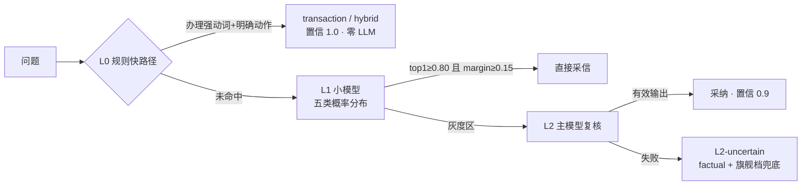

# 03 · 意图路由（cascade 三级级联）

路由决定一条消息走哪条链路（`gewu/agent/routing.py`）：五分类 factual / research / transaction / hybrid / refusal，输出**路由决策包**（dict），下游据此选择链路、工具集与模型档。本文拆解三级漏斗的每一级、误路由安全网的来历，以及决策包的契约。

## 三级漏斗



常量与阈值全部集中在文件头部，是调参的唯一入口：

| 常量 | 值 | 含义 |
| --- | --- | --- |
| `CONF_HIGH` | 0.80 | top1 ≥ 此值且 margin 足够 → 直接采信 L1 |
| `CONF_LOW` | 0.55 | top1 < 此值 → 不相信 L1，走 L2 |
| `MARGIN_MIN` | 0.15 | top1−top2 间隔，小于则视为「类别纠缠」 |
| `L2_CONFIDENCE` | 0.9 | L2 采纳时的置信写死值 |
| `H_CONF` | 0.5 | 启发式/降级路径的置信 |
| `REASON_LIMIT` | 100 | reason 截断（rune） |
| `ROUTE_ORDER` | 固定五类序 | 解析与排序的确定性基础（平局按此序取先） |

### L0：规则快路径

只接「几乎不可能错」的精确 case——`exactTxRe` 要求**办理强动词开头 + 明确办理动作**共现，命中即省一次 LLM（毫秒级、零成本、置信 1.0）：

```python
_EXACT_TX_RE = re.compile(
    r"^(帮我|我要|我想|给我|麻烦).*(预约|预订|请假|销假|退订|取消预约|提交请假)"
)
```

命中后再看 `_CONSULT_RE`（什么/怎么/多少/规定…咨询信号词）：办理 + 咨询动词共现判 **hybrid**（先答政策再办理），否则 transaction。

### L1：小模型概率分布

glm-5.3-flash 输出的是**概率分布**而非单个 label（`{"scores": {五类概率}, "reason": …}`），判断权在代码——这是「模型给证据、判断权在代码常量」原则的落点。解析函数对格式做严格守卫：

```python
for r in ROUTE_ORDER:
    v = scores.get(r)
    # 字符串数字不参与概率判定（模型未按格式输出时宁可走兜底）
    if isinstance(v, (int, float)) and not isinstance(v, bool):
        pairs.append((r, float(v)))
if not pairs:
    return heuristic_fallback(...)
pairs.sort(key=lambda p: -p[1])   # 稳定排序：平局保持 routeOrder 先后
```

双阈值（0.80/0.55）+ margin（0.15）三条件组合出三档：直接采信 / 灰度区升 L2 / 不相信。JSON 解析失败同样降级启发式，保证无 key、网络异常、格式漂移三种情况链路都不断。

### L2：主模型灰度复核

只吃 L1 落灰度区的少量流量；glm-5.3 few-shot 二次判定，输出有效 route 则采纳（置信写死 0.9），解析失败返回 None 交上层兜底——**L2-uncertain**：转 factual 并提高模型档到 flagship（不自由发挥、不反问阻断，用户总能得到一个像样的回答）。

## 误路由安全网（从真实案例学出来的守卫）

**refusal 是代价最高的误路由**（直接拒绝服务）。历史上 flash 曾把「我的情况符合转专业条件吗」高置信误判 refusal——问题带办理/请求强动词或校园领域实体词（`campusDomainRe`，转专业/绩点/保研/图书馆…近 40 个词）时，refusal 判定与之直接矛盾，**不直接采信，强制降入灰度区走 L2 复核**：

```python
if dec["route"] == "refusal" and (
    _REQ_RE.search(question)
    or _TX_VERBS_RE.search(question)
    or _CAMPUS_DOMAIN_RE.search(question)
):
    top1, margin = 0.0, 0.0   # 降入灰度区，走下方 L2 逻辑
```

这是「小模型的无视否定指令倾向必须由代码级守卫兜底，不能指望提示词」的具体化——GLM flash 的这一已知坑（见仓库外备忘）在路由、工具选择两处都有代码守卫。

L1/L2 调用失败均降级启发式（`heuristic_route`，顺序判定不可调换：办理动词 → 研究信号词/长问题 → 短事实），保证无 key/网络异常时链路不断：

```python
if _TX_VERBS_RE.search(q):                 # ① 办理动词
    wants_action, consulting = _REQ_RE.search(q), _CONSULT_RE.search(q)
    if wants_action and consulting: return hybrid
    if wants_action or not consulting:   return transaction
if len(q) > 32 or any(h in q for h in _RESEARCH_HINTS):  # ② 研究信号
    return research
return factual                             # ③ 短事实兜底
```

## 决策包与 fill_policy

路由产出不只是 label，而是一个完整的决策包：

```python
{"route": "transaction", "confidence": 1.0, "layer": "L0-rule",
 "reason": "规则快路径：明确办理指令", "by_llm": False,
 "pre_rag": False, "toolset": [8 个业务工具], "model_tier": "small"}
```

策略部分集中在 `fill_policy`（一处维护，路由类别 → 处理策略的映射表）：

| route | pre_rag | model_tier | toolset |
| --- | --- | --- | --- |
| factual | True | standard | — |
| research | True | flagship | — |
| transaction / hybrid | False | small | 8 个业务工具白名单（`TRANSACTION_TOOLSET`） |
| refusal | False | small | — |

toolset 白名单同时约束 ReAct 与续轮流程——路由判了办理，模型可见的工具就只有这 8 个（最小权限，另见 [05](05-react-agent.md) 的权限矩阵）。route 事件（含 layer/confidence）是评测断言与前端徽章的数据源。

## mode=react 的入口拦截

`route_branch` 条件边：请求 `mode=react` 显式进 ReAct 子图；`REACT_MODE=on` 时「目标明确但路径不定」的办理信号词（安排/规划/顺便/一并…，`react_plan_signal`）也自动转 ReAct：

```python
def route_branch(state: ChatState) -> str:
    if state["mode"] == "react":
        return "react"
    route = state["route"]["route"]
    if state["mode"] == "auto" and route == "transaction" and react_plan_signal(state["resolved"]):
        return "react"
    return route
```

**triage/classic 两策略已随 P14 退役**（Q6 拍板：结论留档 [walkthrough/02](../walkthrough/02-routing.md) 与 eval/reports/，agent 链路的显式入口是 mode=react）。`mode=direct/research` 则在 route 节点直接构造决策包（layer=user-specified），不经过级联。

## 相关文件

| 文件 | 职责 |
| --- | --- |
| `gewu/agent/routing.py` | 全部路由逻辑、正则与常量阈值 |
| `gewu/agent/routing_prompts.py` | L1/L2 提示词（逐字对照 Go 版） |
| `tests/test_routing.py` | 16 例单测：阈值参数化、安全网升级路径、启发式序 |

---

下一篇《04 · 混合检索》进入 RAG 检索域：双路召回、RRF 融合、可选精排与父子块扩展的完整漏斗。
