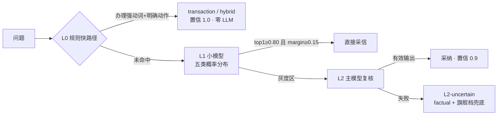

# 03 · 意图路由（cascade 三级级联）

路由决定一条消息走哪条链路（`gewu/agent/routing.py`）：五分类
factual / research / transaction / hybrid / refusal，输出**路由决策包**（dict），
下游据此选择链路、工具集与模型档。

## 三级漏斗

- **L0**（`exactTxRe`）：只接"几乎不可能错"的精确 case（`^(帮我|我要|…).*(预约|请假|…)`），
  命中省一次 LLM；办理 + 咨询动词共现判 hybrid。
- **L1**（glm-5.3-flash）：输出**概率分布**而非单个 label，上游做双阈值
  （0.80/0.55）+ top1-top2 margin（0.15）判定——类别纠缠与低置信都不硬猜。
  概率以字符串输出时不参与判定（宁可降级也不采信不合式输出）。
- **L2**（glm-5.3 主模型）：只吃 L1 落灰度区的少量流量；仍不确定则转 factual
  并提高模型档（不自由发挥、不反问阻断）。

## 误路由安全网（从真实案例学出来的守卫）

**refusal 是代价最高的误路由**（直接拒绝服务）。历史上 flash 曾把「我的情况符合
转专业条件吗」高置信误判 refusal——问题带办理/请求强动词或校园领域实体词
（`campusDomainRe`，转专业/绩点/保研/图书馆…）时，refusal 判定与之直接矛盾，
**不直接采信，强制降入灰度区走 L2 复核**。这是「模型给证据（概率）、判断权在
代码常量」原则的具体化：小模型的无视否定指令倾向（见 GLM 已知坑）必须由代码级
守卫兜底，不能指望提示词。

L1/L2 调用失败均降级启发式（`heuristic_route`，顺序判定不可调换：办理动词 →
研究信号词 → 短事实），保证无 key/网络异常时链路不断。

## 决策包与 FillPolicy

路由产出不只是 label：`{route, confidence, layer, reason, by_llm, toolset,
model_tier, pre_rag}`。策略部分集中维护（`fill_policy`）：factual→standard 档、
research→flagship 档、transaction/hybrid→最小工具集（8 个业务工具白名单，ReAct
与续轮流程同受约束——最小权限）。route 事件（含 layer/confidence）是评测断言
与前端徽章的数据源。

## mode=react 的入口拦截

`route_branch` 条件边：请求 `mode=react` 显式进 ReAct 子图；`REACT_MODE=on` 时
「目标明确但路径不定」的办理信号词（安排/规划/顺便/一并…，`react_plan_signal`）
也自动转 ReAct。**triage/classic 两策略已随 P14 退役**（Q6 拍板：结论留档
[walkthrough/02](../walkthrough/02-routing.md) 与 eval/reports/，agent 链路的
显式入口是 mode=react）。

## 相关文件

`gewu/agent/routing.py`（全部逻辑与常量阈值）、`gewu/agent/routing_prompts.py`
（L1/L2 提示词，逐字对照 Go 版）；单测 `tests/test_routing.py`（16 例，含阈值
参数化与安全网升级路径）。
