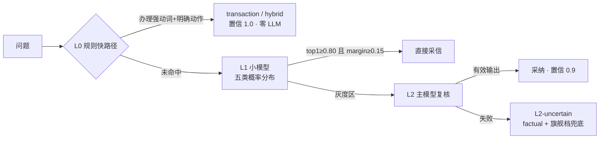

# 03 · 意图路由（P31 终局：route = 观测标签，判断权在动作级）

**生产路径没有前置意图分类。** 意图以两段式 route 事件**纯观测**地表达（不决定链路/工具集/模型档）：

- **provisional（入口，guard 层）**：`GuardMiddleware` 关键词安检闸（P31-1）在纯问候命中时发 provisional route=chitchat（零成本徽章早亮）、危险词硬红线命中时发 route=refusal 并短路拦截。
- **effective（出口，工具轨迹合成）**：`RouteEventMiddleware.after_agent` 按本轮实际工具轨迹合成最终 route（详见 [02](02-orchestration-graph.md)）。**意图从「路由器猜」变成「工具轨迹说话」**。

判断预算全部在动作级：HITL 写确认 / 槽位门 / 检索词守卫 / 联网日限 / 轮次上限（守卫清单见 [02](02-orchestration-graph.md) 的中间件栈）。这与四家生产级开源系统的编排共识一致——「一个循环」是常态，前置意图分类无人做（Codex/Gemini CLI/OpenHands/chat-langchain，2026-10 调研）。

## guard 关键词闸（P31-1）

`gewu/agent/guardrails.py` 三分支，全链零 LLM：

1. `in_conversation`（历史已有 AI 消息）→ 直通放行——会话感知条款（chat-langchain "NOT a follow-up"），防办理短回复「研讨间301」被安检当寒暄吃掉；
2. `GREETING_RE` 纯问候/身份问（整句匹配）→ 放行 + provisional route=chitchat，寒暄由主循环一次调用自然生成；
3. `DANGER_RE` 危险/违规硬红线（制毒/黑客/诈骗/代写/作弊核心词，实施性复合词命中——受害者求助「我被骗了」、防范咨询「怎么防诈骗」、政策咨询「作弊处分规定」不误拦）→ block：GUARD_BLOCK_ANSWER + provisional route=refusal + jump_to=end，21ms 短路。

其余一律放行：软寒暄/能力问交主循环自然回答（一次主模型调用，质量优于 flash 生成的静态话术）。拦截纵深 = 关键词硬红线 + prompt 墙（AGENT_SYSTEM 第 9 条）+ HITL 代码闸；词表丰富化挂账独立小票。

> **历史（P17~P28）**：guard 曾用 flash LLM 做 allow/meta/block lenient 判定（fail-open、meta 就地直答）。P28 已把拦截面收窄到内容安全（范围外放行），P31-1 进一步删除 LLM 判定——收窄后净收益 ≈ 拦变体危险话术，代价是首问串行一跳 + flash 非确定（两次线上实证把校外首触变掷骰子）。

## 历史存档：cascade 三级漏斗（classic，P31-2 退役）

> 以下形态随 `mode=classic` 退役（tag `classic-pre-retirement`，代码与单测见 tag）。保留本节作论文「前置路由 vs 工具自选」对照实验的方法学记录，历史报告见 eval/reports/orchestration-*.md；**System One 决策模型的经典插槽 L1 亦随此退役**（若后续需要确定性决策，重新评估见任务书 §5）。

cascade 五分类 factual / research / transaction / hybrid / refusal 输出**路由决策包**（dict），下游据此选择链路、工具集与模型档：

- **L0 规则快路径**：`exactTxRe`（办理强动词开头 + 明确办理动作共现）命中即省一次 LLM；再按咨询信号词分 hybrid / transaction。
- **L1 小模型概率分布**：flash 输出 `{"scores": {五类概率}}`，**判断权在代码常量**（CONF_HIGH 0.80 / CONF_LOW 0.55 / MARGIN_MIN 0.15 双阈值 + margin 三档）；字符串数字不参与概率判定。
- **L2 主模型灰度复核**：只吃灰度区流量；失败降 L2-uncertain（factual + flagship 档，不自由发挥、不反问阻断）。
- **误路由安全网**：refusal 是代价最高的误路由——问题带办理/请求强动词或校园领域实体词时 refusal 判定不采信，强制降灰度区走 L2。这是「小模型的无视否定指令倾向必须由代码级守卫兜底」的具体化（GLM flash 已知坑在路由、工具选择两处均有代码守卫）。
- **决策包与 fill_policy**：route 事件携带 layer/confidence/pre_rag/toolset/model_tier；transaction/hybrid 挂 8 业务工具白名单（最小权限）。

> **历史病根存档（P17 立项起因）**：classic 的 L1 提示词把「闲聊」写进 refusal 定义（「股市、写代码、闲聊等」）且五分类无兜底类，「你好」被**按设计**路由到 refusal 节点吐硬编码话术。这是前置分类器范式的结构性缺陷（分类清单必须枚举一切输入），开源两派解法：FastGPT/Dify 加显式闲聊/兜底类（本仓未采用），LangChain 官方线直接删前置路由（本仓 P17 采用，P31 走完最后一公里）。

**triage 策略随 P14 退役、react 独立引擎随 P17 退役、cascade 随 P31-2 退役**（结论留档 [walkthrough/02](../walkthrough/02-routing.md) 与 eval/reports/）。

## 相关文件

| 文件 | 职责 |
| --- | --- |
| `gewu/agent/guardrails.py` | guard 关键词安检闸（GREETING_RE/DANGER_RE/会话感知/provisional 事件） |
| `gewu/agent/mw.py` | effective route 合成（`effective_route` 工具轨迹→route 常量表） |
| `gewu/api/chat.py` | mode 枚举校验（auto/react，其余 422） |

---

下一篇《04 · 混合检索》进入 RAG 检索域：双路召回、RRF 融合、可选精排与父子块扩展的完整漏斗。
