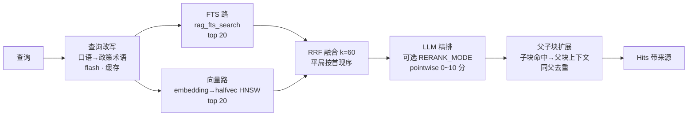

# 04 · 混合检索（RAG 检索域）

检索域（`gewu/rag/`）为一个查询产出「带来源的条款文本」：关键词与语义两路召回、
RRF 融合、可选精排、父子块扩展。**读写全部收口为 PG 存储函数**（P12 形态），
Go 与 Python 都是调用方——这是 P14 存储层零改动复用的前提。

## 检索漏斗

- **双路各取 20**（poolN），k 大于池时扩池；向量路失败（瞬时网络错误）**降级
  为纯 FTS** 并记日志——单次查询容错，不是索引级静默降级（索引无向量时检索
  直接报错，提示重建）。
- **RRF**（`rrf_fuse`）：`1/(60+rank)` 跨路累加；平局按首次出现序——排序确定性
  是评测可复现的基础。
- **精排**（可选）：全部候选拼进一个 prompt 由 flash 逐条打 0~10 分，稳定重排
  （平局保持 RRF 次序）；失败退回粗排，不阻断。
- **查询改写**：有 key 即启用（「最多/借几本」→「上限/外借」），缓存避免重复
  调用。注意 GLM 温度 0 仍非确定——改写输出方差是端到端检索对照差异的主导项
  （P14-1 方差基线归因，见 [10](10-evaluation.md)）。

## 父子块（hierarchical 切分）

语料按标题树切分：**父块** 800 字（H1 聚合，带 breadcrumb 上下文）、**子块**
200 字重叠 40（语义单元）。仅子块建索引参与检索；命中后按 `parent_id` 回取父块
进上下文（「子块匹配、父块回答」）——精确命中与完整语境兼得。flat 单层切分保留
为冻结基线。

## 存储层（PG 存储函数收口）

`gewu/rag/schema.py` 是 DDL 唯一权威（P14-8 起）：

| 对象 | 职责 |
| --- | --- |
| `rag_tokenize(text)` | 中文二元语法 + 拉丁小写分词（SQL 侧，入库与查询同源） |
| `rag_fts_search(cfg, qtext, lim)` | FTS：查询原文分词逐 token OR 匹配，得分=Σts_rank_cd；按 `NOT is_parent` 过滤父块 |
| `rag_upsert_doc(doc jsonb, records jsonb)` | 写路径收口：幂等替换一个文档全部 chunk+向量（FK 级联删旧），父块不写向量 |
| 表 docs/chunks/vectors | chunks.tsv 为 `to_tsvector('simple', rag_tokenized_text(text))` 生成列（GIN）；vectors 为 `halfvec(2048)` HNSW（cosine） |

关键细节：2048 维超出 HNSW 的 2000 维上限，走 **halfvec 半精度**（官方推荐路径）；
查询向量在应用侧 L2 归一 + float32 舍入后以文本 `::halfvec` cast 传入——与 upsert
的 JSONB vec 契约同一条传递路径。

## 设计决策

**为什么字符二元语法而不是分词？** 校园政策专有名词密度高（"推免""体测""学分
认定"），通用分词器会切碎；二元语法天然友好且零词表依赖。字面精确匹配与向量
语义泛化互补——GPA、日期、政策编号这类必须精确的信息由 FTS 路兜底。

**为什么 PG 而不是向量库？** 一个库同时承担关系存储 + 向量 + 关键词三种检索
形态，SQL 元数据过滤（时效性等）是顺手能力；千级 chunk 规模 HNSW 毫秒级。
Milvus 触发线不变：chunk 十万级或需要服务端混排时另立项（ADR-0008）。

**为什么 embed 自定义实现？** 火山方舟多模态端点（`/embeddings/multimodal`）
不支持批量、返回结构与标准 /embeddings 不同——`GewuEmbeddings`（`gewu/llm/embed.py`）
按模式分派：text 批量（按 index 归位、缺位报错）/ ark 逐条并发 4、首错即停。

## 相关文件

`gewu/rag/retrieve.py`（漏斗与改写/精排）、`gewu/rag/store.py`（存储函数调用与
RRF）、`gewu/rag/schema.py`（DDL）、`gewu/llm/embed.py`；PG 集成测试
`tests/test_store_pg.py`（真库，gewu_test + 会话级咨询锁串行）。
