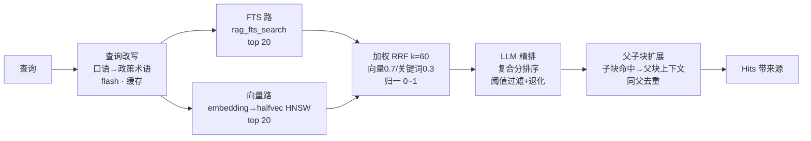
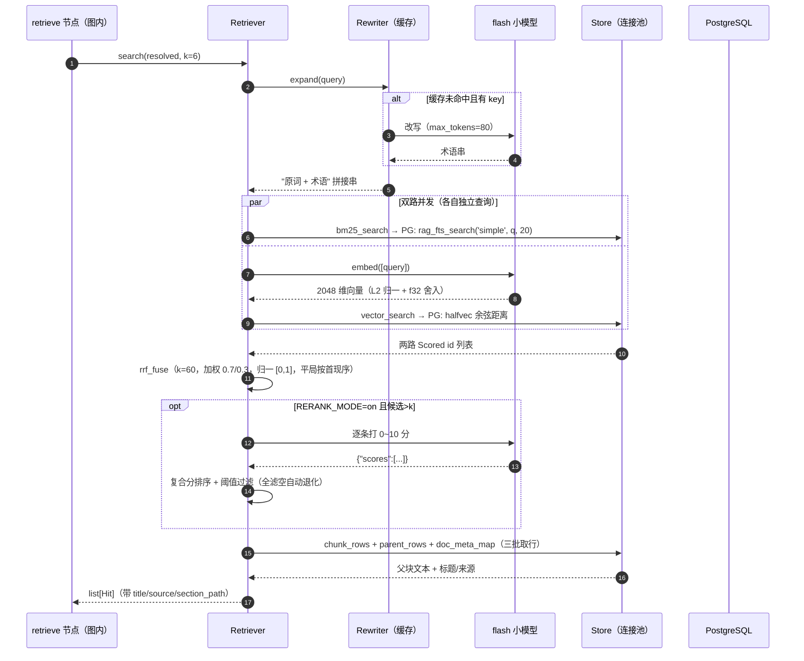

# 04 · 混合检索（RAG 检索域）

检索域（`gewu/rag/`）为一个查询产出「带来源的条款文本」：关键词与语义两路召回、加权 RRF 融合、可选精排（复合分 + 阈值容错）、父子块扩展。**读写全部收口为 PG 存储函数**（P12 形态，P15 起入库侧同为 Python 调用方——切片策略链 + 入库 CLI 全量 Python 化，实现方式参考 WeKnora）。本文按漏斗顺序拆解每一级，并给出存储层 DDL 的关键代码。

## 检索漏斗



管线参数（P15 起全部进 Settings，环境变量可覆盖）：

| 参数 | 缺省 | 含义 |
| --- | --- | --- |
| `RETRIEVAL_POOL_N` | 20 | 双路各取的候选池大小（k 大于池时扩池） |
| `RRF_K` | 60 | RRF 公式的平滑常数 |
| `RRF_VECTOR_WEIGHT` / `RRF_KEYWORD_WEIGHT` | 0.7 / 0.3 | 加权 RRF 两路权重 |
| `retrieval_k` | 6（`RETRIEVAL_K`） | 最终返回条数（factual 与 research 共用） |
| `RERANK_MODE` | on | LLM 精排开关（off 时跳过精排级） |
| `RERANK_THRESHOLD` | 2.0 | 精排模型分阈值（0~10；全滤空自动退化） |
| `EmbedDim` | 2048 | 向量维度（与 embedding 模型一致） |

`Retriever.search()` 的主干即漏斗的代码形态：

```python
def search(self, query: str, k: int = 0, *, expand: bool = True) -> list[Hit]:
    if expand:
        query = self.rewriter.expand(query)          # ① 改写（无 key 原样返回；工具路径传 False）
    if not self.store.has_embeddings():
        raise MissingVectorsError(...)               # 索引级缺失直接报错，不静默降级
    bm_scored  = self.store.bm25_search(query, pool)
    vec_scored = self._vector_scored(query, pool)    # ② 向量路
    fused = rrf_fuse([...], self.rrf_k, [kw_w, vec_w]) if vec_scored \
        else _normalize_by_max(bm_scored)            # 单路退化：FTS 分按 max 归一
    ranked = self._rerank_or_keep(query, fused, k)   # ③ 精排（复合分+阈值退化）
    return self._expand_to_parents([s.id for s in ranked], k)  # ④ 父子扩展
```

**单次查询容错与索引级失败的区分**：向量路失败（瞬时网络错误）降级为纯 FTS 并记日志——这是单次查询的容错（退化为单路时 FTS 分按列表最大值归一，保持 [0,1] 分数标尺）；但索引本身无向量（`has_embeddings()` 为假）时检索**直接抛 `MissingVectorsError`**，提示重建索引——索引级问题不静默降级，两种失败两副面孔。

## 查询改写（口语 → 政策术语）

有 key 即启用（「最多/借几本」→「上限/外借」），flash 一次调用、max_tokens=80，进程内并发安全缓存避免重复调用。改写结果是**拼接**而非替换（`f"{query} {rewritten}"`）——原词保底，术语增强 FTS 召回：

```text
REWRITE_SYSTEM（节选）：
把口语说法换成政策文件用语（如：最多→上限，借书→外借 借阅，钱→元，
挂科→不及格，发学位证→授予学位）；输出 10~25 个字的查询词串。
```

注意 GLM 温度 0 仍非确定——改写输出方差是端到端检索对照差异的主导项（P14-1 方差基线归因，见 [10](10-evaluation.md)）。

**P24 的两处提速与一道硬防线**（线上「食堂位置」检索实证驱动）：

- **工具路径免二次改写**：agent 主循环里 `search_knowledge`/`deep_research` 的 query 已是 LLM 提炼的关键词串，再过 rewriter 是重复劳动——这两个调用点传 `expand=False` 直入漏斗；直答链路（用户原话）保持 `expand=True`；
- **改写输出保序去重**：rewriter 的拼接结果按词去重且保持首现序，避免「原词+术语」串里重复词摊薄 BM25 权重；
- **SearchQueryGuardMiddleware 硬防线**（`agent/mw.py`，docstring 引导之外的代码闸）：模型给的检索词与原问题 CJK bigram **零重合**（完全丢词）时拼回原话再检索——拼接是增补不是替换，召回只增不减；有重合则放行（口语原话摊薄关键词权重）。deep_research 不拦（子问题是 plan 拆解产物本非原话）。

## 双路召回与加权 RRF 融合

两路各取 20（`RETRIEVAL_POOL_N`）个**子块 id**，融合是加权 Reciprocal Rank Fusion（P15 起对齐 WeKnora fuseWithRRF，返回带归一分的 `Scored` 列表）：

```python
def rrf_fuse(rank_lists, k=60, weights=None) -> list[Scored]:
    # score = Σ wᵢ/(k+rankᵢ) ÷ (Σw)/(k+1)，归一到 [0,1]
    for wi, lst in zip(ws, rank_lists, strict=True):
        for rank, cid in enumerate(lst):
            scores[cid] += wi / (k + rank + 1)
    ...
```

要点：**归一分**使「融合分」与「精排模型分」在同一标尺可组合（复合分见下节）；等权退化时与旧版排序完全一致（单调变换）；**平局按首次出现序**——排序确定性是评测可复现的基础（对照实验逐位比对序列，见 [10](10-evaluation.md)）。两路的 SQL 都在 `rag/store.py`：

- **FTS 路**调存储函数 `SELECT id, score FROM rag_fts_search('simple', query, k)`——分词下沉 SQL 侧，入库与查询同源（见下文 DDL）；
- **向量路**查询向量在应用侧 L2 归一 + float32 舍入后以文本 `::halfvec` cast 传入，与 upsert 的 JSONB vec 契约**同一条传递路径**：

```sql
SELECT chunk_id, 1 - (embedding <=> %s::halfvec) AS score
FROM vectors
ORDER BY embedding <=> %s::halfvec, chunk_id ASC   -- 平局按 id，确定性
LIMIT %s
```

## LLM 精排（可选级，复合分 + 阈值容错）

全部候选拼进一个 prompt 由 flash 逐条打 0~10 分（pointwise，一次调用），打分口径写死在提示词里（10=直接包含核心条款/数字/流程，5=主题相关背景，0=无关）。P15 起精排级是 WeKnora 式容错设计：

- **复合分排序**：`0.7×(模型分/10) + 0.3×融合归一分`——模型判断为主、检索信号兜底，平局保持融合序；
- **阈值过滤**：模型分 ≥ `RERANK_THRESHOLD`（默认 2.0）才保留，质量不足宁可少给；全滤空时按 WeKnora 语义**自动退化**（阈值 ×0.7 重试一次，下限 1.5；仍空则保留 top1 若其 ≥1.5），最终为空走上游拒答路径；
- **失败降级**：解析器 `parse_scores` 对格式严格把关（分数个数不符/非法分数即抛错），上层捕获后退回 RRF 粗排顺序，不阻断；`len(fused) <= k` 时整级跳过（重排无意义）。

## 切片与入库（P15：策略链 + 入库 CLI）

语料入库全链路 Python 化（`make ingest [REBUILD=1] [NO_EMBED=1]`），切片是 WeKnora 式**自适应策略链**（`rag/chunker.py`）：

```text
profiler 画像（标题数/密度/主标题级）
  → auto 选型：标题数≥3 且密度>0.005 → heading 档；否则 recursive 档
  → heading 档：标题树（面包屑）→ 按主标题级聚合父块（超限滑切）
              → 父块内段落聚合子块，输出父-子-子…（parent_idx 契约）
  → recursive 档：扁平段落聚合滑切（无父子，检索层 flat 模式兼容）
  → validate_chunks 校验（非空/无空白/不超限/父引用完整）不过自动降档
```

**父子块参数**（`CHUNK_*` 可配，缺省沿用历史值）：父块 800 rune（H1 聚合，带【路径】前缀）、子块 200 rune 重叠 40。**子块嵌入内容 = 文档标题 + 面包屑 + 正文**（WeKnora 同款）——向量吃到标题上下文，`text` 列仍存纯正文、FTS 行为不变。批量向量化批 32、退避重试、L2 归一（`rag/ingest.py`）。

命中后的**父子扩展**（`_expand_to_parents`）：命中子块按 parent_id 分桶，同父只保留最高命中位次的一块，截断到 k 后批量回取父块行与文档元信息；flat 模式（parent_id 为空）每个命中自成一块。父块行**不写向量也不参与 FTS**（`rag_fts_search` 按 `NOT is_parent` 过滤）——漏斗不会被大块文本污染。

## 存储层（PG 存储函数收口）

`gewu/rag/schema.py` 是 DDL 唯一权威（P14-8 起），`ensure_schema` 按序执行、幂等可重入：

| 对象 | 职责 |
| --- | --- |
| `rag_tokenize(text)` | 中文二元语法 + 拉丁小写分词（SQL 侧，入库与查询同源） |
| `rag_tokenized_text(text)` | tokenize 数组 → 空格连接文本（包一层声明 IMMUTABLE，生成列要求） |
| `rag_fts_search(cfg, qtext, lim)` | FTS：查询原文分词逐 token OR 匹配，得分=Σts_rank_cd；按 `NOT is_parent` 过滤父块 |
| `rag_upsert_doc(doc jsonb, records jsonb)` | 写路径收口：幂等替换一个文档全部 chunk+向量（FK 级联删旧），父块不写向量 |
| 表 docs / chunks / vectors | chunks.tsv 为 `to_tsvector('simple', rag_tokenized_text(text))` 生成列（GIN）；vectors 为 `halfvec(2048)` HNSW（cosine） |

关键词检索的完整定义——OR 语义召回 + 逐 token 得分求和 + 双键稳定排序：

```sql
CREATE OR REPLACE FUNCTION rag_fts_search(cfg regconfig, qtext text, lim integer)
RETURNS TABLE(id bigint, score float8) LANGUAGE sql STABLE AS $$
    WITH q AS (SELECT unnest(rag_tokenize(qtext)) AS tok)
    SELECT c.id, SUM(ts_rank_cd(c.tsv, to_tsquery(cfg, q.tok)))::float8
    FROM chunks c JOIN q ON c.tsv @@ to_tsquery(cfg, q.tok)
    WHERE NOT c.is_parent
    GROUP BY c.id
    ORDER BY 2 DESC, 1 ASC
    LIMIT lim
$$;
```

写路径是单个存储函数调用（`Store.upsert_doc`）：应用侧只传两个 JSONB 文本，删旧、插 docs、逐条插 chunks、按 `parent_idx` 回填父块外键、子块写向量，全部在一个 plpgsql 函数里完成——**幂等替换**（同 doc_id 重入即全量覆盖），非法父块下标直接 RAISE EXCEPTION。

关键细节：2048 维超出 HNSW 的 2000 维上限，走 **halfvec 半精度**（pgvector 官方推荐路径）；入库前已 L2 归一化，cosine 与内积等价。

## 一次检索的调用时序



## 设计决策

**为什么字符二元语法而不是分词？** 校园政策专有名词密度高（"推免""体测""学分认定"），通用分词器会切碎；二元语法天然友好且零词表依赖。字面精确匹配与向量语义泛化互补——GPA、日期、政策编号这类必须精确的信息由 FTS 路兜底。

**为什么 PG 而不是向量库？** 一个库同时承担关系存储 + 向量 + 关键词三种检索形态，SQL 元数据过滤（时效性等）是顺手能力；千级 chunk 规模 HNSW 毫秒级。Milvus 触发线不变：chunk 十万级或需要服务端混排时另立项（[ADR-0002](../ADR/0002-milvus-flat与pgvector降级.md)、[ADR-0008](../ADR/0008-存储迁移sqlite到pg.md)）。

**为什么 embed 自定义实现？** 火山方舟多模态端点（`/embeddings/multimodal`）不支持批量、返回结构与标准 /embeddings 不同——`GewuEmbeddings`（`gewu/llm/embed.py`）按 `EMBED_MODE` 分派：text 批量（按 index 归位、缺位报错）/ ark 逐条并发 4、首错即停。

## 相关文件

| 文件 | 职责 |
| --- | --- |
| `gewu/rag/retrieve.py` | 漏斗主干、改写器、精排器（复合分+阈值退化）与提示词 |
| `gewu/rag/store.py` | 连接池、两路检索 SQL、加权 RRF、upsert、向量归一化 |
| `gewu/rag/schema.py` | DDL 唯一权威（表/函数/索引，幂等） |
| `gewu/rag/chunker.py` | 切片策略链（profiler 画像→heading/recursive→校验降级） |
| `gewu/rag/ingest.py` | 入库主流程（解析/切片/嵌入内容拼装/批量向量化） |
| `apps/server/ingest_main.py` | 入库 CLI 装配入口（`make ingest`） |
| `gewu/llm/embed.py` | 双模式 Embeddings（text / ark 多模态） |
| `tests/test_store_pg.py` | PG 集成测试（真库 gewu_test + 会话级咨询锁串行） |
| `tests/test_rag_pipeline.py` | 漏斗单测（Fake store，加权 RRF/精排容错/父子扩展） |
| `tests/test_chunker.py` / `tests/test_ingest.py` | 策略链与入库单测（画像选型/降级/载荷契约） |
| `eval/run_retrieval_eval.py` | 检索层独立评测（Recall@k/MRR/NDCG，方差分离开关） |

---

下一篇《05 · ReAct 子图》转向与 workflow 并存的第二条编排形态：模型自主决定工具调用的循环、防护四件套与写操作转确认流。
