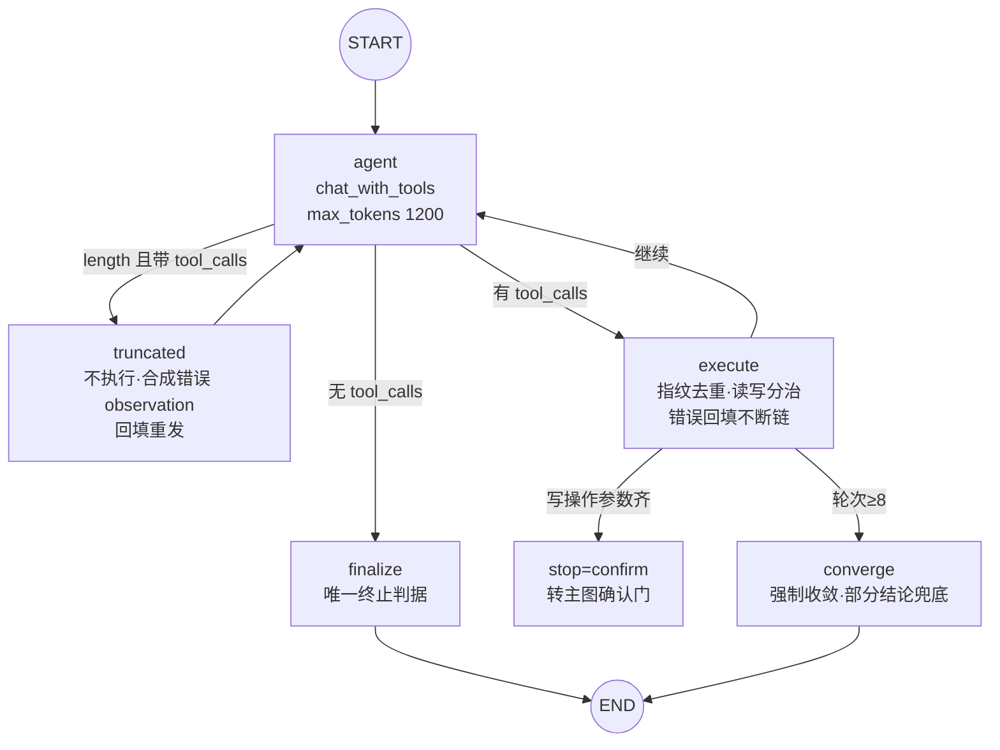

# 05 · ReAct 子图（自主任务执行器）

ReAct 是与 workflow 并存的第二条编排形态（`gewu/agent/react.py`）：模型通过
原生 tool-calling 协议**自主决定**调用哪个工具、循环到信息足够为止——服务
「路径不定」的开放任务；workflow（03/06 的确定性链路）服务「路径已知」的任务。
入口：请求 `mode=react` 显式指定，或 `REACT_MODE=on` 时路由拦截办理信号词。

## 子图结构

## 防护四件套

1. **唯一终止判据**：模型不再产出 tool_calls 即最终回答（不用轮数猜终止）；
2. **指纹去重**：同一 `(name,args)` 规范化指纹（json 排序 key）第 3 次被拒并
   提示换路——防死循环；
3. **轮次上限 + 到顶收敛**：reactMaxTurns=8；到顶后强制收敛一次（「基于已有
   结果直接回答，不要再调工具」），失败则用已累积 observation 组织部分结论，
   不留裸错误；
4. **截断防御（P10 铁律）**：`finish_reason=length` 且带 tool_calls 时**一律不
   执行**（截断的参数 JSON 可能不完整，执行会产生真实副作用），合成错误
   observation 回填交模型重发（Pi 式修复）。实现为 agent 后的**条件路由**
   （length 判断先于工具解析）；重发不记 seen 指纹（未执行过的调用不得被去重
   误伤）。

## 工具表

- **内置读工具**：`search_knowledge`（混合检索，observation 带来源条款、顺带
  累积 citations 去重）、`parse_date`（确定性日期解析，零 LLM 成本）；
- **业务工具**：8 个（查询/预约/取消/请假/审批），经 `agent.tools` 的 CallTool
  单一出口执行——未知工具/越权/缺参在进入业务系统前拦截，业务失败也是有效
  observation 交模型决策；
- **权限矩阵**：工具表按角色裁剪（模型看不见=打不到），路由决策包的 toolset
  再收窄一层（最小权限）。

## 写操作转确认流

写工具（预约/取消/请假/审批）在 ReAct 里**不直接执行**：必填参数齐 → 置
`stop=confirm` 并把归一化后的槽位写回主图 state，由主图的 tx_confirm/tx_gate
接管（pending_action → interrupt → 用户确认 → 执行 → 回执，见 [06](06-transaction.md)）；
参数不全 → observation 提示 agent 先向用户收集。**模型可发起写操作，不能拍板**。

## 运行时环境传递

`ReactContext`（工具表/检索器/业务系统/角色）经 `config.configurable.react_ctx`
注入——**运行时对象不能进 state**（checkpointer 的 msgpack 序列化会拒绝），
这是 LangGraph 的硬约束，也是 state 只放可持久化数据的纪律来源。

## 相关文件

`gewu/agent/react.py`（子图与常量：maxTurns=8 / repeatLimit=2 / observationLimit=1500）、
`gewu/agent/tools.py`（工具表与权限）；单测 `tests/test_react.py`（含 G5 截断
防御专项：截断那次不执行、重发才执行）。
