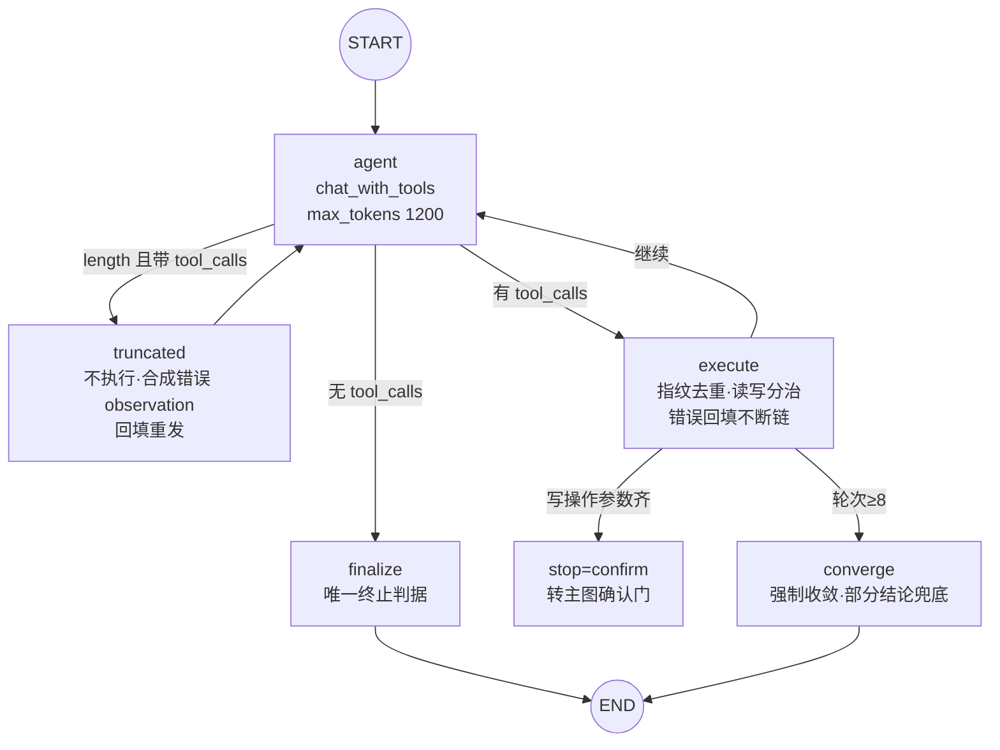
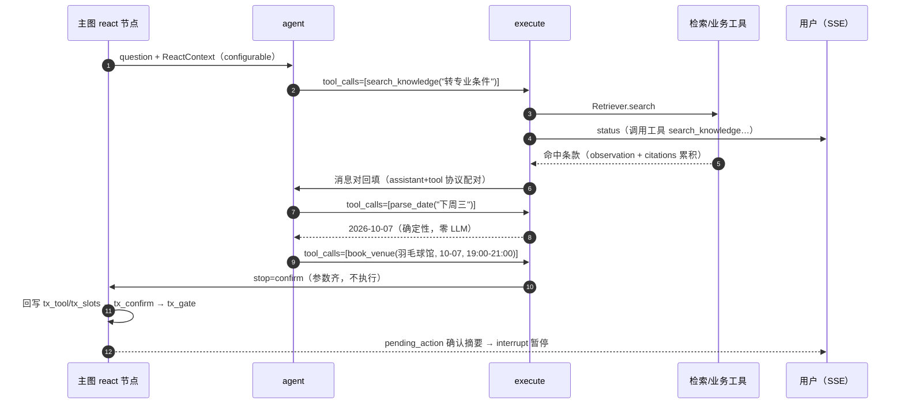

# 05 · ReAct 子图（自主任务执行器）

ReAct 是与 workflow 并存的第二条编排形态（`gewu/agent/react.py`）：模型通过原生 tool-calling 协议**自主决定**调用哪个工具、循环到信息足够为止——服务「路径不定」的开放任务；workflow（[03](03-routing.md)/[06](06-transaction.md) 的确定性链路）服务「路径已知」的任务。入口：请求 `mode=react` 显式指定，或 `REACT_MODE=on` 时路由拦截办理信号词。本文拆解子图结构、防护四件套与写操作转确认流。

## 子图结构



五个节点的分工：

| 节点 | 职责 | 关键细节 |
| --- | --- | --- |
| `agent` | `llm.chat_with_tools(msgs, ctx.schemas, max_tokens=1200)` 一轮决策 | 首轮装配 system（含记忆块尾部注入）+ human；产出存 `pending_ai`（dict 形态：content/tool_calls/finish_reason） |
| `truncated` | 截断防御：**不执行**，合成错误 observation 回填 | `finish_reason=length` 且带 tool_calls 时进入；轮次 +1 后回 agent 重发 |
| `execute` | 逐 call 执行：未知工具/指纹去重/读写分治/错误回填 | observation 截 1500 字（`OBSERVATION_LIMIT`）控上下文膨胀 |
| `finalize` | 无 tool_calls 即最终回答 | content 为空时用已累积 observation 组织部分结论 |
| `converge` | 轮次到顶的强制收敛 | 追加「不要再调工具」human 一次；失败用 partial_answer 兜底 |

子图自带独立的 `ReactState`（与主图 ChatState 分离）：`msgs` 直接持有 langchain 消息对象、`seen` 指纹计数表、`observations`/`citations` 累积、`stop`（`"" | "confirm"`）与回传主图的 `tx_tool`/`tx_slots`。

## 运行时环境传递（ReactContext）

**运行时对象不能进 state**——checkpointer 的 msgpack 序列化会拒绝检索器/业务系统这类对象，这是 LangGraph 的硬约束，也是 state 只放可持久化数据的纪律来源。环境经 `config.configurable` 注入：

```python
ctx = ReactContext(retriever, business, tools, role, user, toolset)
result = sub.invoke({...},
    config={"configurable": {"react_ctx": ctx}})   # 运行时对象不进 checkpoint
```

`ReactContext` 构造时即完成**双重裁剪**：工具表按角色裁剪（`has_role(spec.roles, role)`，模型看不见=打不到），路由决策包的 toolset 白名单再收窄一层（`not allowed or name in allowed`）——最小权限。`schemas` 由内置两工具 + 可见业务工具动态生成，字段名与 workflow 槽位一致（确认流共用归一口径）。

## 防护四件套

**① 唯一终止判据**：模型不再产出 tool_calls 即最终回答——不用轮数猜终止，路径不定的问题该走几轮由模型自己决定：

```python
def _route_after_agent(state: ReactState) -> str:
    ai = state["pending_ai"]
    if ai["finish_reason"] == "length" and ai["tool_calls"]:
        return "truncated"          # 截断防御铁律：length 判断先于工具解析（P10）
    return "execute" if ai["tool_calls"] else "finalize"
```

**② 指纹去重**：同一 `(name, args)` 规范化指纹（`json.dumps` 排序 key）执行 2 次后第 3 次被拒，observation 提示换路或直接回答——防死循环：

```python
def _fingerprint(name: str, args: dict) -> str:
    return name + "|" + json.dumps(args or {}, ensure_ascii=False, sort_keys=True)
```

**③ 轮次上限 + 到顶收敛**：`REACT_MAX_TURNS=8`（预算熔断之外的第二道闸）；到顶后 converge 强制收敛一次（「基于已有结果直接回答，不要再调工具」），失败则用已累积 observation 组织部分结论（前 5 条、各截 200 字），不留裸错误。

**④ 截断防御（P10 铁律）**：`finish_reason=length` 且带 tool_calls 时**一律不执行**——截断的参数 JSON 可能不完整，执行会产生真实副作用。合成错误 observation 回填交模型重发（Pi 式修复）：

```text
"输出达到 token 上限被截断，参数可能不完整，本次未执行。请重新发起完整调用。"
```

实现为 agent 后的**条件路由**（`_route_after_agent` 中 length 判断先于工具解析）；**重发不记 seen 指纹**（未执行过的调用不得被去重误伤）。

## 工具表

| 工具 | 类型 | 说明 |
| --- | --- | --- |
| `search_knowledge` | 内置读 | 混合检索；observation 为编号条款文本（各截 600 字），顺带累积 citations 去重（doc_id+title 键） |
| `parse_date` | 内置读 | 确定性日期解析（`gewu/dates.py`），零 LLM 成本；observation 形如 `下周三 → 2026-10-07` |
| `query_venues` / `my_bookings` / `leave_status` | 业务读 | 查场馆余量 / 本人预约 / 请假单状态 |
| `pending_leaves` | 业务读（counselor） | 待审批清单 |
| `book_venue` / `cancel_booking` / `submit_leave` | 业务写 | 不直接执行——见下节转确认流 |
| `approve_leave` | 业务写（counselor） | 同上 |

业务工具经 `agent.tools.call_tool` 单一出口执行——未知工具、越权、缺参在进入业务系统前拦截（权限矩阵见 [06](06-transaction.md)）；业务失败也是**有效 observation** 交模型决策（「时段冲突，可选…」模型能据此改约别的时间），例外捕获的报错同样回填为 `工具执行失败：…` 不断链。

## 写操作转确认流

写工具在 ReAct 里**不直接执行**：必填参数齐 → 置 `stop="confirm"` 并把归一化后的槽位写回主图 state，由主图的 tx_confirm/tx_gate 接管（[06](06-transaction.md)）；参数不全 → observation 提示 agent 先向用户收集（不调工具、直接输出提问文本）。**模型可发起写操作，不能拍板**：

```python
elif ctx.is_write_tool(name):
    ready, missing, norm_slots = _tx_ready(ctx, name, args)
    if ready:
        emit(ev.status_evt("已整理办理信息，等待确认…"))
        return {"stop": "confirm", "tx_tool": name, "tx_slots": norm_slots, ...}
    out = "缺少必填参数：" + "、".join(missing) + "。请先向用户收集这些信息…"
```

`_tx_ready` 与 workflow 用同一套 `FLOW_DEFS` 必填定义和 `normalize_slot` 归一口径——ReAct 与槽位收集两条路收集到的参数，进确认门时形状一致。

## 一次 ReAct 运行的典型轨迹



## 相关文件

| 文件 | 职责 |
| --- | --- |
| `gewu/agent/react.py` | 子图装配、节点、常量（maxTurns=8 / repeatLimit=2 / observationLimit=1500）、工具 schema |
| `gewu/agent/tools.py` | 工具表、权限矩阵与 call_tool 单一出口 |
| `gewu/agent/prompts.py` | ReAct system 提示词（记忆块尾部注入） |
| `tests/test_react.py` | 含 G5 截断防御专项：截断那次不执行、重发才执行 |

---

下一篇《06 · 知行执行层》进入写操作的完整生命周期：槽位收集、interrupt() 确认门、失败恢复与权限矩阵。
