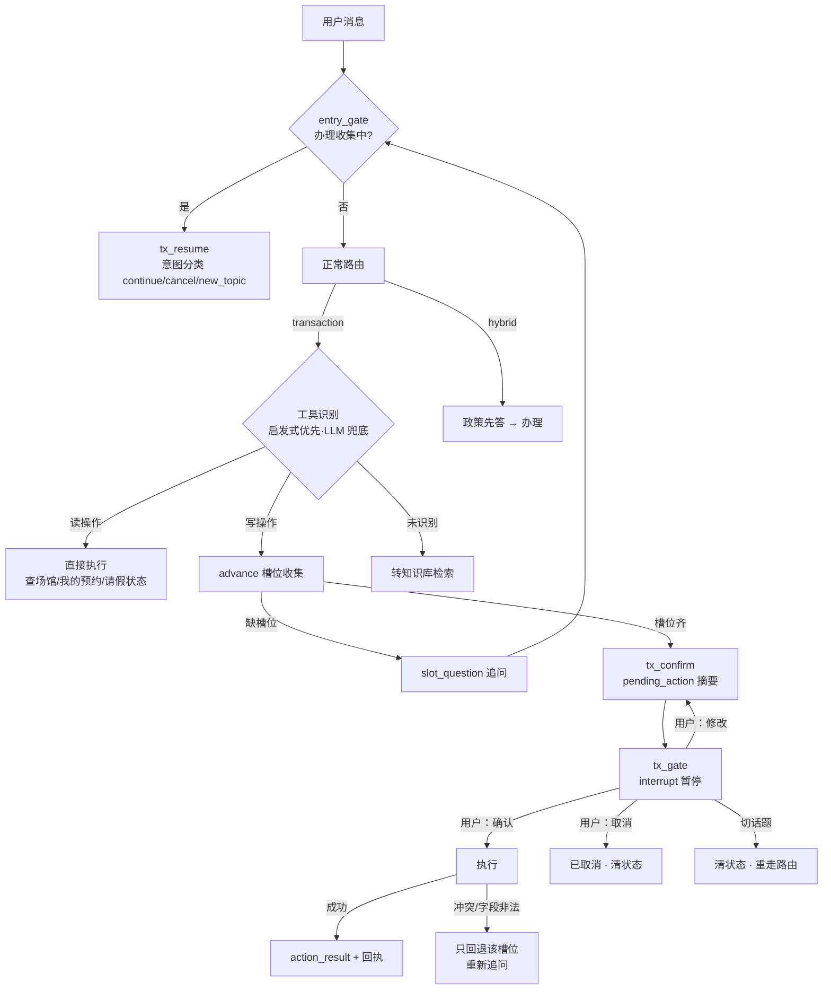
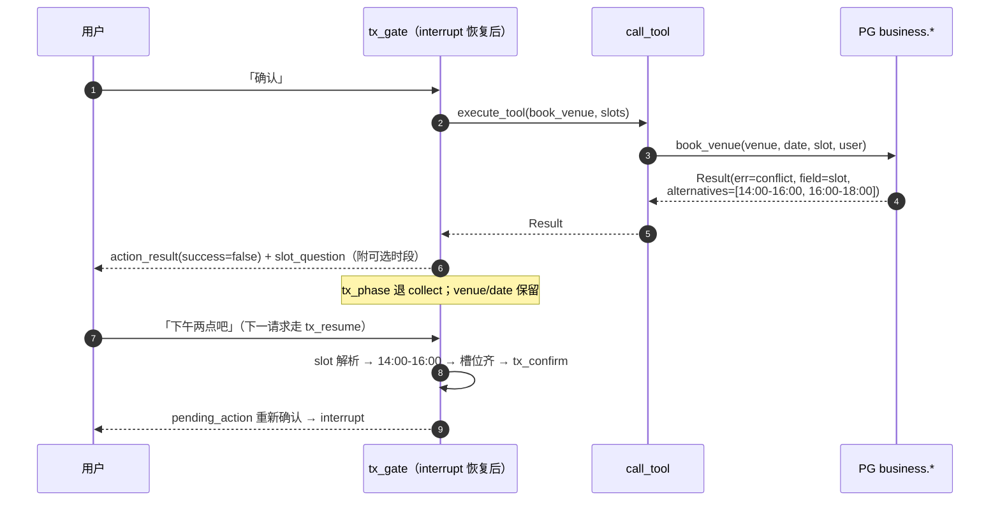

# 06 · 知行执行层（transaction）

「格物」负责让学生知道（信息问答），「知行」负责让学生办成（业务执行）。核心原则（PARITY §9）：**读操作直接执行；写操作必须经过「确认摘要 → 用户确认 → 执行 → 回执」；执行失败不是终点，恢复也是流程的一部分**。本文拆解工具识别、槽位系统、interrupt 确认门与失败恢复的完整机制。

## 流程全景



## 工具识别（启发式优先，LLM 兜底）

`_TOOL_PATTERNS` 是按序判定的正则序列（`gewu/agent/tx.py`），**顺序是契约**——前面的模式优先级高，调换会改变行为：

| 序 | 工具 | 正则要点 |
| --- | --- | --- |
| 1 | `cancel_booking` | 取消预约/退订 |
| 2 | `approve_leave` | 批准/通过…请假 |
| 3 | `pending_leaves` | 待审批/谁请了假 |
| 4 | `leave_status` | 请假单号/进度/LV-\d+ |
| 5 | `my_bookings` | 我的预约/我订了 |
| 6 | `query_venues` | 有/哪些…场馆 |
| 7 | `submit_leave` | 请假/事假/病假/销假 |
| 8 | `book_venue` | 办理动词 + 场馆类宾语**共现**（馆/场/间/羽毛球…） |

两个从真实 bug 学出的守卫：`book_venue` 要求「预约」与场馆类宾语共现——裸「预约」会把「预约心理咨询」也误选成场馆工具（P7 修复）；`_NON_VENUE_RE`（心理咨询/挂号/校医…）作**负向双保险**，且对 LLM 兜底路径同样生效（P7-1）。LLM 只兜底口语化表述，且提示词明令「没有语义匹配的工具时必须返回空，禁止挑最相近的强行办理」；识别不出转知识库检索（`Command(goto="retrieve")`）。

## 槽位系统

每个槽位有 label/ask 文案与**确定性解析器**（`slot_meta`，文案逐字保留 PARITY §9.3 表格）：

| 槽位 | label | 追问文案（节选） | 确定性解析 |
| --- | --- | --- | --- |
| `venue` | 场馆 | 想预约哪个场馆？可选：羽毛球馆、篮球场、研讨间301/302 | 场馆名 → venue_id（查业务库） |
| `date` | 日期 | 预约哪一天？（如：明天、周三、9月2日） | `dates.parse_iso`（周几/相对日/月日全格式） |
| `slot` | 时段 | 可选 5 档；也可回复上午/下午/晚上 | 标准段直接匹配；「晚上七点」→19:00-21:00；上午/傍晚等多选词**不命中**（须指明） |
| `purpose` / `reason` | 用途/事由 | 自由文本 | 原样保留（不猜测） |
| `leave_type` | 类型 | 事假 / 病假 / 其他 | 词表匹配 |
| `start_date` / `end_date` | 起止日期 | 如：明天、下周一（含当天） | 同 `date` |
| `booking_id` / `ticket_id` | 单号 | 形如 VE-0001 / LV-0001 | 正则抽取 |

流程定义（`FLOW_DEFS`）：`book_venue` 必填 venue/date/slot（可选 purpose）；`submit_leave` 必填 leave_type/start_date/end_date/reason；`cancel_booking`/`approve_leave`/`leave_status` 只需单号。

**LLM 抽出的原始值一律过解析器归一**（`normalize_slot`）——日期换算、场馆名→ID、时段口语→标准段都在确定性代码里完成；LLM 的抽取提示词明令「拿不准就不要抽，留给系统追问」「日期原样保留表述，不要自己换算」。分工即：**LLM 找表述，代码算日期**——「下周三到底是哪天」LLM 极易算错，`gewu/dates.py` 确定性换算（周几/下周一/中文数字天数/已过去的 N月N日顺延明年），独立单测、基准日与 Go 版同源。

**advance**（transaction 首轮与 tx_resume 续轮共用）的推进逻辑：有 key 走 LLM 抽槽 → 归一合并（已收集的不覆盖）；无 key 退「上一问的解析器直接解析本轮回答」（`tx_last_asked`）或离线首轮机会抽取（`opportunistic_fill`，自由文本字段不猜测）。「请三天假」短语在给了开始日期时直接换算结束日期（`apply_days_phrase`：start + N−1 天）。缺槽位按流程必填顺序取第一个追问（`slot_question` + answer 同文案）；齐了只置 `tx_phase=confirm`——确认摘要由 tx_confirm 节点统一发（transaction/tx_resume/react 三链共用，避免重复 emit）。

## interrupt() 确认门（P14 原生机制）

写操作确认流从 Go 时代的自研跨轮状态机，变为 LangGraph 原生暂停/恢复：

- **tx_confirm**（副作用节点）：`build_confirm` 产 pending_action 事件 + 确认文案——有序参数表（`场馆：羽毛球馆；日期：…；时段：…`），请假自动补「共 N 天 / X 审批」（按天数映射：≤3 辅导员、≤7 学院、>7 教务处）与病假超 3 天附证明提示；
- **tx_gate**：**首个动作即 `interrupt(payload)`**——图在此暂停，checkpointer 落盘；interrupt 之前零副作用，resume 重放不会重复 emit（纪律）：

```python
def tx_gate(state: ChatState) -> dict:
    payload = {"tool": tool, "label": flow["label"], "args": state.get("tx_slots") or {}}
    user_text = interrupt(payload)      # ← 图在此暂停；resume 值为用户新消息
    st = {**state, "question": user_text}
    intent = classify_reply(llm, meta, user_text, st)   # continue/cancel/new_topic
    ...
```

- **SSE resume 桥**（`gewu/api/chat.py`）：下一请求进来时 `get_state` 检测 `snap.next` 非空 → 把用户消息作为 `Command(resume=question)` 的值续跑——**前端照常发 /api/chat，零改动**；
- resume 值分类处理（`classify_reply`，LLM 优先启发式兜底）：**修改**（槽位解析器从回复里抽出新值 → goto tx_confirm 重发摘要）/ **确认**（`_CONFIRM_MODIFY_RE` 命中 → 执行）/ **取消** / **new_topic**（清状态 goto route 重走正常路由）。

## 失败恢复（字段级）

业务层返回结构化错误（`business.Result`）：

| 字段 | 含义 | 恢复动作 |
| --- | --- | --- |
| `ok` / `message` | 结果与人话描述 | 直接进回执/追问文案 |
| `err` | invalid / quota / conflict / not_found / permission / missing_arg / unknown_tool | 非 field 级 → 结束流程并说明 |
| `field` | 字段级失败标记 | **只回退该槽位**重新追问（`tx_phase` 退 collect，由 tx_resume 续） |
| `alternatives` | 冲突时的可选项 | 拼进追问文案（「可选时段：…」） |
| `receipt` | VE-XXXX / LV-XXXX | 成功回执凭证号 |

字段级问题（时段冲突/日期非法）只回退该槽位重新追问——冲突时带当日可选项；已收集的其他信息保留。其余失败（配额/权限）结束流程并说明。冲突恢复的完整交互：



## 权限矩阵与确定性

- **权限在工具层不在业务系统**：business 对角色无感知，判定收敛在 `agent.tools.call_tool` 单一出口——路由、ReAct、恢复流程、LLM 选工具所有路径都绕不过这道闸：

```python
def call_tool(tools, business, name, args, role, user) -> Result:
    t = tools.get(name)
    if t is None:
        return Result(err="unknown_tool", message=f"未知工具：{name}")
    if not has_role(t.roles, role):
        return Result(err="permission",
            message=f"当前身份（{role_label(role)}）无权执行「{t.label}」")
    return t.fn(business, args, user)
```

学生调 `approve_leave`/`pending_leaves`（counselor 专属）被明确拒绝，评测集有专项用例。工具的角色/读写属性表见 [05](05-react-agent.md)。

- **业务规则与语料一致**：请假 1—3 天辅导员批、3 天以上 7 天以内学院批、超过 7 天教务处批（`approver_of`）；场馆每时段容量（羽毛球馆 2 组/篮球场 1 组/研讨间各 1），「每人每天 2 时段」配额在业务库判定——mock 层也按真实语义实现（`gewu/business/db.py`，P21-2 起 PG；`user` 列在 PG 为保留字，SQL 内一律双引号）。

## 相关文件

| 文件 | 职责 |
| --- | --- |
| `gewu/agent/tx.py` | 工具识别、槽位元数据、advance/确认摘要、续轮分类 |
| `gewu/agent/graph.py` | transaction/advance/tx_confirm/tx_gate/tx_resume 节点接线 |
| `gewu/agent/tools.py` | 工具表与 call_tool 权限出口 |
| `gewu/business/db.py` | mock 业务全量（场馆/预约/请假单、Result 结构） |
| `gewu/dates.py` | 确定性中文日期解析（UTC+8） |
| `tests/` | test_tx.py / test_business_write.py / test_dates.py |

---

下一篇《07 · 状态与持久化》盘点四类状态的生命周期：PG checkpoints、业务/记忆表与每日预算。
