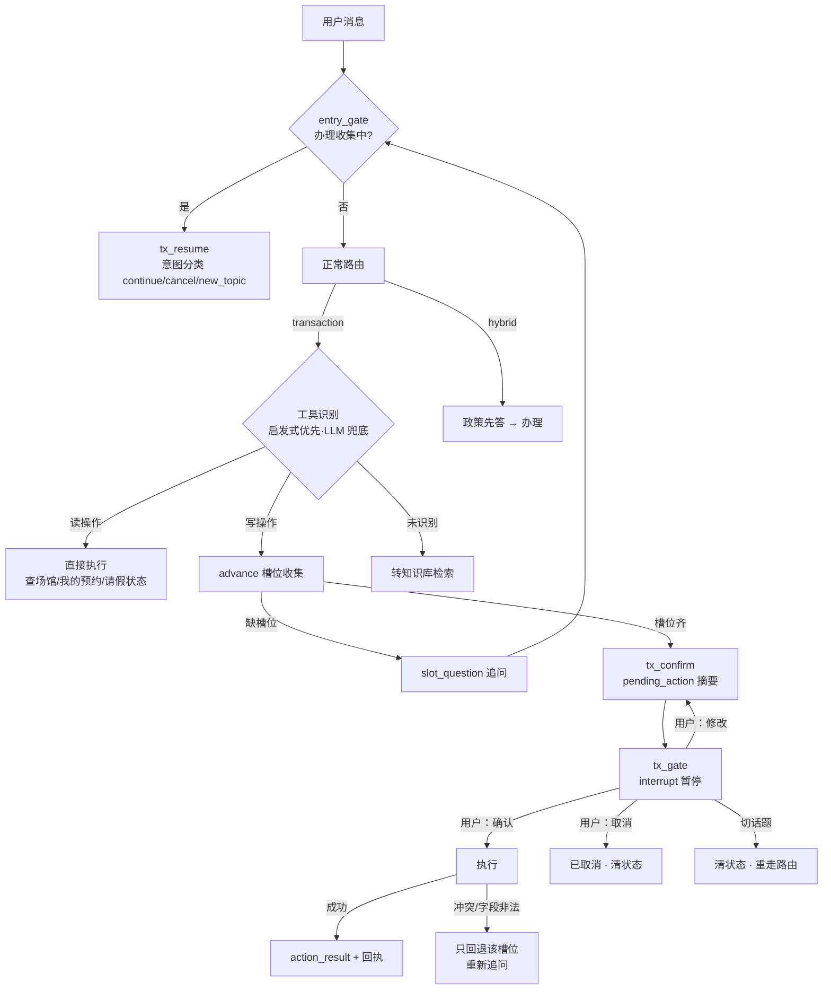

# 06 · 知行执行层（transaction）

「格物」负责让学生知道（信息问答），「知行」负责让学生办成（业务执行）。
核心原则（PARITY §9）：**读操作直接执行；写操作必须经过「确认摘要 → 用户确认 →
执行 → 回执」；执行失败不是终点，恢复也是流程的一部分**。

## 流程全景

## interrupt() 确认门（P14 原生机制）

写操作确认流从 Go 时代的自研跨轮状态机，变为 LangGraph 原生暂停/恢复：

- **tx_confirm**（副作用节点）：发 pending_action 事件 + 确认文案；
- **tx_gate**：**首个动作即 `interrupt(payload)`**——图在此暂停，checkpointer
  落盘；interrupt 之前零副作用，resume 重放不会重复 emit（纪律）；
- **SSE resume 桥**（`gewu/api/chat.py`）：下一请求进来时检测 thread 停在
  interrupt，把用户消息作为 `Command(resume=...)` 的值续跑——**前端照常发
  /api/chat，零改动**；
- resume 值分类处理：修改（改槽位重发摘要）/ 确认（执行回执）/ 取消 /
  new_topic（清状态 goto route 重走正常路由）。

## 槽位系统（`gewu/agent/tx.py`）

- **工具识别**：启发式优先（正则序列，顺序是契约；`book_venue` 带「预约心理
  咨询」负向双保险），LLM 只兜底口语化表述；未识别转知识库。
- **槽位元数据**：每个槽位（venue/date/slot/purpose/leave_type/…）有 label/
  ask 文案与**确定性解析器**。LLM 抽出的原始值一律过解析器归一（日期换算、
  场馆名→ID、时段口语→标准段）——拿不准就不抽，留给系统追问。
- **advance**（transaction 首轮与 tx_resume 续轮共用）：LLM 槽位抽取 → 归一
  合并 → 缺槽位追问（slot_question）/ 齐了进确认。「请三天假」短语在给了开始
  日期时直接换算结束日期。
- **确认摘要**：有序参数表（场馆：羽毛球馆；日期：…；时段：…），请假自动补
  「共 N 天 / X 审批」与病假超 3 天附证明提示。

## 失败恢复（字段级）

业务层返回结构化错误：`{err, field, message, alternatives}`。字段级问题
（时段冲突/日期非法）只回退该槽位重新追问——冲突时带当日可选项；已收集的
其他信息保留。其余失败（配额/权限）结束流程并说明。

## 权限矩阵与确定性

- **权限在工具层不在业务系统**：business 对角色无感知，判定收敛在
  `agent.tools.call_tool` 单一出口——路由、ReAct、恢复流程、LLM 选工具所有
  路径都绕不过这道闸（学生调辅导员工具被明确拒绝，评测集有专项用例）。
- **日期换算不用 LLM**：「下周三到底是哪天」LLM 极易算错。分工：LLM 找表述，
  `gewu/dates.py` 确定性换算（周几/下周一/中文数字天数/已过去顺延明年），
  独立单测、基准日与 Go 版同源。

## 相关文件

`gewu/agent/tx.py`（槽位/流程定义/确认/续轮分类）、`gewu/agent/graph.py`
（transaction/advance/tx_confirm/tx_gate/tx_resume 节点）、`gewu/agent/tools.py`、
`gewu/business/db.py`、`gewu/dates.py`；单测 `tests/test_tx.py` /
`tests/test_business_write.py` / `tests/test_dates.py`。
