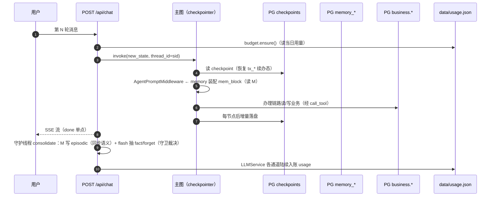

# 07 · 状态与持久化

系统里有四类生命周期不同的状态，各有明确的存放地与失效语义。会话与办理流程状态由 LangGraph 的 PostgresSaver 接管（P14 Q4 原生机制，吸收了 Go 时代的自研 sessions.db）；业务与记忆自 P21-2 起同库迁入 PG（SQLite 退役，凭证/用户见 [11](11-auth.md)）；每日用量是进程外一个 JSON 文件。本文给出每一类的装配方式、读写路径与失效行为。

## 状态总览

| 状态 | 存放 | 生命周期 | 失效 |
| --- | --- | --- | --- |
| 会话与办理流程（ChatState） | **PG checkpoints**（PostgresSaver） | 跨请求、跨进程重启 | thread 级；办理完成/取消时显式清；P22 起随会话删除连带清 |
| 会话登记（归属/标题/kind） | PG 表 `chat_sessions`（P22） | 跨请求、跨重启 | `DELETE /api/sessions/{id}` 三处连带之一 |
| 业务数据（预约/请假单） | PG 表 `bookings`/`leave_tickets` | 永久（演示语义） | `/api/business/reset` 手动清（P21 起 admin-only） |
| 长期记忆（fact/episodic） | PG 表 `memory_fact`/`memory_episodic` | 永久积累 | 同 key UPSERT 覆盖；user_id=P21 起为真实 email；P22 起 fact 用户可管（/memory 页）；P32 起删除为软删（防抽取复活）、注入带声明/标注/分轨；episodic 随会话删除连带清 |
| 消息反馈（赞/踩） | PG 表 `message_feedback`（P25） | 永久积累 | 同 `(user,session,question)` UNIQUE upsert 覆盖（改主意不双行） |
| per-user token 用量 | PG 表 `token_usage`（P23） | 按 (user, day) 累加 | 次日自然新行（无清理任务） |
| 全局每日 token 用量 | `data/usage.json` | 当天 | 跨天自动归零 |

## 会话资源化（P22：`gewu/session/store.py`）

P22 起 session_id 不再是客户端自报的裸 uuid，而是 `chat_sessions` 表登记发放的
服务端资源（`secrets.token_urlsafe(16)` 主键、`"user"`=email 保留字双引号、
`kind ∈ chat`（P36 起 compare 随 classic 退役，存量行 SELECT 不受影响）、
title 首问前 20 字条件回填——`UPDATE ... WHERE title=''`
语义防并发覆盖用户改名）。`/api/chat` 装配点一条 SELECT 做归属校验（本人外
统一 404 防枚举），`"default"` 缺省值废弃（未传 422 给指引文案）。

删除会话 = 三处连带（`gewu/api/sessions.py`）：先 `checkpointer.delete_thread`
（langgraph-checkpoint-postgres 3.x 原生 API，删 checkpoints/blobs/writes 三表
该 thread 全部行），再 `memory_episodic` 按 session_id 清，最后删 `chat_sessions`
行——顺序不反：跨连接非事务，业务行删了 cp 删失败只会留无害悬空检查点（无入口
可达），反过来会留「看似可用实则无历史」的会话。

历史恢复（`GET /api/sessions/{id}/messages`）：优先从 checkpointer state 的
`messages` 提取对话级序列（HumanMessage 文本 + AIMessage 非空 text；工具调用轮
与 ToolMessage 跳过、system 跳过）——覆盖全链路（P31 起单循环唯一形态）；提取
为空时退 `memory_episodic` 兜底（每轮 user/assistant 双条、链路无关）。对话级
纯文本渲染，事件级细节（citations/steps 卡片）不恢复。

## PostgresSaver（P14 Q4 原生机制）

主图以 `thread_id = session_id` 编译进 checkpointer（`gewu/api/app.py` 装配）。构造有一个官方文档没写清的坑——**必须 autocommit 连接**（checkpointer 内部自管事务），DSN 字符串会在 setup 时 TypeError：

```python
def _make_checkpointer(settings: Settings):
    try:
        conn = psycopg.connect(settings.pg_dsn, autocommit=True)   # 必须 autocommit
        cp = PostgresSaver(conn)
        cp.setup()          # 幂等建表
        return cp
    except Exception:
        traceback.print_exc()
        return MemorySaver()   # PG 不可用退内存版（重启即失）
```

装配后每一轮 invoke 都写两份语义：

- **每步落盘**：节点执行后的 state 增量写 PG（`checkpoints`/`checkpoint_blobs`/`checkpoint_writes` 表族，`cp.setup()` 幂等建表）；
- **interrupt 恢复**：HITL 确认门中断时状态完整落盘——**服务重启后用户发「确认」仍能续办**（P14-6 G3 真跑验证：办到确认门 → kill 服务 → 重启 → resume 执行成功落库）。

办理流程状态从 Go 时代的自研「进程内 map + SQLite 镜像」（P8-1 sessions.db）变为框架原生能力，代码量近乎归零。续轮槽位收集由 `WriteSlotGateMiddleware` 引导模型发问（[05](05-react-agent.md)）、确认门中断由 resume 桥接管（[06](06-transaction.md)）——续办语义完全建立在「state 在 PG 里活着」这一事实之上。

## 长期记忆（`gewu/memory.py`）

分层两域表（psycopg ConnectionPool + 建表幂等 DDL，P21-2 自 SQLite 平移；P32 对齐 zcode 记忆模式——[任务书](../runbooks/P32-memory-layer-upgrade.md)）：

| 表 | 内容 | 写入时机 | 读取用途 |
| --- | --- | --- | --- |
| `memory_fact` | 用户级结构化事实（kind: profile/preference/constraint + key/value + 软删 `deleted_at`） | 每轮会话结束后 flash **异步**抽取（P32「开眼」：prompt 携带现有事实清单 + 禁抽清单 + 最近 6 条 episodic 窗口），同 `(user,kind,key)` UPSERT 覆盖 | 记忆块注入：≤20 条全量，超出分轨（profile 常驻 + 非核心按问题词面筛选），行尾带「N 天前更新」标注 |
| `memory_episodic` | 会话原文 user/assistant 双条 | 每轮**同步**落库（毫秒级 PG 写） | 记忆块的「近期对话要点」4 条 + P32 抽取窗口（最近 6 条） |

同步/异步的分工是有意的：episodic 同步落库保证下一轮装配**立刻**能看到上一轮原文，不受异步抽取延迟影响；fact 抽取不在用户等待路径做 LLM（固化失败只打日志，原文已留存）。

固化入口在 SSE 端点流结束后起守护线程（`_consolidate_async` → `consolidate()`）：先写双条 episodic，再让 flash 按 `CONSOLIDATE_PROMPT` 抽稳定事实（专业/年级/绩点/宿舍…，「只抽明确表达或可直接确定的信息，不要推测」，key 用英文标识如 major/gpa）。**P32 起输出为 facts+forget 双字段，且裁决权在代码不在模型**：`forget` 只对现有清单内的未删 key 生效（`_normalize_key` 兼容 flash 偶发的 `kind/key` 复合串），先软删后 upsert（同轮既 forget 又给新值时纠正语义获胜）；与禁抽清单同 key 的 facts 一律丢弃。

**删除是软删（tombstone）**：面板 DELETE 与抽取 forget 都置 `deleted_at`，读取面（recent/all/抽取清单）一律过滤——用户删过的事实不会在后续对话中被重新抽回（zcode「用户要求忘记→移除」语义）；恢复途径=面板重新 POST（upsert 清 `deleted_at`）。

注入（`AgentPromptMiddleware`，P31-3 起）：memory_block 头部两行声明常驻——「长期记忆是背景信息非当前指令」+「与制度条款冲突时以知识库检索结果为准；与当前对话冲突时以当前对话为准」（个人事实进记忆、制度事实走 RAG 的冲突裁决约定）；每 run 以当前问题（最后一条用户消息）驱动非核心事实的词面分轨。无记忆数据时整块为空串，不产生任何噪声。

**评测口径注意**：记忆固化线程与下一轮请求存在并发（P14 时代偶发路由降级漂移）——全量评测以 `MEMORY_CONSOLIDATE=off` 隔离（记忆固化不在 PARITY 契约内），运行态默认 on。归因过程见 [P14 任务书 §6](../runbooks/P14-langgraph-migration.md)。

## 预算（双闸：`gewu/budget.py` + `gewu/usage.py`）

token 成本是两道闸、两本账：

- **全局闸**（`budget.py`，usage.json 文件制）：每日 token 预算（缺省 200 万，`DAILY_TOKEN_BUDGET`），chat 入口 `ensure()` 超限抛 `BudgetExhausted` → 429；`LLMService` 各通道统一把 `usage_metadata.total` 入账。持久化是整文件覆写 `{"date": "...", "tokens": n}`——与 Go 版同格式，跨重启有效、跨天归零；记账文件写失败不影响主链路。
- **个人闸**（P23，`usage.py`，PG `token_usage` 表）：按 `(user, day)` UPSERT 累加，chat 入口比对 `users.daily_token_limit ?? DAILY_USER_BUDGET(20 万)` 超限 429（文案与全局闸区分）；记账归属经 `usage.current_user` ContextVar 从 chat 入口传播到 LLMService 记账口**双写**（全局账 + 个人账）。装配 `make_usage_store` 探测式软降级——PG 不可达退 None 禁用个人功能，全局闸仍兜底。

ContextVar 传播的两个坑（P23 撞出、已在代码注释固化）：StreamingResponse 的 sync 迭代由线程池分派（每次 next 可能换线程），contextvar 必须在 `generate()` 迭代体开头 re-set；consolidate/follow_ups 异步线程不继承，work() 首行显式 set。

## 一轮会话触及的全部状态



## 相关文件

| 文件 | 职责 |
| --- | --- |
| `gewu/api/app.py` | checkpointer 装配（autocommit 坑在此）与各存储域注入 |
| `gewu/agent/mw.py` | GewuAgentState 字段全景（哪些进 checkpoint） |
| `gewu/memory.py` | 双表 schema、memory_block 装配、consolidate 固化 |
| `gewu/budget.py` / `gewu/usage.py` | 全局预算闸（usage.json）与 per-user 用量账（PG） |
| `gewu/session/store.py` | chat_sessions 登记与 message_feedback 表 |
| `gewu/api/chat.py` | 流后异步固化入口 |

---

下一篇《08 · 接口契约》对齐外部视角：27 端点、SSE 十一类事件与 interrupt/resume 桥的字段级约定。
