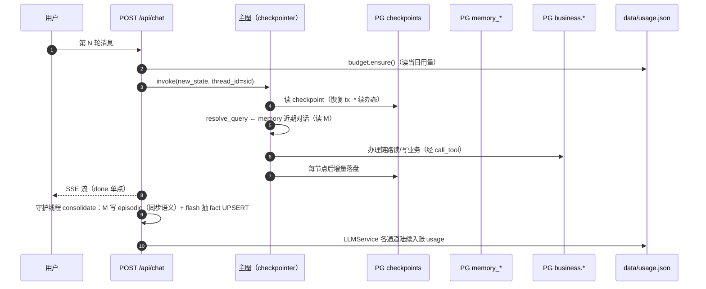

# 07 · 状态与持久化

系统里有四类生命周期不同的状态，各有明确的存放地与失效语义。会话与办理流程状态由 LangGraph 的 PostgresSaver 接管（P14 Q4 原生机制，吸收了 Go 时代的自研 sessions.db）；业务与记忆自 P21-2 起同库迁入 PG（SQLite 退役，凭证/用户见 [11](11-auth.md)）；每日用量是进程外一个 JSON 文件。本文给出每一类的装配方式、读写路径与失效行为。

## 状态总览

| 状态 | 存放 | 生命周期 | 失效 |
| --- | --- | --- | --- |
| 会话与办理流程（ChatState） | **PG checkpoints**（PostgresSaver） | 跨请求、跨进程重启 | thread 级；办理完成/取消时显式清 |
| 业务数据（预约/请假单） | PG 表 `bookings`/`leave_tickets` | 永久（演示语义） | `/api/business/reset` 手动清（P21 起 admin-only） |
| 长期记忆（fact/episodic） | PG 表 `memory_fact`/`memory_episodic` | 永久积累 | 同 key UPSERT 覆盖；user_id=P21 起为真实 email |
| 每日 token 用量 | `data/usage.json` | 当天 | 跨天自动归零 |

## PostgresSaver（P14 Q4 原生机制）

主图以 `thread_id = session_id` 编译进 checkpointer（`gewu/api/app.py` 装配）。构造有一个官方文档没写清的坑——**必须 autocommit 连接**（checkpointer 内部自管事务），DSN 字符串会在 setup 时 TypeError：

```python
def _make_checkpointer(settings: Settings):
    try:
        conn = psycopg.connect(settings.pg_dsn, autocommit=True)   # 必须 autocommit
        cp = PostgresSaver(conn)
        cp.setup()          # 幂等建表
        return cp
    except Exception:
        traceback.print_exc()
        return MemorySaver()   # PG 不可用退内存版（重启即失）
```

装配后每一轮 invoke 都写两份语义：

- **每步落盘**：节点执行后的 state 增量写 PG（`checkpoints`/`checkpoint_blobs`/`checkpoint_writes` 表族，`cp.setup()` 幂等建表）；
- **interrupt 恢复**：tx_gate 暂停时状态完整落盘——**服务重启后用户发「确认」仍能续办**（P14-6 G3 真跑验证：办到确认门 → kill 服务 → 重启 → resume 执行成功落库）。

办理流程状态从 Go 时代的自研「进程内 map + SQLite 镜像」（P8-1 sessions.db）变为框架原生能力，代码量近乎归零。`entry_gate` 判定 `tx_phase=collect` 走续轮、`tx_phase=confirm` 由 resume 桥接管（见 [02](02-orchestration-graph.md)/[06](06-transaction.md)）——续办语义完全建立在「state 在 PG 里活着」这一事实之上。

## 长期记忆（`gewu/memory.py`）

分层两域表（psycopg ConnectionPool + 建表幂等 DDL，P21-2 自 SQLite 平移）：

| 表 | 内容 | 写入时机 | 读取用途 |
| --- | --- | --- | --- |
| `memory_fact` | 用户级结构化事实（kind: profile/preference/constraint + key/value） | 每轮会话结束后 flash **异步**抽取，同 `(user,kind,key)` UPSERT 覆盖 | 注入 prompt 最近 20 条（`MAX_FACTS_IN_CONTEXT`） |
| `memory_episodic` | 会话原文 user/assistant 双条 | 每轮**同步**落库（毫秒级 PG 写） | 指代补全（resolve_query）的近 6 条输入 + 记忆块的「近期对话要点」4 条 |

同步/异步的分工是有意的：episodic 同步落库保证下一轮指代补全**立刻**能看到上一轮原文，不受异步抽取延迟影响；fact 抽取不在用户等待路径做 LLM（固化失败只打日志，原文已留存）。

固化入口在 SSE 端点流结束后起守护线程（`_consolidate_async` → `consolidate()`）：先写双条 episodic，再让 flash 按 `CONSOLIDATE_PROMPT` 抽稳定事实（专业/年级/绩点/宿舍…，「只抽明确表达或可直接确定的信息，不要推测」，key 用英文标识如 major/gpa）。

注入顺序固定（`assemble_messages`）：system（作答准则）→ 长期记忆块 → 参考资料 + 问题——稳定内容前置，利于 prompt cache；无记忆数据时与历史版本逐字一致。

**评测口径注意**：记忆固化线程与下一轮请求的 L1 路由存在并发争用（偶发路由降级漂移）——全量评测以 `MEMORY_CONSOLIDATE=off` 隔离（记忆固化不在 PARITY 契约内），运行态默认 on。归因过程见 [P14 任务书 §6](../runbooks/P14-langgraph-migration.md)。

## 预算（`gewu/budget.py`）

每日 token 预算（缺省 200 万，`DAILY_TOKEN_BUDGET`）：chat 入口 `ensure()` 超限抛 `BudgetExhausted` → 429；`LLMService` 三个通道（chat / chat_with_tools / 流式迭代完成）统一把 `usage_metadata.total` 入账。持久化是整文件覆写 `{"date": "...", "tokens": n}`——与 Go 版同格式，跨重启有效、跨天归零（每次读/写前检查文件日期 rollover）；记账文件写失败不影响主链路（内存值仍准确到进程生命周期）。

## 一轮会话触及的全部状态



## 相关文件

| 文件 | 职责 |
| --- | --- |
| `gewu/api/app.py` | checkpointer 装配（autocommit 坑在此） |
| `gewu/agent/state.py` | ChatState 字段全景（哪些进 checkpoint） |
| `gewu/memory.py` | 双表 schema、memory_block 装配、consolidate 固化 |
| `gewu/budget.py` | 每日预算闸与记账 |
| `gewu/api/chat.py` | 流后异步固化入口 |

---

下一篇《08 · 接口契约》对齐外部视角：六端点、SSE 十类事件与 interrupt/resume 桥的字段级约定。
