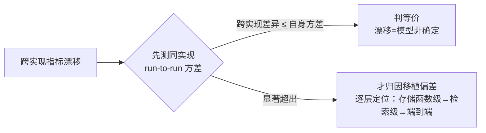

# 10 · 评测体系

评测是这个仓库的方法论核心：「讲到哪必须是真有代码+测试+对比报告」。评测资产与被测服务**跨语言隔离**（纯标准库 HTTP 客户端，契约靠 SSE 而非共享代码）——这套隔离在三次跨实现迁移中保证了评测本身零改动。本文给出数据集、运行口径、flaky 判定与方差归因方法。

## 数据集（eval/）

| 数据集 | 规模 | 断言方式 |
| --- | --- | --- |
| `dataset.jsonl` | 28 题：factual 9 / multi_hop 8 / refusal 3 / transaction 7 / hybrid 1（多轮 8 条） | gold_keywords + expected_docs 引用交集；transaction 断言**业务库真实状态** |
| `dataset-chitchat.jsonl` | 8 题（P17 新增）：你好/在吗/你是谁/能办什么/谢谢/早安等 | 不含「只能回答」+ 非空回答 + 零引用 + route 含 chitchat |
| `dataset-agent.jsonl` | 8 题 | expect 结构化断言（route/success/booking/ticket/answer_contains）；`--mode react`（P17 起 react=auto 同路） |
| `search-queries.jsonl` | 41 条 | 检索层 doc 级命中序列（跨实现对照实验用） |
| `retrieval-queries.jsonl` | 45 条（P15 新增） | 检索层独立评测集：flash 对主集问题生成的**口语化变体**（`gen_query_variants.py`），继承 doc 级 gold（`src_id` 回链原题） |

主集逐题是 JSON 行，断言素材显式声明：

```json
{"id": "fact-001", "type": "factual", "question": "图书馆工作日几点开门几点闭馆？",
 "mode": "auto", "expected_docs": ["0007-library"], "gold_keywords": ["7:30", "22:30"]}

{"id": "ag-know-002", "role": "student", "turns": ["转专业后原课程绩点怎么算？会影响保研排名吗？"],
 "expect": {"route": "agent", "citations_include": ["0001-transfer"], "answer_contains": ["不通过"]}}
```

交易型用例驱动完整多轮对话后查 `/api/business/overview` 断言预约单/请假单/审批层级——比「答案里含 XX 字样」可信得多；权限拦截（学生调辅导员工具）与冲突恢复（约满时段给可选项重问）都有专项用例。

## 运行口径

```bash
RATE_LIMIT_PER_MINUTE=600 make run          # 服务端
python3 eval/run_eval.py --mode classic --tag classic    # classic 基线轨（P17）
python3 eval/run_eval.py --tag agent-first               # agent-first 轨（mode=auto 默认）
python3 eval/run_eval.py --dataset eval/dataset-chitchat.jsonl --tag chitchat
python3 eval/run_eval.py --dataset eval/dataset-agent.jsonl --mode react --tag agent
MEMORY_CONSOLIDATE=off …                     # 全量评测隔离记忆固化（见 07）
```

**双轨口径（P17）**：classic 与 agent-first 跑同一 28 题主集——前者是「前置路由+手写图」对照基线，后者是默认链路；`asked_slot` 断言语义等价（classic 的 slot_question 事件 或 agent 的问号收尾轮，任一命中）。两流派延迟/token/正确率对照见 eval/reports/orchestration-20261001.md（token 6.5× 代价如实记录）。

**检索层独立评测（P15，`make retrieval-eval`）**：绕开端到端直接打 `Retriever`，指标为 doc 级 **Recall@k / MRR / NDCG**；`--no-rewrite` / `--no-rerank` 两开关分离改写与精排的方差（GLM 温度 0 仍非确定，P14-1 结论的工程化承接）。变体集再生走 `make variants`（flash 生成，口径见 `eval/gen_query_variants.py`）。

报告（Markdown 指标表 + 逐题明细）落 `eval/reports/`，P 系列基线与 A/B 对照全部留档（P8-retire-baseline、P14-search-parity-* 系列、orchestration-20261001、agent-first-ab 等 30+ 份）；业务库断言前先 reset（残留预约会占「每人每天 2 时段」配额）。

## flaky 判定（无回归 ≠ 满分）

GLM 温度 0 仍非确定（flash 尤甚），评测失败集会漂移。仓库判据：**无回归 = 失败集不扩大**（相对已知 flaky 基线集），失败用例重跑确认——pass^k 思想。

| 已知 flaky | 归因 |
| --- | --- |
| mtfact-002 | flash 路由漂移 |
| ag-know-002 / ag-tx-001~002 | ReAct 偶发不落工具 |
| tx-002 / tx-003（agent 轨） | P17：多轮办理对话式收集的 GLM 非确定（同代码多轮通过/失败交替，tx-003 六轮完整重放全对） |

首见记录：eval/reports/P8-retire-baseline.md §4；P14 全量 28/28 时 mtfact-002 曾 flaky 重跑过。

## 方差基线归因法（P14-1 定案）

跨实现对照（如迁移前后）遇到指标漂移时，不能直接归因移植偏差——先测**自身 run-to-run 方差**：同实现跑两遍对照。判据：**跨实现差异 ≤ 自身方差 → 等价**。

实证（P14-1 检索对照）：Go↔Go 自身序列一致率 15/41 ≈ Go↔Python 15/41，叠加改写 5 连测实验（同查询产出 2 种改写输出）——漂移由 GLM 改写非确定性主导，非移植偏差。存储函数级正确性由真库单测保障（同库同函数，理论逐条相等）。



## 评测覆盖的已知边界

- 检索层 gold 目前是 **doc 级**（变体集继承主集 expected_docs）——chunk 级人工标注（精确 recall@k）未建；
- LLM-as-judge（忠实度打分）在 roadmap（M3）未落地；
- 重启续办（G3）为手动场景验证，未进自动评测；
- follow_ups 质量与 feedback 数据目前只有真跑目检与单测守卫（长度/去重/数量），无离线指标。

## 相关文件

| 文件 | 职责 |
| --- | --- |
| `eval/run_eval.py` | 端到端评测客户端：SSE 解析、多轮驱动、断言、报告生成 |
| `eval/run_retrieval_eval.py` | 检索层独立评测（Recall@k/MRR/NDCG + 方差分离开关） |
| `eval/gen_query_variants.py` | 口语化变体集生成（`make variants`） |
| `eval/run_search_parity.py` | 检索对照与方差基线（41 条序列比对） |
| `eval/k6-chat.js` | 压测脚本（P5 负载验证用） |
| `eval/reports/` | 全量留档（P 系列 + A/B 对照 + orchestration 双底座） |
| [P14 任务书 §6](../runbooks/P14-langgraph-migration.md) | 门禁历史与归因过程 |

---

本系列到此完结。回到[架构文档导读](README.md)。
