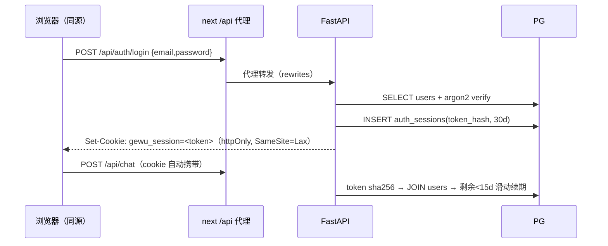

# 11 · 用户与认证（P21）

> gewu 在 P21 前是「公开演示、有意无鉴权」的形态（CORS `*`、session_id 客户端
> 自报、user_id 写死 `demo-{role}`、role 是请求参数）。P21 引入用户体系后，
> 身份成为一切归属的锚点：**who you are（认证）→ what you own（台账/记忆归属）
> → what you can do（role 权限矩阵坐实）**。本文讲三张表、cookie 会话流程、
> 邀请码原子核销与 role 服务端权威的设计；范围收紧前后的契约差异见
> [PARITY](../PARITY.md) §0.5。

## 表结构与代码位置

```
apps/server/gewu/auth/store.py        AuthStore（psycopg pool + 幂等 DDL + argon2）
apps/server/gewu/api/auth.py          四端点 + require_user / require_admin 守卫
apps/server/scripts/auth_tool.py      make invite / make admin（内测 CLI，后台 UI 属 P23）
```

| 表 | 关键列 | 说明 |
| --- | --- | --- |
| `users` | `id BIGSERIAL PK`、`email UNIQUE`、`password_hash`、`role CHECK(student/counselor/admin)`、`status` | 内部代理键 id **不外露**；对外用户键=email |
| `auth_sessions` | `token_hash TEXT PK`（sha256）、`user_id FK`、`expires_at`、`last_seen_at` | 服务端会话表；cookie 存原始 token，库存摘要（拖库不可复用） |
| `invite_codes` | `code PK`、`max_uses`、`used_count`、`expires_at` | 封闭注册的发放凭据（内测期 CLI 发放） |

对外用户键选 email 而非数字 id 的理由：台账 `bookings."user"`、记忆
`memory_fact.user_id`、agent 工具链 `call_tool(user=...)` 全是 TEXT 列，email
直接落进去（唯一、人类可读、台账展示直出），换取 agent 工具链与记忆双表
**零类型改动**；防枚举不靠 id 不可猜，而靠「id 根本不出现在任何对外位置」。

## 认证流程（register / login / logout / me）



- **密码**：argon2id（`argon2-cffi`），verify 恒时；login 失败统一 401
  「邮箱或密码错误」（不区分邮箱不存在/密码错/停用）。
- **会话凭证为什么是服务端表而不是 JWT**：登出即删行（可撤销）、无签名密钥
  管理、过期语义交给 PG；单体单库形态下 JWT 的无状态收益吃不到。
- **注册即登录**：register 成功直接下发 cookie；邀请码核销 + 建 user + 建
  session 在**同一事务**，邮箱冲突时核销一并回滚（码不被浪费）。
- **cookie 属性**：httpOnly + SameSite=Lax + 30d；`Secure` 由
  `COOKIE_SECURE` 控制（M4 https 部署后开启）。前端经 next rewrites 同源
  代理访问，无跨域 cookie 依赖（CORS 相应收白名单化，默认空=仅同源）。

## 邀请码原子核销（并发正确性）

```sql
UPDATE invite_codes SET used_count = used_count + 1
WHERE code = %s AND used_count < max_uses
  AND (expires_at IS NULL OR expires_at > now())
RETURNING used_count
```

单条 UPDATE 依赖行锁：并发核销 uses=1 的码恰好一个成功（测试
`test_invite_concurrent_single_winner` 四线程验证）。没有「先 SELECT 检查再
UPDATE」的两步竞态。

## role 服务端权威（权限矩阵坐实）

P21 前 `role` 是 `/api/chat` 请求参数——任何人自称 counselor 即可拿辅导员工
工具，`tools_for()` 权限矩阵实为君子协定。P21 起：

- role 唯一权威 = `users.role`，服务端在 chat 装配点取
  （`api/chat.py`：`new_state(..., user.role, user.email)`）；请求体 `role`
  字段**废弃忽略**（PARITY §0.5 契约变更）。
- 越权拦截从「约定」变「强制」：student 调 `approve_leave` 在工具层被拦，
  且无法通过任何请求参数绕过。
- 台账 `/api/business/overview` 默认本人视图（按登录 email 过滤），admin
  可 `?all=1`；`/api/business/reset` 仅 admin（403）。
- 记忆管线（fact/episodic + consolidate）零改动点亮：user_id 从
  `demo-{role}` 变为真实 email，跨会话记忆第一次真正按用户隔离。用户侧
  可见与可管理（面板 UI）属 P22。

## business / memory 迁 PG（P21-2，闭 P13 遗留）

两域自 SQLite 迁入同一 PG（接口签名/返回形状/权限语义零变化，只换驱动）：

- 连接形态对齐 `rag.Store`（ConnectionPool min1/max4）；`book_venue` 等
  「检查→写入」复合操作持进程锁 + 单事务，保持 SQLite 单连接时代的串行语义。
- 两个迁移期实坑（对后来者有值）：① `user` 是 **PG 保留字**，列定义与全部
  SQL 引用必须双引号 `"user"`；② SQLite `AUTOINCREMENT` 在 DELETE 后计数
  不归零，PG 序列同语义——测试用 `wipe()`（DELETE + setval 归零，保证
  VE-0001 可断言），PARITY 端点 `reset()` 保持计数延续。
- 内测数据不迁移：SQLite 文件归档 `data/archive/`，建表重建 + `make demo`
  重放种子；评测集是 jsonl 文件制不受影响。

## 管理与发放（内测 CLI）

```
make invite USES=10 DAYS=14 NOTE=内测一批   # 生成邀请码（打印）
make admin EMAIL=a@b.com                    # 已注册账号提权 admin
```

后台管理页（用户列表/用量/会话巡查/邀请码发放 UI/per-user 预算）属 P23。

## 相关文件

| 文件 | 内容 |
| --- | --- |
| `gewu/auth/store.py` | 三表 DDL、AuthStore、argon2 封装、User/AuthError 类型 |
| `gewu/api/auth.py` | 四端点、require_user/require_admin、cookie 收发 |
| `gewu/business/db.py` / `gewu/memory.py` | 迁 PG 后的业务/记忆存储 |
| `gewu/api/chat.py` / `routes.py` | 认证接线与范围收紧 |
| `apps/web/lib/auth.ts` / `app/login/page.tsx` | 前端登录态 hook、登录/注册页 |
| `tests/test_auth.py` | 核销原子性/过期/登出失效/权限 18 用例 |
