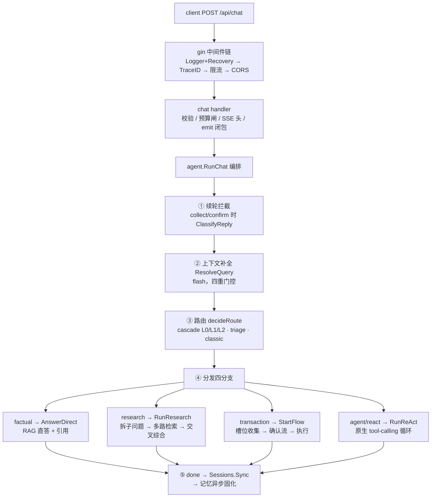

# 01 · 一次 chat 请求的生命周期

> 一次 `POST /api/chat` 从进入进程到 SSE `done` 事件的完整路径。
> 读完应能回答：一条消息经过哪几层、谁在哪个环节消费 LLM、断开连接后发生什么。

## 全景

## 逐层讲解

**入口层（internal/api）**：handler 只做四件事——参数校验（question/mode/role/session_id）、
预算闸（`budget.Ensure()`，超限 429 不进管线）、写 SSE 头、构造 `emit` 闭包（marshal →
写 `data: ...\n\n` → 立刻 Flush）。HTTP 层完全不知道后面怎么编排。关键细节：ctx 取自
`c.Request.Context()`，客户端断开 → ctx 取消 → 一路传播到上游 LLM 流读取，整条链路自然中止。

**编排五步（internal/agent/pipeline.go）**：

1. **续轮拦截**：会话处于 collect/confirm 阶段时，消息优先被解释为对流程的回应
   （`ClassifyReply` 判 continue/cancel/new_topic），而不是新问题；
2. **上下文补全**：多轮追问「那第二个条件呢」先被 flash 补全成自包含问题
   （`ResolveQuery`，四重门控，单轮零成本），补全结果**贯通路由与检索两个环节**——
   一次补全双收益；原话保留给记忆存档与用户可见层；
3. **路由**：产出决策包 `RouteDecision`（不只是 label，还带 Toolset 最小权限工具集 /
   ModelTier / PreRAG），详见 [02](02-routing.md)；
4. **分发**：四条分支见下表。核心收敛点：**写操作无论从 workflow 还是 ReAct 进来，
   都走同一条「确认摘要 → 用户确认 → 执行 → 回执」**，详见 [03](03-acting.md)；
5. **收尾**：done 事件（latency_ms）→ 会话状态落库（SQLite 跨重启续办，失败只告警
   不伤回答）→ 记忆固化（episodic 同步 + facts 异步，不阻塞回答路径）。

**四条分支**：

| 分支 | 路径 | LLM 消费 |
|---|---|---|
| factual | `AnswerDirect`：混合检索 → 编号上下文 → 流式生成 | flash（检索改写/rerank）+ 主模型流式 |
| research | `RunResearch`：拆 ≤4 子问题 → 逐路检索 → 证据去重（≤12）→ 交叉综合 | flash（拆解）+ 主模型流式 |
| transaction/hybrid | `StartFlow`：工具识别 → 槽位收集 → 确认 → 执行 | flash（工具兜底/抽槽/续轮意图） |
| agent/react | `RunReAct`：原生 tool-calling 自主循环（≤8 轮） | 主模型多轮 + 工具内检索 |

**横切关注点**：

- **事件契约**：`route → status/step/slot_question/pending_action → answer_delta* →
  citations/action_result → done`（internal/agent/events.go）。事件形状是前端与评测的
  共同契约，SSE 接口与评测跑同一入口 `RunChat`；
- **预算**：入口 Ensure + 每次 LLM 调用内部 Ensure 的双层拦截，详见 [06](06-engineering.md)；
- **观测**：X-Trace-Id 贯穿响应头 / gin 日志 / agent 日志。

## 设计主线

> **廉价的确定性优先，昂贵的智能兜底。**

正则快路径先吃掉高置信 case；flash 小模型做结构化任务（路由/抽槽/补全/续轮分类），
且全部有确定性降级；主模型只花在最终生成与仲裁上。断连靠 ctx 取消单向传播，
成本靠预算闸双层拦截。

## 边界与已知短板

- 消息债务（inbox/steering）在同步 SSE 单请求架构下结构性不存在——用户无法在工具
  执行期间插话，只能等 done 后发下一轮。这是刻意简化，代价与收益见 [03](03-acting.md)
  的终止语义对照；
- done 事件暂无结束原因字段（completed/error/aborted 不可区分），已列入
  [P10](../runbooks/P10-finish-reason.md)。
