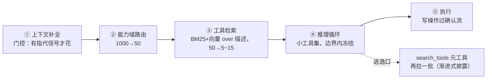

# 05 · 思考：千级工具下的五段式管线（设计推演，未实现）

> 本篇是设计推演而非现状描述：如果把格物的工具从 10 个扩展到 1000 个（skill/MCP 生态），
> 哪些结构保留、哪些必须换。写下来的目的是让扩展路径显式化——**知道什么规模该换什么
> 方案**与方案本身同样是工程能力。

## 问题：全量工具直接推理为什么失效

把 1000 个 tool schema 全塞进请求，是三重恶化：

1. **选不准**：工具选择是模型注意力里的大海捞针，几百个相近工具
   （`book_meeting_room` vs `reserve_discussion_room`）互相干扰，误选率显著上升；
2. **贵且慢**：千级 schema 每次调用吃掉数万 token，且稀释相关指令的注意力；
3. **不安全**：全量暴露 = 本轮理论上什么都能调，最小权限无从谈起。

## 反面：一次性备齐上下文也不对

极端的另一头——前置检索出一批工具、备齐全部资料、一个长推理跑到底——同样有三个坑：
召回不全没有纠错机会、简单问题被强收全流程税、推理中途发现缺工具无法补。

## 答案：分级准备 + 惰性扩展

每段存在的理由是**给下一段收窄输入空间**：补全产出自包含问题（否则路由误判）→
路由产出业务域（否则全量检索）→ 检索产出最小工具集（否则推理选不准）→ 推理产出
行动序列（工具集冻结保证协议配对与缓存稳定）→ 执行挂确认流。

三个生产要素（缺一条就是 demo 管线）：

1. **门控降级**：每段都有便宜的跳过条件——简单问题零准备成本；
2. **逃逸口**：前置检索必漏召回，循环内 `search_tools` 元工具兜底，模型自己拉候选；
3. **边界冻结**：工具集只在请求/turn 边界刷新，turn 内不变。

## 格物现有代码的映射

这个模式在 10 个工具的规模下已经以静态形式存在：

| 五段式 | 格物现状 | 规模上去后换成 |
|---|---|---|
| ① 上下文补全 | `ResolveQuery`（四重门控） | 不变 |
| ② 能力域路由 | cascade / triage → RouteDecision | 不变（输出接入工具索引的域过滤） |
| ③ 工具检索 | 决策包静态 `Toolset` + 角色矩阵 | **BM25+向量检索工具描述**（machinery 与知识库同构，直接复用 rag 域） |
| ④ 推理循环 | RunReAct + `reactTools` 双重过滤 | 不变 + 挂 search_tools 元工具 |
| ⑤ 执行 | 确认流单一出口 | 不变 |

关键判断：**10 个工具用静态子集是正确的工程决策**——这个量级上检索式发现是过度
设计。换挡的信号是工具过百、误选开始可观测。

## 参考的业界形态

Claude Code 的 skills 渐进加载（只暴露名称+描述，触发才载入全文）、Anthropic 的
Tool Search Tool、MCP 生态的工具发现，都是同一模式的不同实现。格物的差异只在
规模与③的实现方式，骨架一致。
